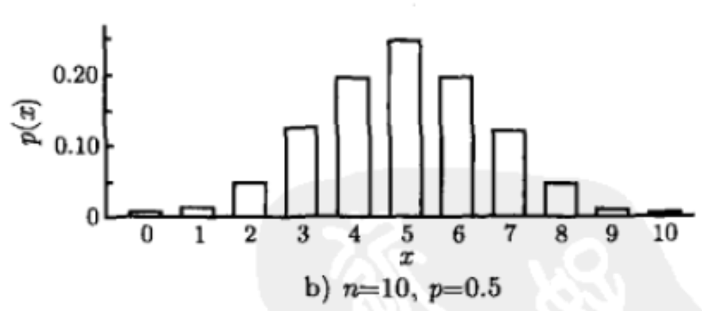
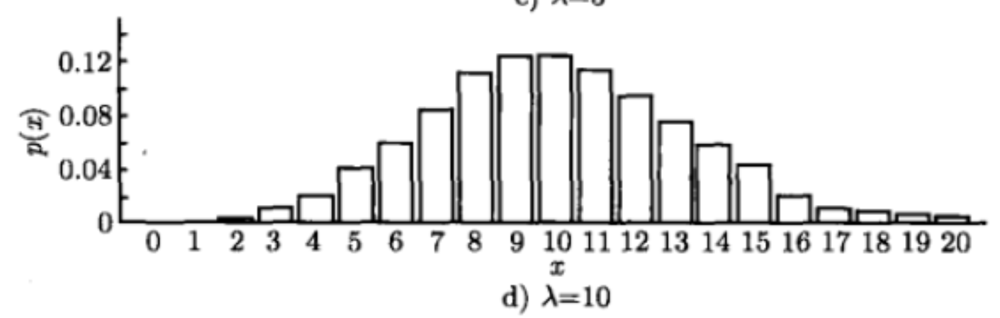

# Permutation and Combination

- Different sampling methods
  - Sampling without replacement
  - Sampling with replacement

- Example: probability of at least one same birthday in class
  $$P(A) = 1- P(A^C) = 1 - \frac{365 \times 364 \times (365-n+1)}{365^n}$$

- Example: divide committee of 7 into 2,2,3
  $$N = \frac{7!}{2!2!3!}$$

- Example: 2m players, m field, how many ways to assign players to field
  - Think of 2m places
    $$N = \frac{(2m)!}{(2!)^m}$$

- Example: 2m players, m field, how many ways to assign players **(without fields)**
  - Think of 2m places
    $$N = \frac{(2m)!}{(2!)^m \times m!}$$

# Common Distributions

## Bernoulli Distribution

- For single observation:
  - $P(X=1) = p$
  - $\sigma^2_X = p(1-p)$
  - $\hat \sigma^2 = s^2 = \hat p (1-\hat p)$

- For average/proportion:
  - $\hat p = \bar X = (X_1 + X_2 + ... + X_n) / N $
  - $Var(\hat p) = Var(\bar X) = \frac{p(1-p)}{N}$
  - $s^2(\hat p) = s^2(\bar X) =\frac{\hat p (1-\hat p)}{N}$

- For difference in average/proportion (same sample size):

  - $\bar X$ and $\bar Y$: $Var(\bar X - \bar Y) = \frac{2p(1-p)}{N} $
  - $\bar X$ and $\bar Y$: $s^2(\bar X - \bar Y) = \frac{2\hat p(1-\hat p)}{N} $

## Binomial Distribution

- Number of successes
  $$P(X=K) = {N \choose k} p^k (1-p)^{N-k} $$
  

## Poisson Distribution

- Number of events in a certain period
- Note, when n is big and p is small, close to binomial distribution

$$P(X=k) = \frac{\lambda^k}{k!}e^{-\lambda}$$

## Geometric Distribution

- Number until first success
  $$P(X=k) = (1-p)^{k-1}p$$

## Hyper-Geometric Distribution

- Choose $m$ from $n$, get $k$ successes out of $r$
  $$P(X=k) = \frac{ {r \choose k}{ {N-r} \choose {m-k} } }{N \choose m}$$

## Normal Distribution

$$f(x) = \frac{1}{\sqrt{2\pi}\sigma}e^{-\frac{(x-\mu)^2}{2\sigma^2} }$$

$$X \sim N(\mu_X, \sigma^2), Y \sim N(\mu_Y, \sigma^2)$$

$$\bar X - \bar Y \sim N[(\mu_X - \mu_Y, \sigma^2(\frac{1}{N_X} + \frac{1}{N_Y})]$$

## $\chi^2$ Distribution

$$X \sim N(\mu, \sigma^2)$$

$$X_1^2 + X_2^2 +...+X_n^2 \sim \chi^2(n)$$

$$\frac{(n-1)s^2}{\sigma^2} \sim \chi^2(n-1)$$

## $t$ Distribution

$$X \sim N(\mu, \sigma^2)$$

$$\frac{X}{\sqrt{\chi^2(n)} } \sim t(n)$$

## Other Distributions

- Exponential
- Gamma
- Beta

# Calculations for random variables

## Expectation

- A random variable is unlikely to be too far from mean

**Markov Inequality**

$$X \geq 0 \rightarrow P(X \geq t) \leq \frac{E(X)}{t} \rightarrow P[X \geq kE(X)] \leq \frac{1}{k}$$

**Chebyshev Inequality**

$$P(|X-\mu| > t) \leq \frac{\sigma^2}{t^2}$$

**Law of total expectation / Conditional expectation**

$${E} (X)=\sum _{i}{\operatorname {E} (X\mid A_{i})\operatorname {P} (A_{i})}$$

## Variance

- $Var(X) = E(X^2) - [E(X)]^2 = E\{[(X-E(X)]^2\}$
- $Var(aX) = a^2Var(X)$
- $Var(X+Y) = Var(X) + Var(Y) + 2Cov(X,Y)$

## Covariance

- $Cov(X,Y) = E(XY) - E(X)E(Y) = E[X-E(X)][(Y-E(Y)]$
- $Cov(X,Y) = Cov(Y,X)$
- $Cov(X,X) = Var(X)$
- $Cov(aX Y) = aCov(X,Y)$
- $Cov(X_1 + X_2, Y) = Cov(X_1, Y) + Cov (X_2, Y)$

## Correlation

- $\rho(X,Y) = \frac{Cov(X,Y)}{\sqrt{Var(X)}\sqrt{Var(Y)} }$
- $\rho=0$ only indicates no **linear** relationship

## Indendency

- $E(XY) = E(X)E(Y)$
- $Var(X+Y) = Var(X) + Var(Y)$
- $Cov(X,Y) = \rho(X,Y) = 0$

**Note: NOT sufficient**

- Example: $X \sim N(0,1), Y = X^2$, but $Cov(X,Y) = E(X X^2) - E(X)E(X^2) = 0$

## Central Limit Theory

- The sum/mean of independent random variables tends toward a normal distribution even if the original variables themselves are not normally distributed.)

- ${Z_1, Z_2,...}$ from $iid$
- $E(Z) = \mu, Var(Z) = \sigma^2$
- When $Z$ comes from normal distribution:

  $$\frac{\bar Z -\mu}{\sigma / \sqrt N} \sim N(0,1)$$

  $$\frac{\bar Z -\mu}{\hat \sigma / \sqrt N} \sim t(N-1)$$

- When sample size is big:

  $$\frac{\bar Z -\mu}{\sigma / \sqrt N} \xrightarrow{N\to\infty} N(0,1)$$

  $$\frac{\bar Z -\mu}{\hat \sigma / \sqrt N} \xrightarrow{N\to\infty} N(0,1)$$

- Example: 60 out of 100 flips are positive
  - **Binomial Distribution**
  - Null: p = 0.50
  - Mean: $np$ = 50
  - Variance: $np(1-p)$ = 25
  - Normal Distribution: $P(X \geq 60) = P(\frac{X-50}{\sqrt{25} } \geq \frac{60-50}{\sqrt{25} }) = P(Z_{N(0,1)} \geq2)$

# Linear regression

- Unbiased estimator of $\beta_1$:

  $$\hat \beta_1=\dfrac{\sum\limits_{i=1}^n (x_i-\bar{x})(y_i-\bar{y})}{\sum\limits_{i=1}^n (x_i-\bar{x})^2}$$

- Unbiased estimator of $\sigma^2$:

  $$\hat \sigma^2=\frac{\sum e^2}{N-k}$$

- Parameter Test

  $$Z = \frac{\hat \beta_1 - 0}{\sigma_{\beta_1} } \sim N(0,1)$$

  $$T = \frac{\hat \beta_1 - 0}{s_{\hat \beta_1} } \sim t\ (N-k)$$

  $$s_{\hat \beta_1} = \sqrt{\hat \sigma^2\ /\sum{(x-\bar x)^2} }$$

# Some Statistical Concepts

## Confidence Interval

- The confidence interval you compute depends on the data you happened to collect. If you repeated the experiment, your confidence interval would almost certainly be different. So it is OK to ask about the probability that the interval contains the population mean.

- It is not quite correct to ask about the probability that the interval contains the population mean. It either does or it doesn't. There is no chance about it.

- What you can say is that if you perform this kind of experiment many times, the confidence intervals would not all be the same, you would expect 95% of them to contain the population mean, you would expect 5% of the confidence intervals to not include the population mean, and that you would never know whether the interval from a particular experiment contained the population mean or not.

## Statistical Significance

The observarions are very unlikely to have occurred given the null hypothesis.

## P-value

"In statistical hypothesis testing, the p-value or probability value or asymptotic significance is the probability for a given statistical model that, when the null hypothesis is true, the statistical summary would be greater or equal to the actual observed results."

## Causal vs. Correlation

- Examples of correlations instead of causality
  - Drinking -> Longevity
  - Drugs -> Heart disease

- Advantage of causality
  - Robust prediction for different populations

- Cannot tell the impact of a feature
  
