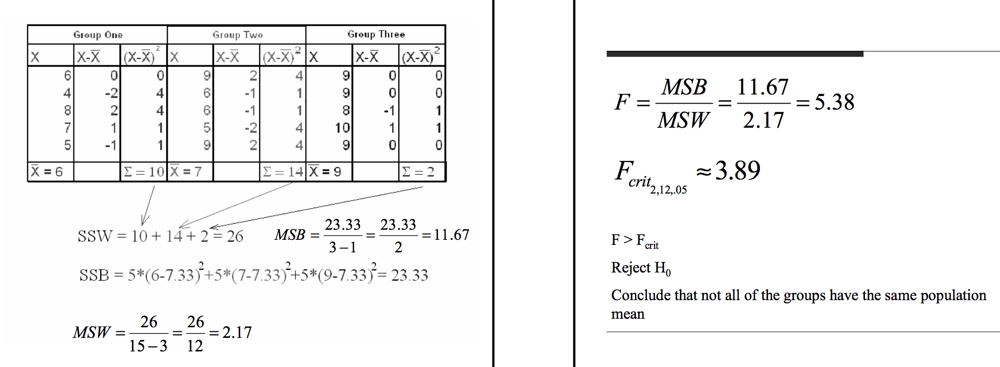
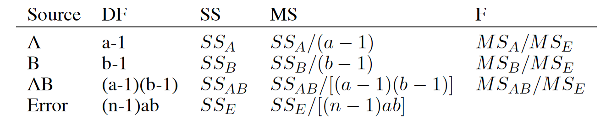
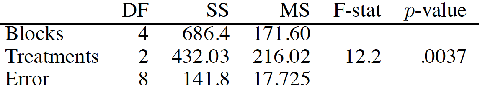
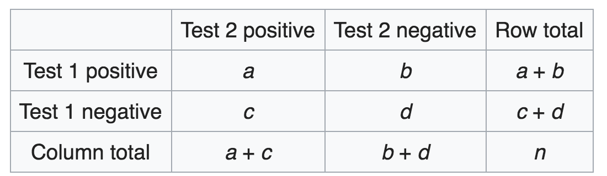

# Paired sample t-test

##  Theory

- $X_i$ and $Y_i$ are paired, and correlated
    - $Cov(X_i, Y_i) = \sigma  _{XY}$
    
- Independece across pair: 
    - $E(X_i - Y_i) = E(\bar X - \bar Y) = \mu_X - \mu_Y$
    - $Var(\bar X - \bar Y) = \frac{1}{N}[\sigma^2_X+\sigma^2_Y - 2 \rho\sigma_X \sigma_Y]$, where $\rho$ is correlation coefficient between $X$ and $Y$.

- Normal assumption:
    - $D = X-Y \sim N(.,.)$
    - $\bar D \sim N(.,.)$

- Under big sample size:
    - $D = X-Y$ doens'y have to be normal
    - $\bar D \xrightarrow{N\to\infty} N(.,.)$

- Test Statistic (Actually for **one-sample t-test**):
    - $$t = \frac{\bar D - \mu_D}{s  _{\bar D} } \sim t\ (df=N-1)$$
    - $${s  _{\bar D} } = \frac{s_D}{\sqrt{N} } = \frac{\sqrt{\frac{1}{N-1}\sum(D_i-\bar D)^2} }{\sqrt{N} }$$

**Comparison with independent sample t-test**
- When $\sigma_X = \sigma_Y$:
    - *Independent*: $Var(\bar X - \bar Y) = 2\sigma^2/N$
    - *Paired*:  $Var(\bar X - \bar Y) = 2\sigma^2(1-\rho)/N$

**Non-parametric methods**
- Signed rank test
- Assumption: half positive and half negative for the sign of differences between pairs
- Robust to outliers
- No need for normal assumptions
- Good for small sample size

# ANOVA test

## Theory

**Assumption**:

$$Y  _{ij} = \mu + \alpha_i + e  _{ij}, i^{th}\ treatment,\  j^{th} observation$$

- $e  _{ij} \sim N(0, \sigma^2)$,  iid
- Constraint: $\sum \alpha_i=0$
- $H_0: \alpha_i=0$ for each $i$

- Break the errors:
    - $SS_W = \sum_i\sum_j(Y  _{ij}-\bar Y  _{i.})^2$
    - $SS_B = J \sum_i(\bar Y  _{..}-\bar Y  _{i.})^2$

- Under normal distribution:
    $$SS_W/\sigma^2 \sim \chi^2[I(J-1)]$$

- Under $H_0$:
  
    $$SS_B/\sigma^2 \sim \chi^2(I-1)$$

- When two $\chi$ samples are **independent**

$$\frac{\chi^2_a/a}{\chi^2_b/b} \sim F(a,b)$$

- Under normal distribution and $H_0$

$$F = \frac{SS_B/(I-1)}{SS_W/[I(J-1)]} \sim F[I-1, I(J-1)]$$

  - Under $H_0$, $E(numerator) = E(denominator) = \sigma^2$, so F should be close to 1
  - Under $H_1$, when some $\alpha_i>0$, $E(numerator) >\sigma^2$, so F should be larger than 1 

**Violation of assumptions**:
- Independence: should not be violated
- Normality: still valid if non-normal and large sample
- Non-constant variance: still valid with equal sample size across groups

**Another perspective of looking at ANOVA**:
- F-test for a set of parametrs between complicated model and a reduced/simple model

**Example**

## Multiple Comparison

- Goal: control Type-I error

**How to define combined error rate**
- $H_0 = H  _{01} \cap H  _{02} ... \cap H  _{0K}$
- Option1: Experiment/Family-Wise Error 
    - Reject one or more of $H  _{0i}$ while all $H  _{0i}$ are true
    
- Option 2: False Discovery Rate (FDR)
    - $\frac{Number\ of\ Type-I\ error}{Number\ of\ Rejecting\ H_0}$
    - e.g., a 0.05 FDR means that we allow one incorrect **Rejection** with 19 correct **Rejections**
    - If $H_0$ is true, then all discoveries are false

**Bonferroni Correction**
- Instead of $t  _{df}(\alpha)$, use $t  _{df}(\frac{\alpha}{M})$
    - $M$ is number of comparisons
    - Controls family-wise error at $\alpha$

- Completely general: it applies to any set of c inferences, not only to multiple comparisons following ANOVA
    - Feature - Different features of a product
    - Drug - Different symptoms of a disease

- "The Bonferroni method would require p-values to be smaller than .05/100000 to declare significance. Since adjacent voxels tend to be highly correlated, this threshold is generally too stringent."

**Protected LSD (Least Significant Difference) for multiple comparisons**
- Use ANOVA F-test first
- User t-test as usual for multiple comparisons for **a few** planned comparisons

**Tukey’s (“honestly significant difference” or “HSD”) for multiple comparisons**
- Specifically for multiple comparisons after ANOVA test
- Between the largest and smallest sample means
    - $g$ is number of groups
    - $v$ is degrees of freedom for error

- Test statistic
$$Q = max_i \frac{\bar y  _{i.} }{\sqrt{MS_E/n} } - min_j \frac{\bar y  _{j.} }{\sqrt{MS_E/n} } \sim q(g, v)$$

- When sample size is different:
- When sample size is same:
$$\bar y  _{i.} - \bar y  _{j.} \pm \frac {q(\alpha, k, N-k)}{\sqrt{2} } \hat \sigma  _{\epsilon} \sqrt{\frac{1}{n} +\frac{1}{n} }$$

- Compare with Bonferroni
$$\bar y  _{i.} - \bar y  _{j.} \pm t  _{(\alpha/2K,v)}  \hat \sigma  _{\epsilon} \sqrt{\frac{1}{n} +\frac{1}{n} }$$

**To be added**
- http://www2.hawaii.edu/~taylor/z631/multcomp.pdf
- http://www.stat.cmu.edu/~genovese/talks/hannover1-04.pdf
- http://personal.psu.edu/abs12//stat460/Lecture/lec10.pdf

## Two-factor ANOVA

**Assumnption**

$$Y  _{ijk} = \mu + \alpha_i + \beta_j + \delta  _{ij} + e  _{ijk}$$

**Error break**

$$SS=SS_A+SS_B+SS  _{AB}+SS_E$$

**Four $\chi$ Distributions**

$$SS_A/\sigma^2 \sim \chi^2(I-1)$$

$$SS_B/\sigma^2 \sim \chi^2(J-1)$$

$$SS  _{AB}/\sigma^2 \sim \chi^2[(I-1)(J-1)]$$

**Three F-statistics**

$$F=\frac{MS_?}{MS_E} = \frac{ {SS}_?/{df}_?}{SS_E/[IJ(K-1)]} \sim F[df_?, IJ(K-1)]$$

---

# Experiment Design

## Examples of confounding
- Effect of ***Gender*** in College Admission confounded by ***Major***: women apply for hard majors
- Effect of ***Coffee Drinking*** on coronary diseases confounded by **Smoking**: coffee drinkers smoke more
- **Randomization**: mitigate the impact of confounding factors so that they are *same* in both groups

## Completely Randomized Design (CRD)

- For each experiment $i$, randomly assign a treatment with equal probability
- Example: one-wayANOVA

## Randomized Completedly Block Design (RCB)
- Goal: higher power by decreasing error variance
- Note: Blocks exist ***at the time of the randomization of treatments to units***. You ***cannot*** determine the design used in an experiment just by looking at a table of results, you have to know the randomization.

$$y  _{ij} = \mu + \alpha_i + \beta_j + \epsilon  _{ij}$$

- The **computation** of estimated effects, sums of squares, contrasts, and so on is done exactly as for a two-way factorial, but **design** is different.

- With a randomized block design, the experimenter divides subjects into subgroups called **blocks**, such that the variability within blocks is less than the variability between blocks. Then, subjects within each block are randomly assigned to treatment conditions. 
- Compared to a completely randomized design, this design reduces variability within treatment conditions and potential confounding, producing a better estimate of treatment effects.

- ***Example***: Paired-Sample t-test, where ***person*** is the block
- ***Example***: Fertilizer agricultural experiment, where ***field*** is the block
- ***Spatial and Temporal Blocking***

The table below shows a randomized block design for a hypothetical medical experiment.

|Gender	||Treatment|
|::|::|::|
||Placebo	|Vaccine|
|Male	|250	|250|
|Female	|250	|250|
Subjects are assigned to blocks, based on gender. Then, within each block, subjects are randomly assigned to treatments (either a placebo or a cold vaccine). For this design, 250 men get the placebo, 250 men get the vaccine, 250 women get the placebo, and 250 women get the vaccine.

It is known that men and women are physiologically different and react differently to medication. This design ensures that each treatment condition has an equal proportion of men and women. As a result, differences between treatment conditions cannot be attributed to gender. This randomized block design removes gender as a potential source of variability and as a potential confounding variable.

# Categorical analysis

## Chi-square test
- Example: one dimension

$$Q=\sum  _{i=1}^{k}\frac{(Y_i - np_i)^2}{np_i} = \sum \frac{(Expected - Observed)^2}{Expected} \sim \chi^2(k-1)$$

- ExampleL: two dimension
    - the multi-variable distribution on $I$ changes across group $J$
    

$$E  _{ij} = \frac{n  _{i.}n  _{.j} }{n  _{..} }$$

$$df = (I-1)(J-1)$$

- Example: Pair nomial data

- Null hypothesis:
    - P(Negative to Positive) = P(Positive to Negative):  $p_b = p_c$
- Alternative hypothesis:
    - P(Negative to Positive) $\neq$ P(Positive to Negative): $p_b \neq p_c$
- Test Statistic:
    - $\chi ^{2}={(b-c)^{2} \over b+c}$
- Interpretation:
    - if b>c and significant, then Test 2 is makeing a different to change from negative to positive
