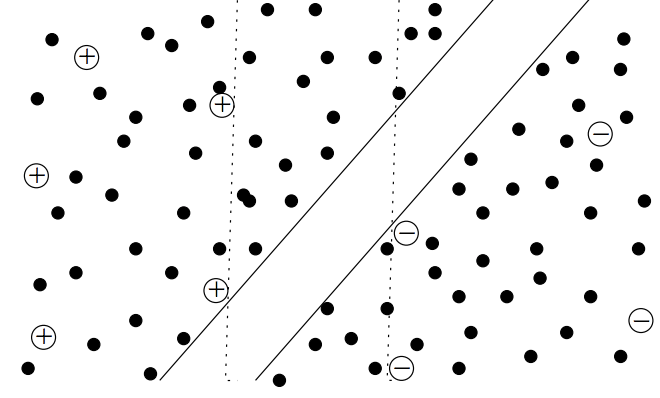
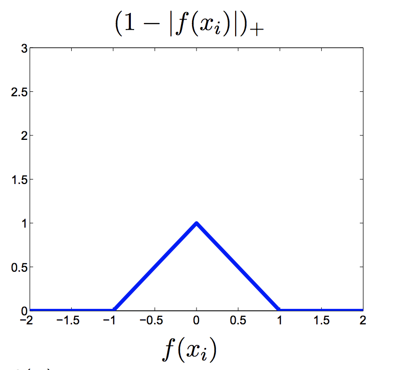
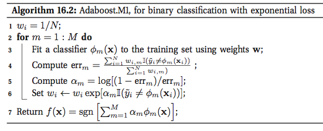
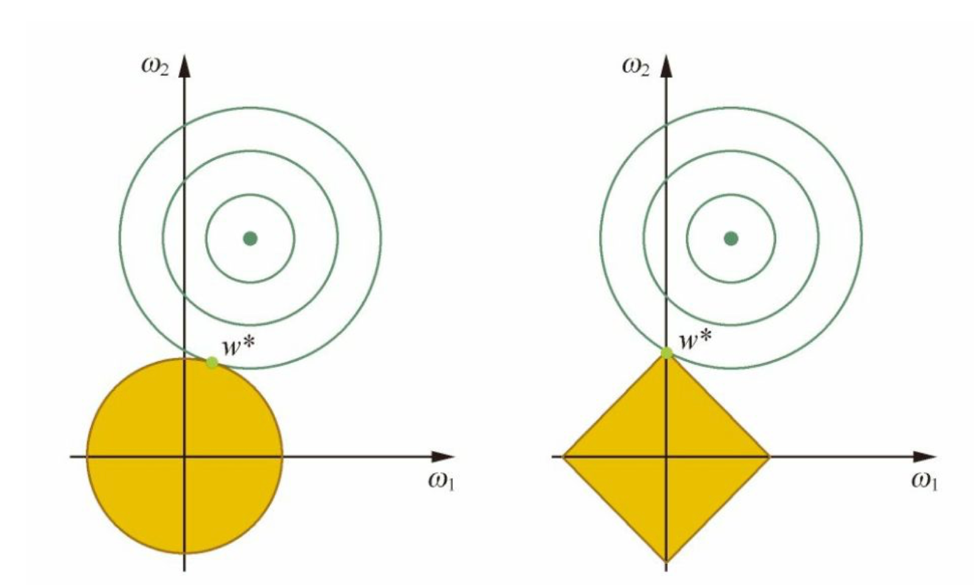
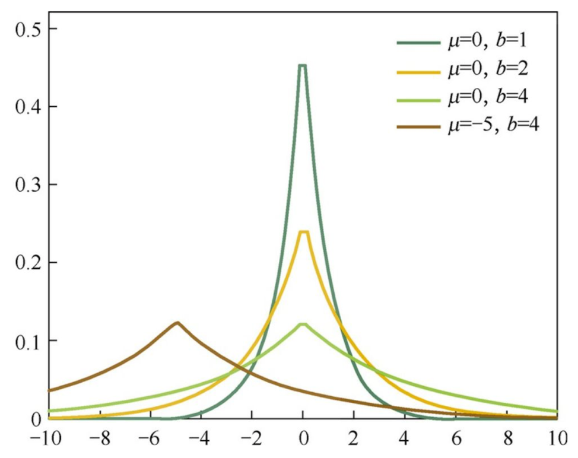
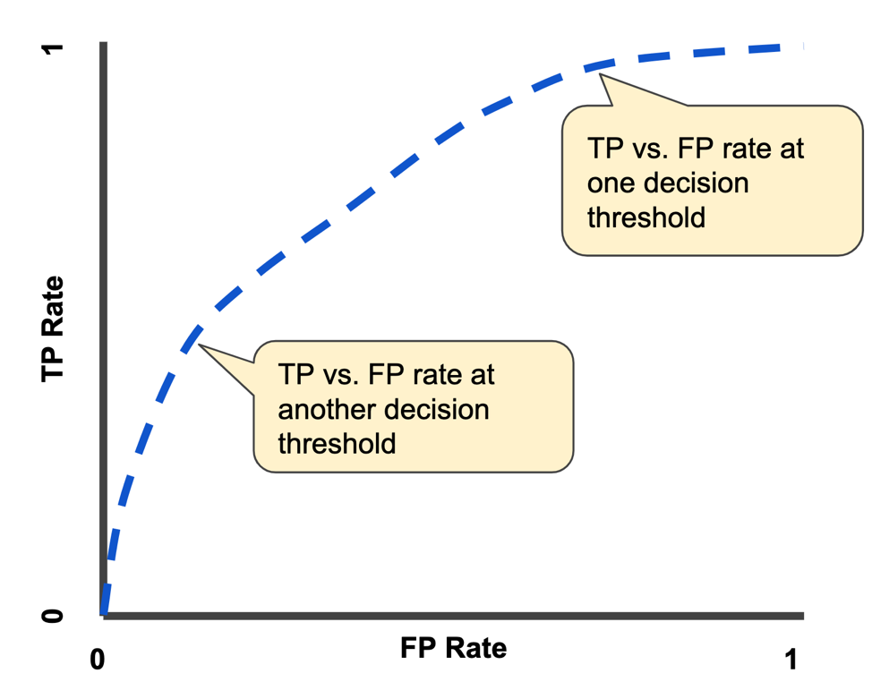
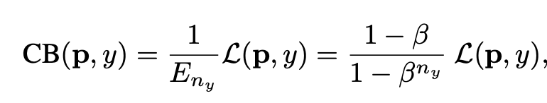

# Bayesian

## Overview

- Want to: learn $P(c|x)$
    - Discriminative models (like LR)
    - Generative models: based on $P(x|c)$
    
- For generative model:
    - $P(c|x) = \frac{P(x,c)}{P(x)} = \frac{P(c)P(x|c)}{P(x)}$
    - Prior: $P(c)$
    - Likelihood: $P(x|c)$
    
- How to describe $P(x|c)$
    - $P(x|c) = P(x|\theta_c)$
    - For continuous variables: $P(x|c) = N(\mu_c, \sigma^2_c)$ (*depends on right assumption*)

## Naive Bayes

- Motivation: Calculate $P(x|c)$, which is a joint distribution, cannot be estimated from limited samples (curse of dimension).

- Attribute conditional independence assumption: $P(x|c) = \prod_i P(x_i|c)$

## Bayesian Inference

**Example: flip coins**
- Represent data by some parameters: $P(D|\theta) = \prod_i P(Y_i|\theta) = \theta^{N_+} (1-\theta)^{N_-}$

- Set prior for $\theta$: $P(\theta)$

- Calculate posterior for $\theta$: $P(\theta|D) = \frac{P(D|\theta)P(\theta)}{P(D)}$

## EM (Expectation-Maximization) algorithm

- $Z$ is latent variable. Cannot be obsewrved.
- $LL(\Theta|X,Z) = ln P(X,Z|\Theta)$
- $LL(\Theta|X) = ln P(X|\Theta) = ln \sum_z P(X,Z|\Theta)$
- For GMM clustering: $\mathbf Z = (k_1, k_2, ..., k_i, ...)$, the class label for each data point.

- Expectation: $Q(\boldsymbol\theta|\boldsymbol\theta^{(t)}) = \operatorname{E}_{\mathbf{Z}|\mathbf{X},\boldsymbol\theta^{(t)} }\left[ \log L (\boldsymbol\theta;\mathbf{X},\mathbf{Z})  \right] $

- Maximization: $\boldsymbol\theta^{(t+1)} = \underset{\boldsymbol\theta}{\operatorname{arg\,max} } \ Q(\boldsymbol\theta|\boldsymbol\theta^{(t)})$

# Unsupervised - Clustering

## Validity Index
- External index (compare with reference model)
- Internal index
    - Intra-cluster average/max distance
    - Inter-cluster min distance, centroid distance, etc.
    

## K-Means

## Hierarchical Clustering

## GMM (Gaussian Mixture Model)

**Known class labels:**
- $\mu_k=\sum_i x_{i,k} / N_k$
- $\sigma^2_k = \frac{\sum_i (x_{i,k} - \mu_k)^2}{N_k}$

**Unknown class labels**:
- Objective is to maximize likelihood
    - $P(\mathbf X) = P(\mathbf X |\mu,\sigma^2, \alpha) = \sum_k \alpha_k P(\mathbf X|\mu_k,\sigma^2_k) $
- Approach: *Soft Labels*

- Initialization to assign each sample $i$ to class $k$.
- $\mu_k=\sum_i x_{i,k} / N_k$
- $\sigma^2_k = \frac{\sum_i (x_{i,k} - \mu_k)^2}{N_k}$
- $\alpha_k = \frac{N_k}{N}$

***Until Convergence***
- Expectation (E) step: 
    - Calculate the probability of sample $i$ belongs to each class from 1 to $K$
    - $p(k|x_i) = \frac{p(k)p(x_i|k)}{p(x_i)} = \frac{\alpha_{k}N(x_i|\mu_{k}, \sigma^2_{k})}{\sum_{k}\alpha_{k}N(x_i|\mu_{k}, \sigma^2_{k})}$

- Maximization (M) step: 
    - Re-estimate paramaters
    - $\mu_k = \frac{\sum_ip(k|x_i)x_i}{\sum_ip(k|x_i)}$
    - $\sigma^2_k = \frac{\sum_ip(k|x_i)(x_i-\mu_k)^2}{\sum_ip(k|x_i)}$
    - $\alpha_k = \frac{\sum_ip(k|x_i)}{N}$
    
- Detailed proof for GMM clsutering: https://en.wikipedia.org/wiki/Expectation%E2%80%93maximization_algorithm

# Semi-supervised learning

## Self-training
- Train $f$ from $(X_ll, Y_l)$
- Predict on $x ∈ X_u$
- Add $(x, f(x))$ to labeled data
- Repeat

## Generative models

- Assumption: labeled and unlabelled comes from the same mixed distribution
- Compare with GMM-based clustering: labels of unlabelled data can be viewed as latent variable $Z$

- One way of formulating:  $p(X_l, Y_l, X_u|\theta) = \sum_{Y_u}p(X_l, Y_l, X_u, Y_u|\theta)$

- The combined log-likelihood: $${\underset {\Theta }{\operatorname {argmax} } }\left(\log p(\{x_{i},y_{i}\}_{i=1}^{l}|\theta )+\lambda \log p(\{x_{i}\}_{i=l+1}^{l+u}|\theta )\right)$$

Where: 
- Labelled: $\log p(\{x_{i},y_{i}=k_i\}_{i=1}^{l}|\theta ) = \sum_i ln \ p(x_i,k_i|\theta) = \sum_i ln\ \alpha_{k_i}p(x_i|\mu_{k_i}, \sigma^2_{k_i}) $

- Unlabelled: $\log p(\{x_{i}\}_{i=l+1}^{l+u}|\theta ) = \ln \sum_i p(x_i|\theta) = \sum_i \sum_k \ln \alpha_k  p(x_i|\mu_k, \sigma^2_k) $

To be solved by EM algorithm

## Semi-supervised Support Vector Machines (S3VM)

- http://pages.cs.wisc.edu/~jerryzhu/pub/sslicml07.pdf
- Main idea: Add loss/penalty term for unlabelled data:
- The third term prefers unlabeled points outside the margin

$$ Min \sum_i [1 - y_i f(x_i)]_+ + \lambda_1 ||w||^2 + \lambda_2 \sum_i (1-|f(x_i)|)_+$$

## Graph-based methods

## PU Learning

- All positive samples + unlabelled samples

# Trees

- Use Information Gain to split nodes
    - Information entropy: $E_0 = -\sum_k p_k log_2p_k$, where $k$ is class index
    - Information Gain $Gain= E_0 - \sum_{node} N_{node}\% \times E_{node}$ 
    - Maximize information gain -> Increase in "purity"
    - ***Example: ID3***

- Use Information Gain Ratio to split nodes    
    - Drawback of information gain: best result will be using "ID" column (i.e., perfect split)
    - Fix: Information Gain *Ratio* $Gain\ Ratio = \frac{Gain}{IV_{feature} }$: to normalized based on number of distinct values
    - ***Example: C4.5***: mixed use of information gain and information gain ratio
    
- Use Gini index to split node
    - Gini = $1 - \sum_k p^2_k$
    - Gini index $= \sum_{node} N_{node} \times Gini_{node}$ 
    - Minimize gini index -> Increase in "purity"
    - ***Example: CART***

- Continous variable and Missing values

- Decision Boundary and Multivariate Decision Tree
  
    - When splitting node, select attribute *set* instead of single attribute (i.e., left: $w^Tx>0$ , right: $w^Tx<0$)
    
- Node splitting for *Regression Tree*
    - Find feature $j$ and splitting point $s$ so that:
    
     $$Min_{j,s} [min_{c_{left} }\sum_{left}(y_i - c_{left})^2 + min_{c_{right} }\sum_{left}(y_i - c_{right})^2]$$

 

# SVM

How to formulate the problem?
- Most Intuitive formulation
    - Maximize Geometric Margin: $\gamma $
    - Constraint: $\gamma_i = \frac{y_i (w^Tx_i + b)}{||w||} \geq \gamma $
    
- Define functional margin:
    - $\gamma_i = \frac{\hat \gamma_i}{||w||}$, where ${\hat \gamma_i}$ is function margin: $y_i f(x_i$)
    - Maximize Functional Margin:$Max \frac{\hat \gamma}{||w||}$
    - Constraint: $\hat \gamma_i = {y_i (w^Tx_i + b)} \geq \hat \gamma $

- Take a step further:
    - Scaling $w$ and $b$ by $\hat \gamma$ will not affect decision boundary
    - Maximize: $\frac{1}{||w||}$
    - Constraint: ${y_i (w^Tx_i + b)} \geq 1$

See Notes below for how to re-formulate the problem:
- 1) Original problem: $Min ||w||^2$
- 2) Unconstraint problem $Min_w\ Max_{\alpha, \beta}\ L(\alpha, \beta, w)$
- 3) Dual problem: $Max_{\alpha, \beta}\ Min_w\ L(\alpha, \beta, w)$ with constraints.
- 4) With SVM satisfying *Slater Condition*, solve dual problem equivalent to orginal problem

Loss function:
- Min $\lambda ||w||^2 + \sum_i[1-y_i(w^Tx_i + b)]_+$

Kernel function
- Popular kernels (linear, Polynomial, RBF)
    - Polynomial: $k(x_1, x_2) = (x_1, x_2 +c)^d$
    - RBF: $k(x_1, x_2) = exp(- \frac{||x_1 - x_2||^2}{2\sigma^2})$
- How to select kernel
    - CV

# Logistic Regression

## Why usually discretize continuous variables?
- Robust to extreme values (e.g., age = 300)
- Introduce non-linearity (e.g., age < 10, age = 10-15, age > 30)
- Easier for feature interaction

## Algorithm 

- Prediction function: $p = \frac{1}{1+exp(-f(x))}$, where $f(x) = \theta^Tx$
- Loss function: 
    - $L = \sum_i ln[p(y_i|x_i;\mathbf w)]$; where y = 0,1
    - $l(y, p) = -[y ln(p) + (1-y)ln(1-p)]$ ; where y = 0,1

- Exponential Loss: 
    - $l(y, f) = - y ln[\frac{1}{1+exp(-f(x))}] - (1-y)ln[\frac{1}{1+exp(f(x))}]$; where y = 0,1
    - $l(y, f) = ln[1+exp(-yf(x))]$, where y = -1, +1

- Gradient wrt $f(x)$
    - $r_{m-1} = \frac{\partial l}{\partial f} = (y-p)$; where y = 0,1
    - $r_{m-1} = \frac{\partial l}{\partial f} = \frac{y}{1+exp(yf(x))}$, where y = -1, +1

- Gradient wrt $\theta$
    - $\frac{\partial L}{\partial \theta_j} = \frac{\partial L}{\partial f} \frac{\partial f}{\partial \theta_j} = \sum_i(p_i-y_i)x_i^j$ ; where y = 0,1
    - $\theta_j := \theta_j - \alpha \frac{\partial L}{\partial \theta_j}$

- How to prove convex optimization: 
    - $L = \sum_i [-y_i \mathbf w x_i + ln (1+e^{\mathbf w x_i})]$ ; where y = 0,1

# Boosting

## GBDT (Gradient Boosting Decision Tree)

---

---

**Summary**:
- $r_{i,m}$ is the negative gradient direction for function $f$.
- A regression tree is used to fit the negative gradient direction. (e.g., residual vector in squared error loss)
- Each node split, find best **feature** and **split point**
- Another optimization problem is solved to find estimated value for each region (i.e., linear search for step size)

**Special cases:**

1. Square error --> Boosting Decesion Tree to fit residuals

2. Absolute error

3. Exponential error
    - $l(y,f)=exp(-yf(x))$ , where y = -1, +1
    - Recovers Adaboost Algorithm
    - sensitive to noise data 

---

**Adaboost**

- Classifer at iteration $m-1$: $f_{m-1}(x) = \alpha_{1}\phi_{1}(x) + \alpha_{2}\phi_{2}(x) + ... + \alpha_{m-1}\phi_{m-1}(x)  $

- Classifer at iteration $m$: $f_m(x) = f_{m-1}(x) + \alpha_m \phi_m(x)$

- Minimize exponential Loss: $L(y, f) = exp(-yf(x)) =\sum_i exp(-y_i f_m(x_i)) = \sum_i [exp(-y_i f_{m-1}(x_i)][exp(-\alpha_m y_i \phi_m(x_i))] = \sum_i w_{m,i}\ exp(-\alpha_m y_i \phi_m(x_i))$
- It can be shown that $w_{m,i}= exp(- \alpha_{m-1}y_i \phi_{m-1}(x_i)) \times ... \times  exp(- \alpha_{1}y_i \phi_{1}(x_i))$
    - $w_{m+1, i} = w_{m,i} \times exp(-\alpha_t)$ when correct
    - $w_{m+1, i} = w_{m,i} \times exp(\alpha_t)$ when wrong

- Optimal solution: ($\alpha^*_m, \phi^*_m(x)) = argmin\ L $

- Obviously, $\phi^*_m(x)$ is not affected by the value of $\alpha_m >0$, 
    - $\phi^*_m(x)$ = $argmin \sum_i w_{m,i} I(y_i \neq \phi_m(x_i))$ (i.e., a classification tree)

- $$\alpha^*_m(x) = argmin \sum_i w_{m,i} exp(-\alpha_m    y_i \phi^*_m(x_i)) = argmin[ \sum_{y_i = \phi_m(x_i)} w_{m,i} e^{-\alpha_m} + \sum_{y_i \neq \phi_m(x_i)} w_{m,i} e^{\alpha_m}] = argmin [(e^{\alpha_m} - e^{-\alpha_m})\sum_i w_{m,i}  I(y_i \neq \phi_m(x_i)) + e^{-\alpha_m} \sum_i w_{m,i}] = argmin [(e^{\alpha_m} - e^{-\alpha_m}) err_m + e^{-\alpha_m} \times 1] = \frac{1}{2}log \frac{1-err_m}{err_m}$$

---

4. Logistic loss
   

## XGBT

- (***Regularization***) Added regularization for trees (Number of leaves + L2 norm of leave weights) for better generalization

- (***Second Order***) Taylor Expansion Approximation of Loss
    - In GBDT, we have first-order derivative (negative gradient)
    - Generally we have $f(x + \Delta x) = f(x) + f'(x)\Delta x + \frac{1}{2}f''(x) (\Delta x)^2 + ...$
    - In this case: ($3^{rd}$ order is useless since $\frac{\partial^3 L}{\partial f} = 0$

- (***Bind final objective with tree building***) The goal of tree each iteration is to find a decision tree $f_t(X)$ so as to minimize objective (Gain + Complexity Cost): $$\sum_i[g_if_t(x_i) + \frac {1}{2} h_i f_t^2(x_i)] + \Omega(f_t)$$

- Next Step: find how to split into $J$ regions, and for each region, what is the optimal weight $w_j$.

- $w^*_j$ is derived first, then node split
    - In GBDT, squared error is minimized for node splitting
    - In XGBoost, directly bind the split criteria to the minimization goal defined in previous step

- Other improvements
    - **Random subset of features** of each node just like random forest to reduce variance
    - **Parallel feature finding** at each node to improve computational speed

- Details: https://xgboost.readthedocs.io/en/latest/tutorials/model.html

## LightGBM
- From Microsoft
    - https://github.com/Microsoft/LightGBM/blob/master/docs/Features.rst#references
    
- Problem: 
    - too many features
    - too many data

- (***Less Data***) Gradient-based One-sided Sampling (GOSS)
    - Select top a% large gradient samples
    - Select randomly b% low gradient samples, and scaling them up to recover the original data distribution

- (***Less Feature***) Exclusive Feature Bundling (EFB)
    - Bind sparse feature
    - From (Data $\times$ Features) to (Data $\times$ Bundles)
    
- (***Better Tree***) Leaf-wise grow instead of Level-wise grow 
    - The resulting tree may be towarding left side)
    - But with same number of nodes, the $\Delta Loss$ can be greater compared with level-wise
    - Regularize by imposing constraints on tree depth

- (***Categorical Split***) Splits for categorical data
    - Instead of one-hot encoding, partition its categories into 2 subsets.

- (***Less Computation***) Histogram 
    - Bucket continuous variables into discrete bins
    - No need for sorting like xgboost
    - Reduces computation complexity (from no. data to no. bins).
    - Reduces memory usage/requirements 
    - Avoid unneccesary computation by calculating *Parent Node* and *One Child* with less data. The other child node can be calculated by *Parent* - *Child*

- (***Better parallelizing***) reduces communication
    - Feature Parallel: each worker has full feature set of data (instead of subset); performs selection on subset; 
    - Data Parellel: merge histogram on local features set of each worker (instead of merging global histograms from all local histograms

## Compare bagging with boosting

- Bagging (RF)
    - Focus: reduce variance
    - Reduce variance by building independent trees and aggregating
    - Reduce bias by using deeper trees
    
- Boosting (GBDT)
    - Focus: reduce bias
    - Reduce variance by using shallow/simple trees
    - Reduce bias by sequentially fitting error

## CatBoost
- ***Treatment for categorical features***
    - For low-cardinality features: one-hot encoding as usual
    - For high cardinality features: use **Target-Based with prior** 
    - Advantage - Address **Target Leakage**: the new feature is computed using target of the previous one. This leads to a conditional **shift** — the distribution differes for training and test examples.
    - Ref: https://catboost.ai/docs/features/categorical-features.html
https://towardsdatascience.com/introduction-to-gradient-boosting-on-decision-trees-with-catboost-d511a9ccbd14
    - Ref: https://towardsdatascience.com/introduction-to-gradient-boosting-on-decision-trees-with-catboost-d511a9ccbd14
    
    

- ***Treatment for combinations of categorical features***
    - Calculate Target Statistics for combinaitons of
        - categorical features already in the current tree
        - other categorical features in the dataset

- ***Ordered Boosting***
    - A special way to address **Prediction Shift** with a modification of standard gradient boosting algorithm, that avoid **Target Leakage**
    - detailed to add.
    
        

# EVD and SVD 

## EVD

## SVD

- http://explained.ai/gradient-boosting/index.html
- https://homes.cs.washington.edu/~tqchen/pdf/BoostedTree.pdf

# L1 and L2 Regularization

## Approach 1：From Figure

## Approach 2: Solve for minumum

Difference in loss function:
- L1: $L_1(w) = L(w) + C|w|$ 
- L2: $L_2(w) = L(w) + Cw^2$ 

Take L1 as example:
- Calculate: $\frac{\partial L_1(w)}{\partial w}$
- When w<0: $f_l = \frac{\partial L_1(w)}{\partial w} = L'(w) - C$
- When w>0: $f_r = \frac{\partial L_1(w)}{\partial w} = L'(w) + C$
- If $|L'(w)|<C$ is met (i.e., C is large enough), then we have $f_l<0$ and $f_r>0$, thus minimum is find at $w=0$

Take L2 as example:
- $\frac{\partial L_2(w)}{\partial w} = L'(w) + 2Cw$
- Unless $L'(w=0) =0$, minimum is not at $w=0$.

## Approach 3: Bayesian Posterior

Recall the posterior for parameter:  

$$P(\theta|D) = \frac{P(D|\theta)P(\theta)}{P(D)}$$

Remove constants:

$$P(\theta|D) = P(D|\theta)P(\theta)$$

Solve for $\theta$:

$$\theta = argmin\ \{-[lnP(D|\theta) + lnP(\theta)]\} =  argmin\ [L(\theta) - ln(P(\theta)]$$

For L1: $\theta$~Laplace Disribution

$$P(\theta) = \frac{1}{2b}e^{-\frac{|\theta|}{2b} }$$

$$\theta = argmin\ [L(\theta) + C|\theta|]$$

For L2: $\theta$~Guassian Disribution

$$P(\theta) = \frac{1}{\sqrt{2\pi}\sigma}e^{-\frac{\theta^2}{2\sigma^2} }$$

$$\theta = argmin\ [L(\theta) + C\theta^2]$$

Laplace: compared with Guassian, more likely to take zero:

# AUC and ROC curve

- AUC: For a random (+) and a random (-) sample, the probability that S(+) > S(-)
- Explains why AUC equals to the area under the curve of TPR and FPR:

$$AUC = \sum P(S(+)>S(-)|+,-) \cdot P(+,-) = \sum_{-} P(S(+)>S(-)|-) = \sum_{-}[TPR|Threshold = S(-)]$$

# Miscellaneous

***Label Imbalance***
-  One approach is to use label-aware loss function
- ref: https://arxiv.org/pdf/1901.05555.pdf
- 

- With hyperparameter $\beta$ ranging from 0 to 1
    - when $\beta$ is 0: no weighing
    - when $\beta$ is 1: weighing by inverse class frequency

***Different Distribution between Train and Test***
- How to tell whether the distribution of train and test set are different
- Train on the label `train` versus `test`. 
- A high AUC suggests different distribution.

***Selection of loss function for regression***
- ref: [here](https://mp.weixin.qq.com/s?__biz=MzU1Nzc1NjI0Nw==&mid=2247484165&idx=1&sn=86b4e59faaabe297b5e09abba4bb9410&chksm=fc31b93dcb46302b7ab63abf6c371deadc8aaf2a6c85939c78e10d25fa0d1ff60357229d05a2&token=1433307692&lang=zh_CN&scene=21#wechat_redirect)
- for high and low values: use MSE 
- for medium values: use MAE
- exclude the X% subset with lowest performance in the training

***Model Aggregation***
- ideal subset of models:
    - each model: high performance
    - between models: low correlation

