# English Grammer

- semantic: relating to meaning in language or logic
- syntactic: of or according to syntax

## Constituency and CFG
- Constituents like noun-phrases
- Constituent structure


- Context-free Grammer (CFG)
    - Consists of a set of **rules**, and a **lexicon** of words and symbols
    - Define a **grammatical** sentence and perform **Syntactic Parsing**
    - A (human) syntactically annotated corpus is called a **Treebank**.
    - From **Treebank** we can extract CFG grammars 
    - A device to generate sentence
    - A device to assign a structure to a sentence
     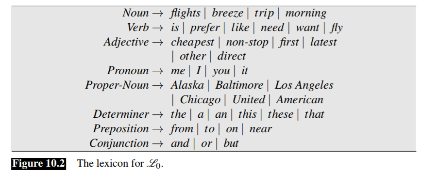
    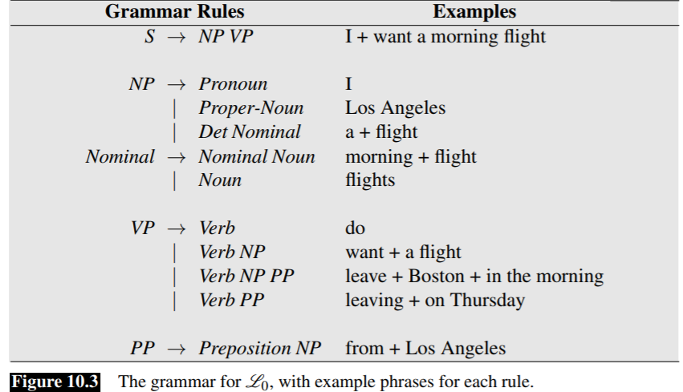


- Example 1:
    - NP → Det Nominal
    - NP → ProperNoun
    - Nominal → Noun  \vert  Nominal Noun
    
    - ***Finally***: Det + Nominal → a dog
    - 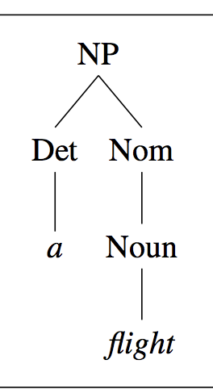


- Example 2: 
    - S → NP VP
    - VP → Verb NP *e.g., prefer a morning flight*
    - VP → Verb NP PP *e.g., leave Boston in the morning*
    - VP → Verb PP *e.g., leaving on Thursday*
    - PP → Preposition NP *e.g., from Los Angeles*
    
- Example 3:
    - 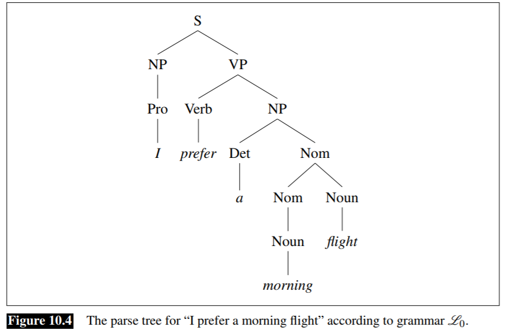


```python

```

## Grammar rules
- Sentence-level construction
    - Declarative: I want an apple
    - Imperative: Show me the apple
    - Yes/No question: Is this an apple?
    - Wh structure: What flights do you have from Burbank to Tacoma Washington?
        - S → Wh-NP Aux NP VP
        - Long-distance dependencies -> Sometimes need semantic modelling
- Other grammar rules TBA
    - Noun. phrase
    - Verb. phrase


# Text Normalization


## sentence segmentation
- Input: paragraph
- Output: sentences
- Ambiguity
    - Period: whether end of sentence or Mr., Inc., etc.

## word tokenization / text normalization
- Input: sentence
- Output: tokens
    - contraction: is not --> isn't
    - punctuation marks
- Lemmatization:
    - is, am, are → be
    - He is reading detective stories
    - He be read detective story.
    
- (**Simplified)** Stemming:
    - ATIONAL → ATE (e.g., relational → relate)
    - ING →  if stem contains vowel (e.g., motoring → motor)
    - SSES → SS (e.g., grasses → grass)


# Syntactic parsing
## Structural Ambiguity
- Attachment Ambiguity
    - 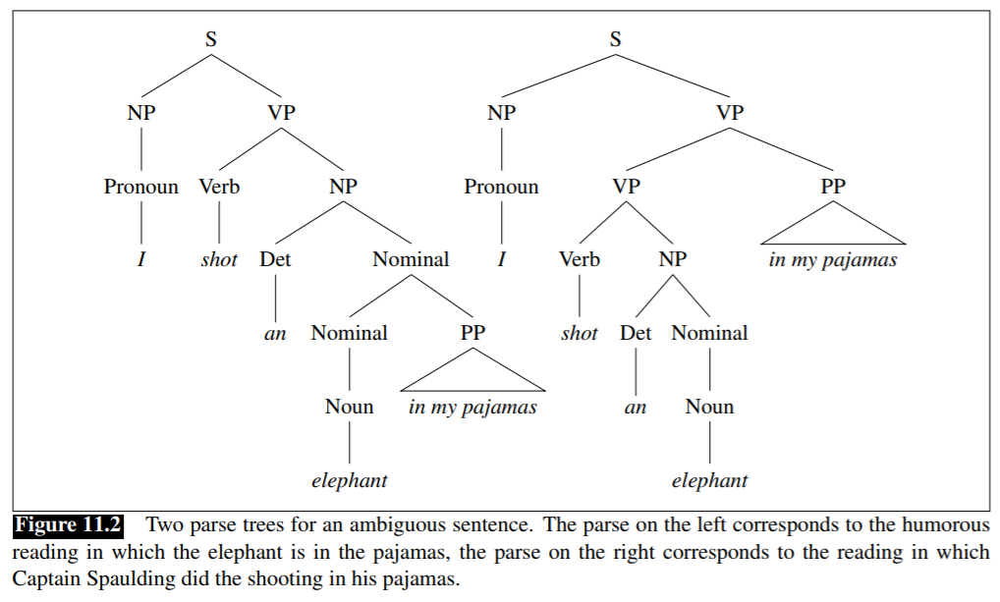
- Coordination Ambiguity
    - [old [men and women]] or [old men] and [women] 


##  CKY Algorithm
- Convet context-free grammar into Chomsky Normal Form (CFG->CNF)
- 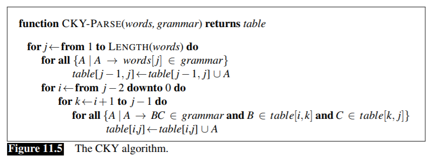
- 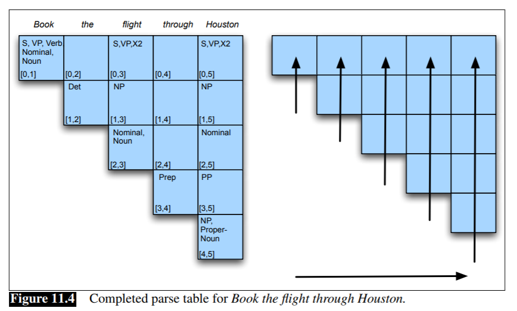

## Partial parsing and chunking
- Partial parsing: export flatter trees
- Chunking: export **flat**, **non-overlapping** segments that constitute the basic non-recursive phrases corresponding to the major content-word parts-of-speech: noun phrases, verb phrases, adjective phrases, and prepositional phrases
    - Example: [NP a flight] [PP from] [NP Indianapolis][PP to][NP Houston][PP on][NP
NWA]
- State-of-the-art chunking: ML
    - Modelled as a classification problem
    - 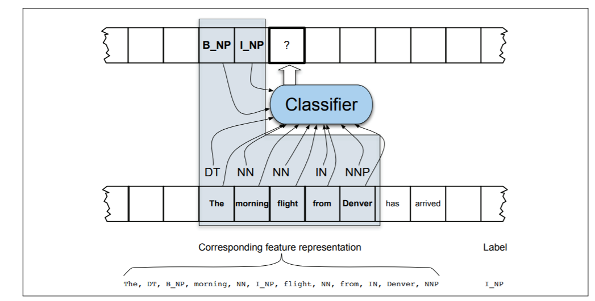
    
## Challenge
- Is able to represent/interpret structural ambiguity, but cannot resolve them
- Needs a methods to compute the probability of each interpretation and choose the most probable interpretation. (***Statistical Parsing***)


# Statistical parsing
***Probabilistic context-free grammar (PCFG)***
- For rules defined from non-terminal node to child nodes, assign a probability (hopefully from a tree bank)$p$ 
- 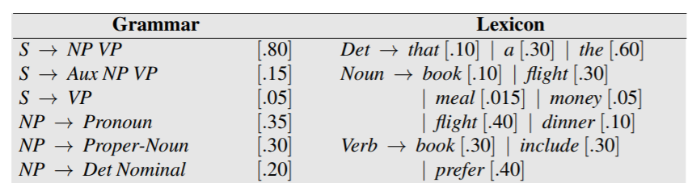
- By comparing the $P = \prod_i p$, we can tell which one is more probable
- Assumptions: 
    - Independence
        - For example, NPs that are syntactic *subjects* are far more likely to be pronouns; In other words, the location of the node in the tree also counts
    - Lack of Sensitivity to Lexical Dependencies
        - For example: [dogs in houses] and [cats], cannot distinguish dog, house, cat; In other words, may have coordination ambiguity
- 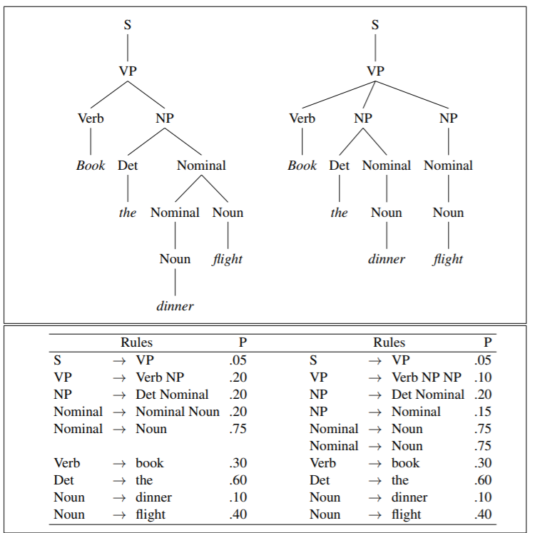
- Usage in Language Modelling
    - N-gram: can only model a couple words of context
    - PCFG: capable of using whole context 


- Some other disadvantage:
    - Rely on a good tagger (PoS, n., v., adj., etc)
    - Non-standard, unseen structures
    - Have to define grammer at the beginning


# Dependency Parsing
- Comparison between 
**Constituency**, phrase structure grammar, context-free grammars (CFGs) and **Dependency** grammar

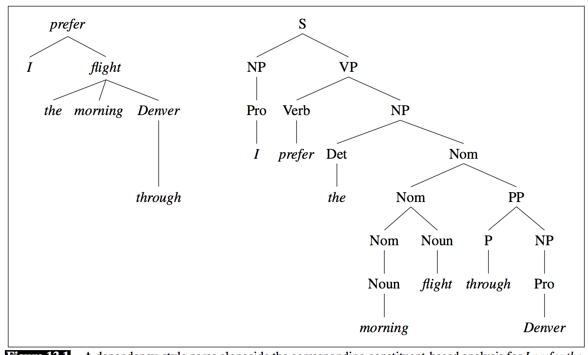

- In dependency parsing, an associated set of **directed**,  binary grammatical relations that hold among the words.

- Advantage: 
    - One link type vs. Multiple set of phrase orders; Good for language with **free word order**
    - Provides an approximation of semantic relationship

## About dependency structure
Argument of relations
- Head
- Dependent

Kinds of (grammatical) relations:
- ***Clausal*** Argument Relations
- Nominal ***Modifier*** Relations

Projectivity
- Crossing arcs leads to non-projectivity

Dependency Treebanks
- Universal Dependencies treebanks


## Methods for dependency parsing
- Transition-based parsing: 
http://stp.lingfil.uu.se/~sara/kurser/5LN455-2014/lectures/5LN455-F8.pdf
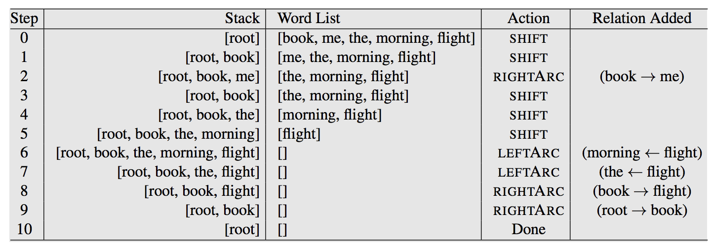

- Discriminative Classification Problem:
    - Features: 
        - Top of stack word, POS; 
        - First in buffer word, POS; etc.
        - ...
        
    - Speed
        - Fast linear time parsing $O(n)$
        
    - Greedy
        - No guarantee for best parsing
        
    - Algorithm
        - Decision Tree, SVM, etc.


- Evaluation
    - Compare each pair of wordswith true relations


## Models based on  Deep Learning 
https://web.stanford.edu/class/archive/cs/cs224n/cs224n.1194/slides/cs224n-2019-lecture05-dep-parsing.pdf

- Evaluate Dependency Parsing Predicions


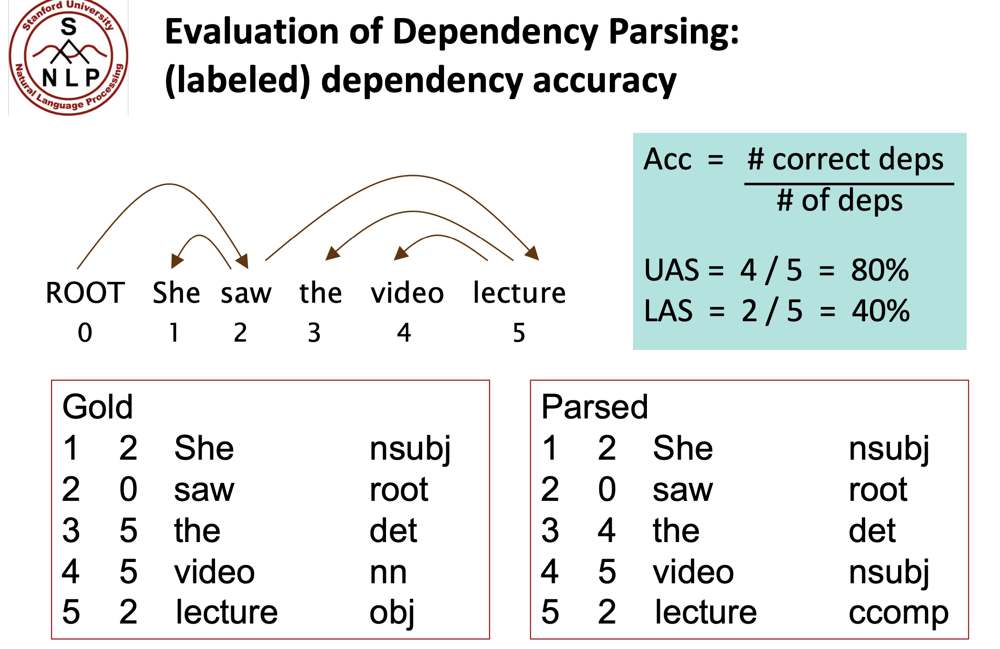

- The input verctors include:
    - embeddings for words
    - POS tags
    - dependency relations
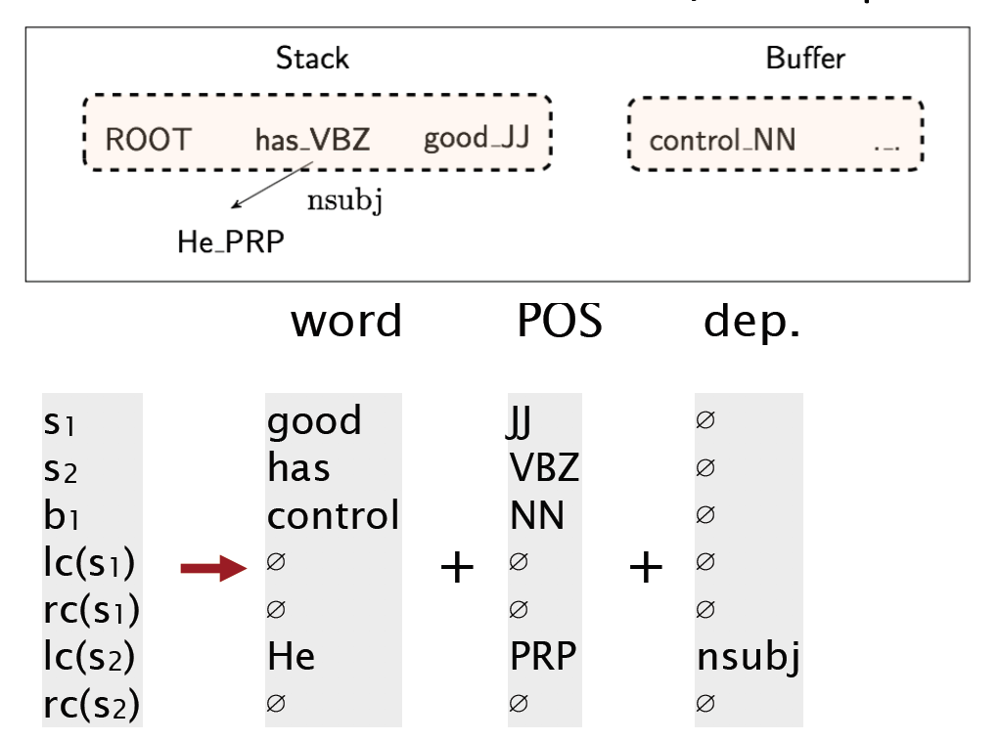

- The ouput is one of the actions:
    - Shift
    - Left Arc
    - Right Arc
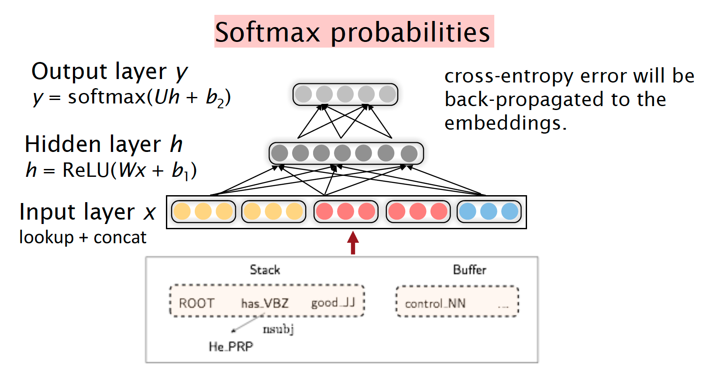

# Word Vectorization


## Frequency and TF-IDF
- Characterize a word based on words within a window-size
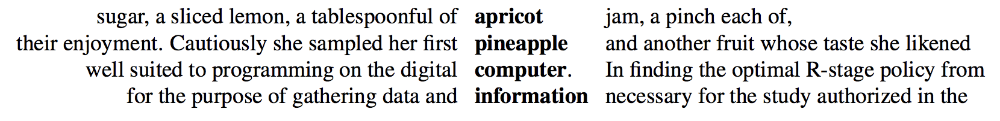
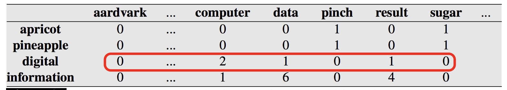


- Result: **Sparse** and **Long** vector


##  Word Embedding 

Motivation:
- Short and Dense
- Capture Synonym
- Less params to avoid overfitting


### Word2vec

- Why other Options not working
    * One-hot vectors (vocabulary list too big; No similarity measurement; how about new words)
    * Co-currence vector (matrix given a certain window size, # of times two words are together)->Sparsity
    * Singular Vector Decomposition (SVD) for cocurrence matrix (too expensive)
    * Use a word's context to represent --> Word embedding
    
    
    
- Key Components
    - Center word *c*, context word *o*
    - Two vectors for each word *w*: $ v_w $ and $ u_w $.
    - $\theta$ contains all *u* and *v* (Input and Output Vector)
    - For example: $ P( w_2 \vert w_1 ) = P(w_2 \vert w_1;  u _{w2}, v _{w1}, \theta )$        
    - After optimization for loss, get two vectors for each word. Combine or Use *u* or Use *v*
    - Can also be learned through a logistic regression


- Variation [ref](https://lilianweng.github.io/lil-log/2017/10/15/learning-word-embedding.html#full-softmax)

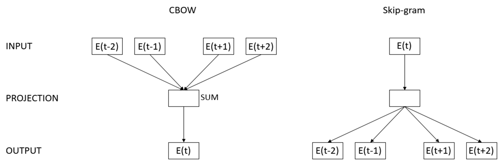


- Skip-grams (SG): given center, predict context
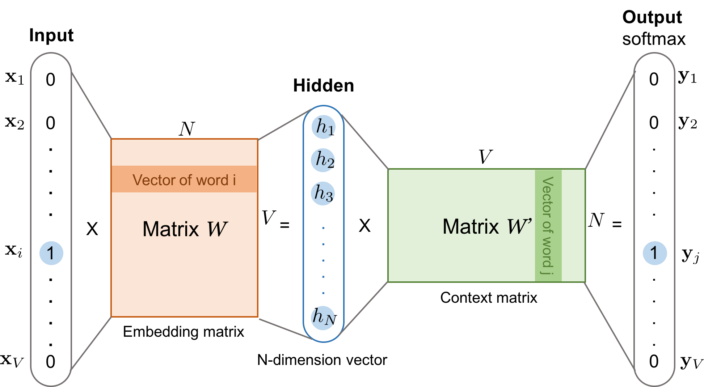


- Countinous Bag of Words (CBOW): given bag of context, predict center

  

  

  
- Define calculation of probability
    $$ P(O \vert I) = \frac{exp(u_I v_O^T)}{\sum _{w}exp(u_I v_j^T)}$$
    - $w$ is entire vocabulary
    - $u$ = Input-hiddern matrix
    - $v$ = hidden-output matrix


- Define loss function
    - For one word given center word $w_I$: 
    $$Loss = - log(P(w_O \vert w_I)) = - log [\frac{exp(u_I v_O^T)}{\sum _{w}exp(u_I v_j^T)}] $$
    
    - For all words in the window of center word $w_I$:
    $$Loss = -\sum _{-M \leq i \leq M, i \neq 0}logP(w _{I+i} \vert w_I)$$

    - For all words in the senetnce:
    $$ Loss = -\frac{1}{T}\sum _{t}\sum _{-M \leq i \leq M, i \neq 0} P(w _{t+i} \vert w_t)$$


- Negative Sampling
    - ref: https://lilianweng.github.io/lil-log/2017/10/15/learning-word-embedding.html#full-softmax
    - The entire vocabulary $w$ is too big, so randomly sample some words to calculate softmax.
    - The probability of each word $P(w) = 1 - \sqrt{\frac{t}{f(w_i)}}$, where f is word frequency, t is hyperparameter.
    - The probability is simplied as:
    $$P(O \vert I) = \frac{exp(u_I v_O^T)}{\sum _{w}exp(u_I v_j^T)} \approx \frac{exp(u_I v_O^T)}{1+exp(u_I v_O^T)} =\frac{1}{1+exp(-u_I v_O^T)}= \sigma(u_I v_O^T)$$
</br>
    - The objective function of **context** word becomes:
    $$Loss = - log(P(w_O \vert w_I)) = - log [\sigma(u_I v_O^T)]$$

    - The objective function of **negative** word becomes:
    $$Loss = - log(1-P(w_N \vert w_I)) = - log [\sigma(-u_I v_N^T)]$$
    
    - The combined negative sampling loss function:
    $$Loss = -[log\ \sigma(u_I v_O^T) + \sum_i log\ \sigma(-u_I v _{N_i}^T)]$$
    - where $N_i$ is from the negative sampling distribution.
    
- Define update for hidden-output matrix $v$ given center word $w_I$    
    - For words other than $O$: $$\frac{\partial L}{\partial v_j} = -\frac{1}{P} \frac{\partial P}{\partial v_j} = u_I P$$
    - For word $O$:$$\frac{\partial L}{\partial v_O} = -\frac{1}{P} \frac{\partial P}{\partial v_O} = u_I (P-1)$$
    - Update rule: $$v = v - \mu  \frac{\partial L}{\partial v}$$


- Define update for input-hidden matrix $u$ given center word $w_I$   
  - $$\frac{\partial L}{\partial u_I} = -\frac{1}{P} \frac{\partial P}{\partial u_I} = \sum _{j \neq O}{v_j P} + v_O (P-1)$$
  - Update rule:$$u_I = u_I - \mu \frac{\partial L}{\partial u_I}$$

- Detailed example and practice: see [Word_Embedding Notebook](Word_Embedding.ipynb)


- Vector similarity
    - Cosine similarity: 
    


###  GloVe
- Combine count-based and direct-prediction
- Learn such linear relationship based on the ***co-occurrence matrix*** explicitly.
- **Training Goal**: To learn word vectors such that their dot product equals the logarithm of the words’ probability of co-occurrence

  
- ref: http://building-babylon.net/2015/07/29/glove-global-vectors-for-word-representations/

- 


# Document Vectorization

## Bag of Word (BoW) Model
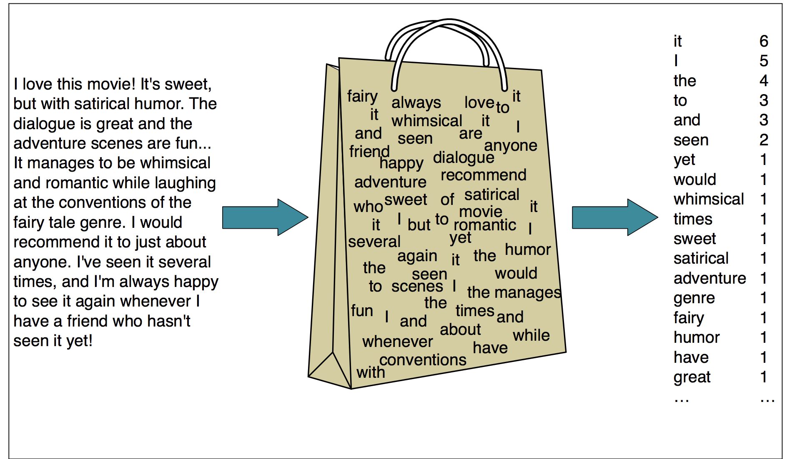

- Frequency encoding: long tail of more significant words
- One-hot encoding: lose information of difference between words
- TF-IDF: captures frequency; eliminate stop-words effect
- TF-IDF: $w _{i,j} = tf _{i,j} \times log(\frac{N}{df_i})$, where 
    - term i and document j
    - $df _{i}$ is number of documents containing term i
    - $tf _{ij}$ is number of ocurrences of term i in document j
    - N is total number of documents


- ***High dimension when vocabulary increases***
- ***Cannot deal with synonym***

- Extension: TF-IDF weighted WordVec

## Matrix Decomposition
- LSA (Latent semantic analysis)
    - Or: **non-negative matrix factorization (NNMF)**
    - Perform SVD on TF-IDF matrix
    
   
    - Compare 2 terms
    
    - Compare 2 documents
    
- Overall problem of vectorization with BoW models
    - cannot measure similarity when sharing no terms
    - high dimensionality with big sparseness
    - lose information on grammar, semantic meanings
    
- ***Hard to explain the physical meaning of SVD***

## Doc2Vec

- Fixed length with lower dimensionality for a document
- A paragraph vector is added. The paragraph vector takes into consideration the ordering of words within a narrow context, similar to an n-gram model.
- Implementation in `gensim`: `model = Doc2Vec(corpus, size=5, min_count=0)`


## Topic Modeling

- For the math, see another notebook [Topic Modelling](Topic%20Modelling.ipynb).
- For detailed application, see another notebook [Yelp NLP](yelp_nlp.ipynb).

---


# Document Similarity
## DSSM (Deep Structured Semantic Models)

- ref: https://arxiv.org/pdf/1706.06978.pdf
- Use case: to match the query $Q$ with multiple docs $D$
- Can be generalized to item recommendation/ranking. The advantage is that **item** and **user** embedding are in two sub-networks. The storage can be done separately, and the inference can be fast.


***Word Hashing***

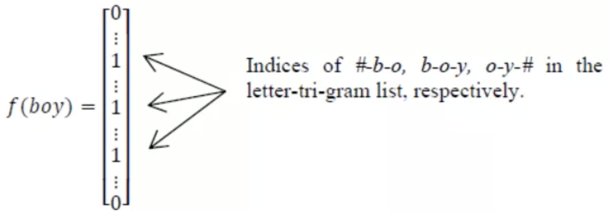

- Use letter-grams to tokenize words, and then use tokenized words to feed into BoW model. 
- Also tackles Out-of-Dictionary words and Typos

***Peformance***
- (+) Good for Recall and initial Ranking
- (-) BoW model didn't consider word orders

## Learning to Rank 

Ref: http://citeseerx.ist.psu.edu/viewdoc/download?doi=10.1.1.723.6492&rep=rep1&type=pdf

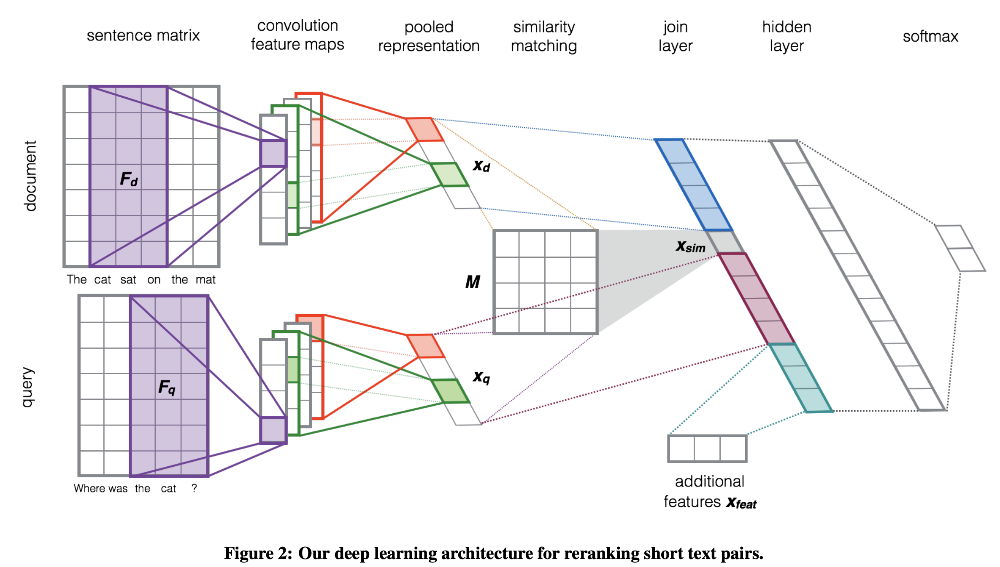

- $sim(x_d, x_q) = x_d^T M x_q$, where similarity matrix $M$ will be trained with other parameters.
- Loss: cross entropy

## InferSent


- A shared sentence encoder that outputs a representation for the premise u and the hypothesis v. Once
- Three matching methods are applied to extract relations between u and v
    - Concatenation of the two representations (u, v)
    - Element-wise product u ∗ v
    - Absolute element-wise difference  \vert u − v \vert 
- The resulting vector a 3-class classifier (entailment，contradiction，neutral) consisting of multiple fullyconnected layers culminating in a softmax layer

# Language Modeling
- Task Definition: 
    - Predict next word
    - Assign probabilities to sequence of words
- For example 
    - google search, spellig check, speed recognition, machine translation

## N-gram model
   - Prototype: $P(L = 3, e_1 = I, e_2 = am, e_3 = WS) = P(e_1 = I) \times P(e_2 = am  \vert  e_1 = I) \times P(e_3 = WS  \vert  e_1 = I, e_2 = am) \times P(e_4 = EoS  \vert e_1 = I, e_2 = am, e_3 = WS)$ 
       - NOTE: from beginning of sentence
   - Advantage of N-gram: Using count of different length of grams as they shown in corpus


   - For example: 2-gram (bigram). Calculate probs of "I am", "am WS", "WS EoS" instead of "I am WS EoS"
       - $P(e_t \vert e^{t-1}_1) = P(e_t \vert e _{t-1}) $]
       - $P(e_t \vert e _{t-1}) = \frac{C(e_t, e _{t-1})}{C(e _{t-1})}$
       - Can be generalized to 3-gram model
       - 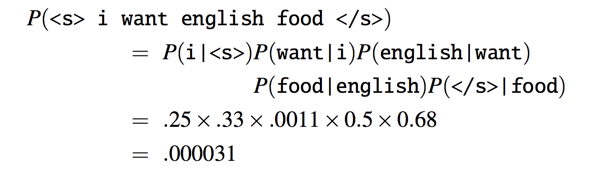


   - Main problem: **Sparsity**, some senetence may not appear in training set, joint probability will be zero (The same problem as Prototype)
   - Fix by **smoothing**/**interpolation**: $P(e_t \vert e _{t-1}) = (1-\alpha)P _{ML}(e_t \vert e _{t-1}) + \alpha P _{ML}(e_t)$
       - A combination of unigram and bigram to ensure P>0
       - Variation: more grams, context-dependent alpha, etc
   - Fix unknown words by adding a "**unk**" word
       - Replace singletopns or words only appearing once/few times in training corpus with $unk$
       - Pre-define a closed vocabulary list $V$, and convert words in training set and not in $V$ to be $unk$


## Neural network models


### NN Model with Fixed Window Size      
   - No Sparsity problem (using input embedding M, so possible to treat similar words similarly during prediction)
   - Model size reduced (Instead of learning all probs {a, b, c} X {A, B, C}, Neural network learn weights to represent the quadratic combination)
   - Ability to skip a previous word
   - BUT: X do not share weight, and how to decide window size


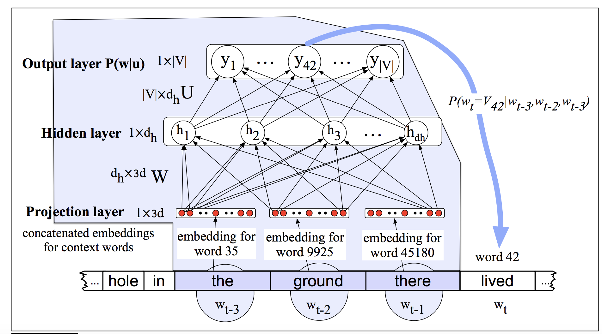
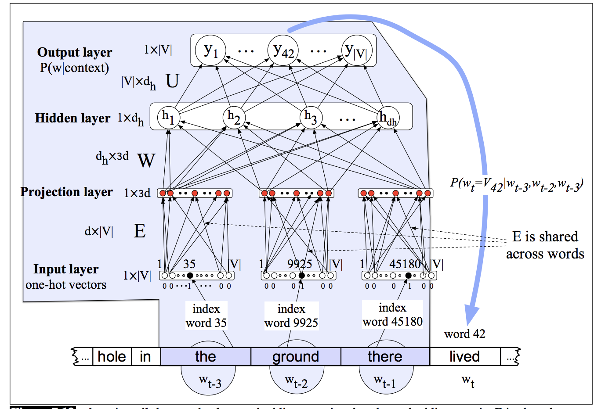

### RNN Model
   - Any sequence length will work
   - Weights shared, model size doesn't increase
   - BUT: computation is slow (why) and cannot access information from many steps back
   - Others applications of RNN
        * One-to-one: tagging each word
        * many-to-one: sentiment analysis
        * Encoder module: example: element-wise max of all hidden states -> as input for further NN model


## Evaluation of LM
- Given 1) Test dataset, and 2) trained language model P with parameter $\theta$
- Log likelihood $log(E _{test};\theta) = \sum _{E\in E _{test}}{log[P(E;\theta)]}$
- Perplexity: $ ppl(E _{test};\theta) = exp(-log(E _{test};\theta) / len(E _{test}))$
    - ppl = 1: perfect
    - ppl = Vocabulary size: random model
    - ppl = +inf: worst model
    - ppl = some value $v$: need to pick $v$ values on average to get the correct one


## BERT
- see section below Transformer

# Classification

## Basic workflow


## General Approach

### Word Window Classification
- Task definition: classify a word in its *Context Window*
    - Advantage: Do not train single word: ambiguity
    - Advantage: Do not just average over window: lose position information
    - Get a vector X with length of 5d where 5 is window size and d is embedding size
    - Predict y based on softmax of WX and minimize cross-entropy error
    
- Example: NER (*Named Entity Recognition*)
    - 'Museums in Paris are good". Binary task: whether Paris is a *location* or not.
    
- What happens for word embedding x:
    - Updated just as weigh W
    - Pushed into an area helpful for classification task
    - Example: $X _{in}$ may be a sign for location


- Some **disadvantages** of window-based methods
    - Anything outside the context window is ignored
    - Hard to learn systematic pattern

### Deep Learning -  CNN

ref: https://blog.goodaudience.com/introduction-to-1d-convolutional-neural-networks-in-keras-for-time-sequences-3a7ff801a2cf


## Part-of-Speech Tagging
- Concepts
    - Closed class: 
        - Prepositions: on, in
        - Particles: (turn sth) over
        - Determiner: a, an, the, this, that
        - Conjunctions: and, or, but
        - Pronouns: my, your, who
    - Open classes:
        - Nouns
        - Verbs
        - Adjectives
        - Adverbs


- Tagset:
    - 45-tag Penn Treebank tagset
    
- Training set
    - Corpora labeled with parts-of-speech
    
- Ambiguity:
    - Example: book (noun. or verb.)
    - Solution1: Most Frequent Class Baseline: for example: $a$ is a determiner instead of a letter in most cases
    

### Hidden-Markov-Model (HMM) for PoS tagging

**Prepare transion matrix from training examples**
- A matrix: tag transition matrix
    - VB: verb, MD: modal verb like "will"
    - $P(VB \vert MD) = \frac{C(MD, VB)}{C(MD)} = 0.8$
- B matrix: emission matrix
    - $P("will" \vert MD) = \frac{C(MD, "will")}{C(MD)} = 0.3$
    
    

 
**Define Optimal solution**
- Solve by NB
- $Tag^* _{1-n} = {argmax}_t P(T _{1-n} \vert W _{1-n}) \\
\xrightarrow{Bayesian} P(T _{1-n})P(W _{1-n} \vert T _{1-n}) \\
\xrightarrow{Inpendence\ Assumption} P(T _{1-n}) \prod _{i=1}^n P(W_i \vert T_i) \\
\xrightarrow{Bigram\ Assumption}  \prod _{i=1}^n P(T_i \vert T _{i-1}) \prod _{i=1}^n P(W_i \vert T_i) \\
=  \prod _{i=1}^n P(T_i \vert T _{i-1})P(W_i \vert T_i)$ 

**Solution Algorithm**
- The Viterbi Algorithm
    - Essentially dynamic programming problem
    - See mini example for details: http://www.davidsbatista.net/assets/documents/posts/2017-11-11-hmm_viterbi_mini_example.pdf
    - $\delta_i(T)=max _{T _{i−1}}  P(T \vert T _{i−1})⋅P(W _{i−1}∣T _{i−1})⋅\delta_i(T _{i−1})$
    - 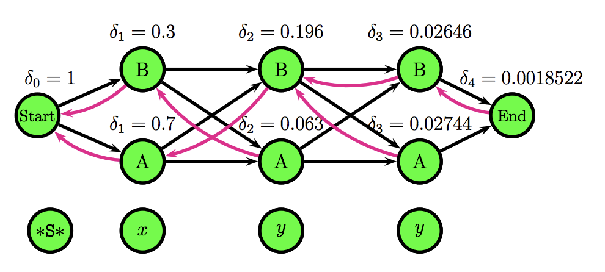
    - Note: if previoys state is fixed, it is equivalent to NB


- Beam search
    - Better computational efficiency
    

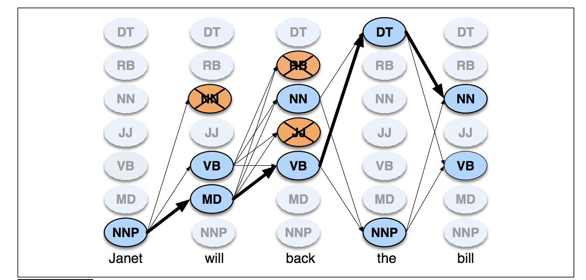

**Extensions**
- Modify Bigram Assumption to be Trigram Assumption: $\prod _{i=1}^n P(T_i \vert T _{i-1}, T _{i-2})P(W_i \vert T_i)$
- Add awareness of sentence end: $[\prod _{i=1}^n P(T_i \vert T _{i-1}, T _{i-2})P(W_i \vert T_i)]\ P(T _{n+1} \vert T_n)$
- Data interpolations to fix sparseness: similar to smoothing in n-gram models

### Maximum Entropy Markov-Model (MEMM)
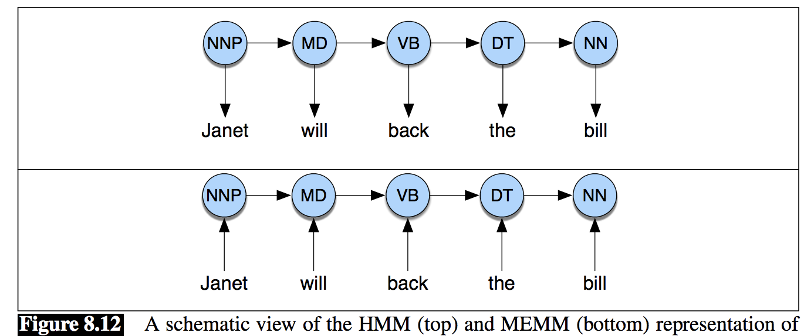

-  HMM/Generative: $$Tag^* _{1-n} = {argmax}_t P(T _{1-n} \vert W _{1-n}) \\
\xrightarrow{Bayesian} P(T _{1-n})P(W _{1-n} \vert T _{1-n}) =  \prod _{i=1}^n P(T_i \vert T _{i-1})P(W_i \vert T_i)$$ 


- MEMM/Discriminative: $$Tag^* _{1-n} = {argmax}_t P(T _{1-n} \vert W _{1-n}) = \prod _{i=1}^n P(T_i \vert T _{i-1}, W_i)$$

$$p(T_i \vert T _{i-1},W_i) = \frac{e^{s(T_i, T _{i-1},W_i)}}{\sum_c e^{s(T_c, T _{i-1},W_i)}} $$

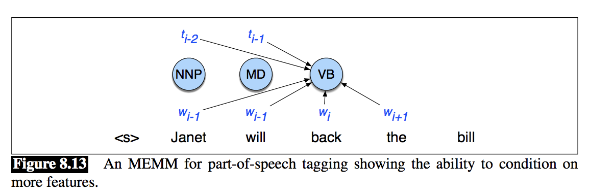
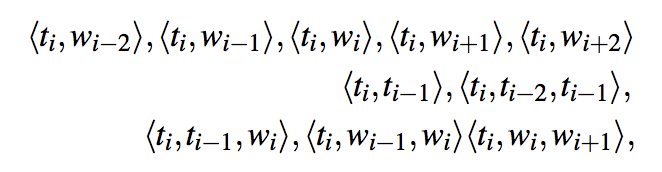

**Extension**

Ability to contain feature sets besides simply $w_i$ and $t _{i-1}$.
- wi contains a particular prefix (from all prefixes of length ≤ 4)
- wi contains a particular suffix (from all suffixes of length ≤ 4)
- wi contains a number
- wi contains an upper-case letter
- wi contains a hyphen
- prefix
- suffix
- ......
  

**Solution Algorithm**: 
- Viterbi algorithm just as with the HMM

**Main drawback**:
- Label Bias Problem: MEMM are normalized locally over each observation where the transitions going out from a state compete only against each other, as opposed to all the other transitions in the model.
- ref: https://awni.github.io/label-bias/
- The label bias problem results from a “conservation of score mass” This means that all of the incoming probability to a state must leave that state. An observation can only dictate how much of the incoming probability to send where. It cannot change the total amount of probability leaving the state. The net result is any inference procedure will bias towards states with fewer outgoing transitions.


### Conditional random field (CRF model)
- ref: http://www.davidsbatista.net/blog/2017/11/13/Conditional_Random_Fields/
- CRFs are used for predicting the sequences that use the contextual information to add information which will be used by the model to make a correct prediction.
    - Output transition and observation probabilities are not modelled separately.
    - Output transition dependent on the state and the observation as one conditional probability.

- 


**feature function $f$**
- ref: https://blog.echen.me/2012/01/03/introduction-to-conditional-random-fields/
- Input:
    - sentence $s$
    - the position $i$ of a word in the sentence
    - the label $y_i$ of the current word
    - the label $y _{i−1}$ of the previous word
- Output:
    - A real-valued number (often either 0 or 1).
- Example:
    - $f_1(s,i,y _{i},y _{i−1})=1$ if $y_i$= ADVERB and the ith word ends in “-ly”; 0 otherwise. 
    - If the weight $w_1$ associated with this feature is large and positive, then this feature is essentially saying that we prefer labelings where words ending in -ly get labeled as ADVERB.


**A typical formulation of features**

$$s(\vec x,  \vec y) =  \sum _{t=0} [A _{y _{t-1}, y_t} + P(y_t  \vert  x_t)]$$

- $A$ transition matrix from label $y _{t-1}$ to label $y _{t}$
- $P$ emission matrix from word $x_t$ to label $y_t$.
  
    

$$P(y \vert X) = \frac{e^{s(x, y)}}{\sum _{y \in \mathbf Y}{s(x, y)}}$$

- The loss function becomes 
$$-log[\hat P(y_0 \vert X)]$$

### Summary of three models 


***Below is the graph representation of HMM, MEMM and CRF***
- 


- HMM/Generative: two components reflect two independence assumptions

$$ P(T _{1-n} \vert W _{1-n})  =  \prod _{i=1}^n p(T_i \vert T _{i-1})p(W_i \vert T_i)$$ 


- MEMM/Discriminative: normalize over the set of possible output labels at **each** time step -> locally normalized

$$P(T _{1-n} \vert W _{1-n}) = \prod _{i=1}^n P(T_i \vert T _{i-1}, W_i)$$

$$p(T_i \vert T _{i-1},W_i) = \frac{e^{s(T_i, T _{i-1},W_i)}}{\sum _{c \in \mathbf C} e^{s(T_c, T _{i-1},W_i)}} $$


- CRM: Global Normalization. The only difference is how we **normalize** the scores. Note that it's computational more expensive than MEMM.

$$P(T _{1-n} \vert W _{1-n}) = \prod _{i=1}^n P(T_i \vert T _{i-1}, W_i)$$

$$p(T_i \vert T _{i-1},W_i) = \frac{e^{s(T_i, T _{i-1},W_i)}}{\sum _{T' \in \mathbf T} e^{s(T'_i, T' _{i-1},W_i)}} $$

- A good blog about the comparison: https://awni.github.io/label-bias/

### Bi-LSTM + CRF

- 

---

- 

- ref:http://proceedings.mlr.press/v95/li18d/li18d.pdf
- ref: https://arxiv.org/pdf/1508.01991.pdf


- Bi-LSTM: get embeddings of each word, and to capture both past and future information
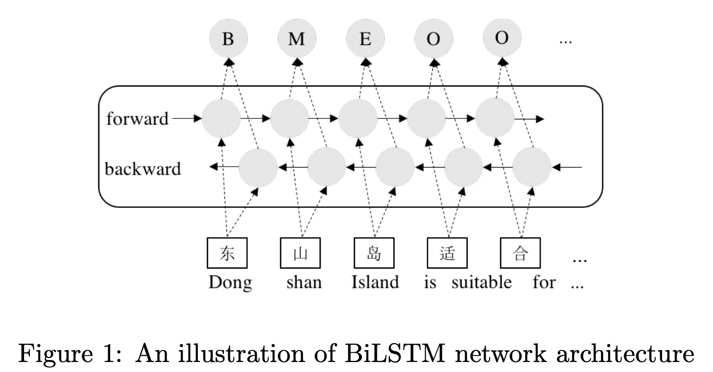

- CRF: put constraint on adjacent labels, and to predict the tags of whole sentence jointly
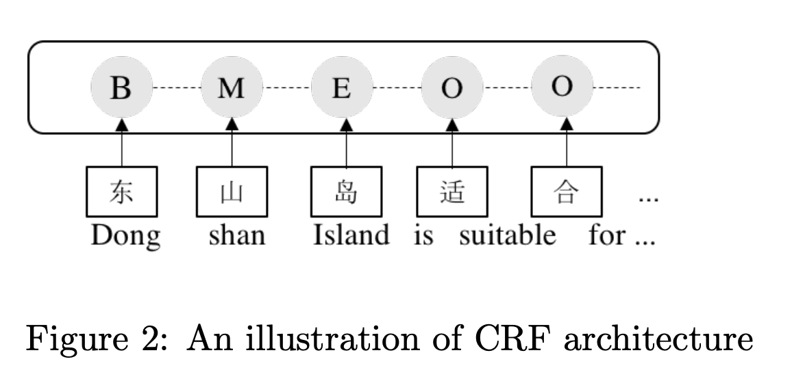

- Bi-LSTM and CRF
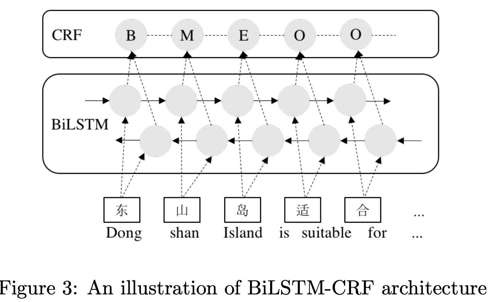


- Math:
    - $$s(\vec x,  \vec y) =  \sum _{t} [A _{y _{t-1}, y_t} + P(y_t  \vert  x_t)]$$
    - Where emission matrix: $P(\vec y_t  \vert  \vec x_t) = g(LSTM)$

## Named Entity Recognition

- Typical types of entity
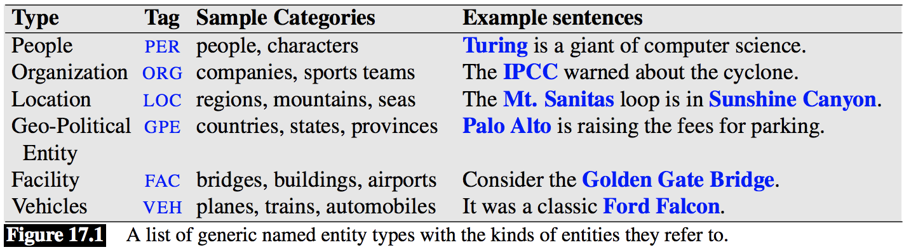

- When ambiguity arises
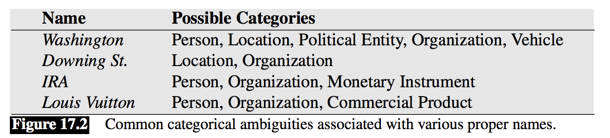

### Modelling Approach
- Features
    - identity of $w _{i-1}, w_i,w _{i+1}$
    - embeddings for $w _{i-1}, w_i,w _{i+1}$
    - part of speech of $w _{i-1}, w_i,w _{i+1}$

    - base-phrase syntactic chunk label of $w _{i-1}, w_i,w _{i+1}$
    - $w_i$ contains a particular prefix (from all prefixes of length ≤ 4)
    - $w_i$ contains a particular suffix (from all suffixes of length ≤ 4)
    - $w_i$ is all upper case
    - word shape of $w _{i-1}, w_i,w _{i+1}$
        - for example: $DC10-30$ would map to $XXdd-dd$

- Model
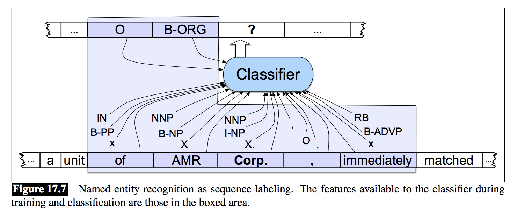

    - Rule-basded models
    - Deep-learning models
        - 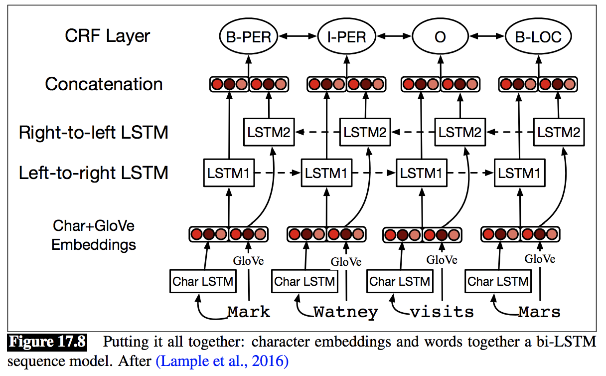

    -  Also see above section

 

## Sentiment Analysis

### Tokenzation

- Preprocessing
    - Remove stopword
    - Remove tags
    - Remove urls
    - Lemmatization
    - Stemming


- Prepare dictionary
    - Emotion icons (human labels), replace with text
    - Acronym dictionary (lol), replace with full form


- example:
    - Ref: http://sentiment.christopherpotts.net/tokenizing.html
    - **Raw**: 
    >:SentimentSymp:  can't wait for the Nov 9 #Sentiment talks! YAAAAAAY!!! >:-D http://sentimentsymposium.com/.>
    - **Tokens**:
        - @sentimentsymp
        - :
        - can't
        - wait
        - for
        - the
        - Nov_09
        - #sentiment
        - talks
        - !
        - YAAAY
        - !
        - !
        - - !
        - ">:-D"
        - http://sentimentsymposium.com/

### Affect Lexicon
- **Emotions**: is one of the different dimensions for affect lexicons, like emotions, attitudes, personalities, etc.

- **Sentiment**: can be viewed as a special case of emotions in the valence dimension, measuring how pleasant or unpleasant a word is.

- How to create sentiment lexicon (Lexicon Induction Methods)
    - Human labelling
    - Supervised
    - Semi-supervised - General Approach
        - Start from seed words that define 2 poles (good vs. bad)
        - Measure the similarity of new word $w$ with seed words
    - Semi-supervised - 0
        -  Using WordNet synonyms and antonyms
    - Semi-supervised  - 1
        - Word vectors can coming from fine-tuned off-the-shelf word embeddings
        - Cosine similarity
    - Semi-supervised - 2
        - "And": similar polarity - fair and legitimate, corrupt and brutal
        - "But" opposite polarity - fair but brutal
    - Semi-supervised - 3
        - Define Pointwise Mutual Information: $PMI(X,Y) = log \frac{P(X, Y)}{P(X)P(Y)}$
        - Polarity(Phrase) = PMI(Phrase, "good") - PMI(Phrase, "bad")

### Features

- ***Add negation***:
    - Example: did**n’t** like this movie , but I ...
    - Becomes: didn’t **NOT_like** **NOT_this** **NOT_movie** , but I ...


- ***BoW features***

    - Unigram/Bigram: 
        - bigram addressed the problem of only considering single word, but larger vector
        - example: (I go out, (I go, go out))
    - Bag of Word 
    - TF-IDF (**Problem**: dimension too big)


- ***Environment Features***
    - Location
    - Time
    - Device
    - .....


- ***Linguistic Features***
    - **Human efforts involved**
    - Length of comment
    - Number of negative words
    - Sum of prior scores
    - Number of hashtags
    - Number of handles
    - Repeat characters
    - Exclamation, Capitalized tesxt
    - Number of new lines
      

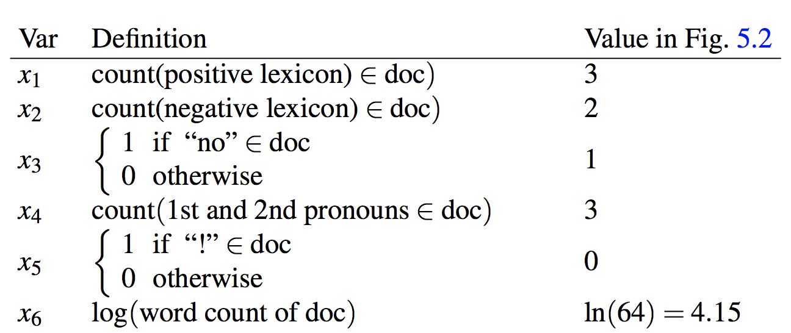

### Evaluation Metrics
- Precision
- Recall
- Accuracy
- F1
- AUC

### Model 

- Baseline Model
    - Lexicon-based method: Count +/- words
        - Example from *MPQA lexicon*
        - "+": admirable, beautiful, confident, dazzling, ecstatic, favor, glee, great
        - "−" : awful, bad, bias, catastrophe, cheat, deny, envious, foul, harsh, hate
        - The prediction can be simply $\sum_i^n{s_i}$, where $s_i$ is the signed score of each word (i.e., accounting for negation).


- Naive Bayes  (Calculate $P(k), P(X \vert k)$)
    - 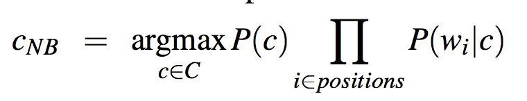
    -  Naïve Bayes classifiers assume that the effect of a variable value on a given class is independent of the values of other variable. This assumption is called class conditional independence.
    - ***Good for small dataset, and easy to train***
    - Numerical Example:
    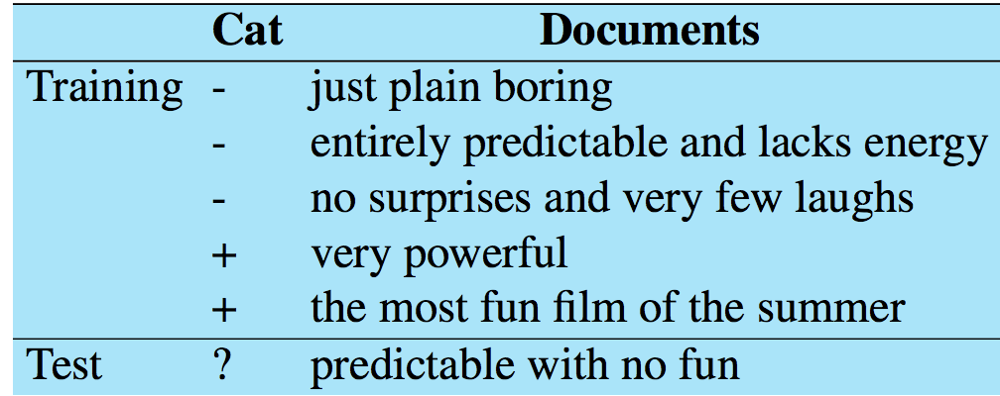
    - P(+) =, P(-) = 
    - P(predictable \vert +) = ...
    - P(predictable \vert -) = ...
    - P(+)P(S \vert +) = ...
    - P(-)P(S \vert -) = ...
    
    - Some improvements for sentiment analysis:
        - Code word appearance instead of frequency

- Comparison between NB and LR
    - NB: Strong conditional independence assumption
    - LR: better estimate correlated features
    - LR: add regularizations:
        - L1: Laplace Prior
        - L2: Gaussian Distribution with zero meam
        - Bayesian interpretations: ${argmax}_w [P(Y \vert w,x)P(w)] = {argmax}_w [Log(P(Y \vert w,x)) - \alpha \sum w^2]$ when $P(w)$ is zero mean Gaussian


- Machine Learning Algorithm
    - SVM
    - DT/RF/BT
    
- Deep Learning Algorithm
    - Set sequence length
    - Set vocabulary size
    - Word embedding
        - Pre-trained (GloVe)
        - Online-traning
    - CNN
    - LSTM
        - E.g., word "not" can be rotating the polarity of the next word
    
- Syntactic meanings
    - Dependency parsing
    - Coreference
    - Sentence structure

### Beyond Sentence-level Positive/Negative Problem

- https://www.cs.uic.edu/~liub/publications/kdd04-revSummary.pdf
- https://static.googleusercontent.com/media/research.google.com/en//pubs/archive/34368.pdf
- Example: 
>  The food was great but the service was awful!

- ***Step 1***: Find the *Features* (i.e., food, service)
    - 1. Perform PoS tagging on the sentence, and extract Nouns (NN) and Noun Groups / Phrase (NG)
    - 2. Find the high-frequency NN/NG
    - 3. Apply some feature prune rules. 
        - e.g., frequency > 3
        - e.g.,  noun sequences which follow an adjective like "great *food*".


- ***Alternative Approach***
    - Identify all coarse-grained aspects of interest using domain knowledge.
    - Human label sentences/nouns in the review. (i.e., n1 -> Food, n2 -> Serive)
    - Build supervised learning models to generate labels


- ***Step 2***: Find the *Opinion Words* (i.e., great, awful)
    - 1. Find nearby adjective that is close to the *features*
    - 2. Find some infrequent features


- ***Step 3***: Find the orientation of each *Opinion Word*
    - 1. Establish a set of seed words
    - 2. Adjective synonym set and antonym set from WordNet 

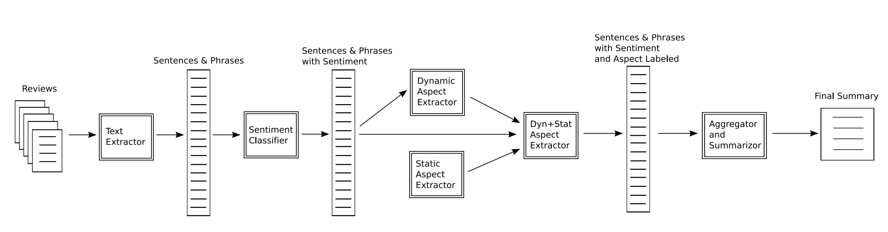

---


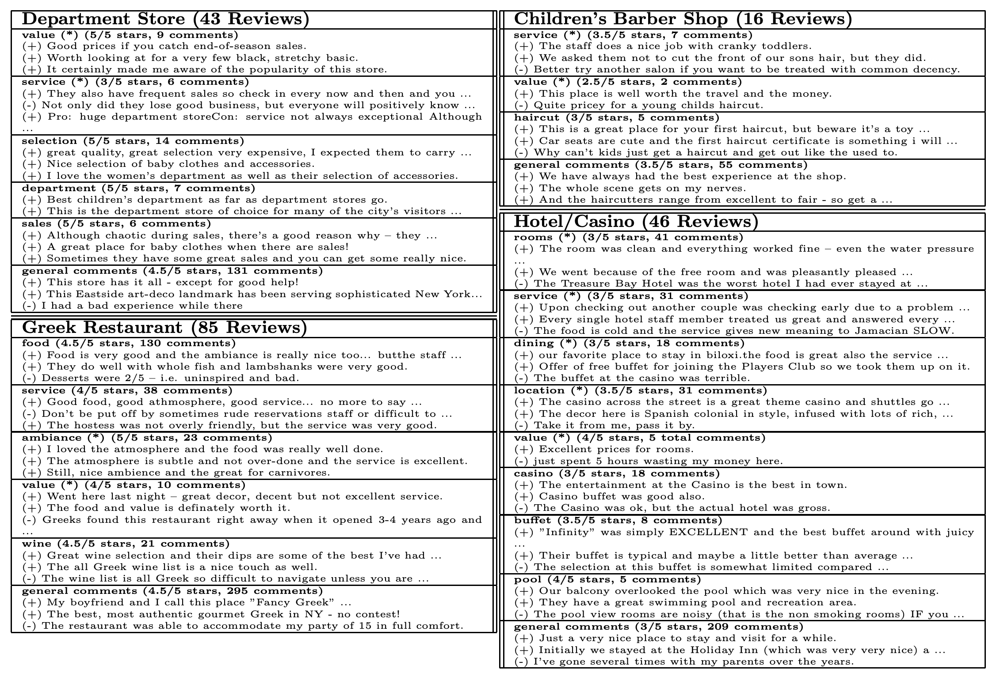


```python

```


```python

```


```python

```

## Word Sense Disambiguity
https://slideplayer.com/slide/5187871/

Background Example:
- **Lemma**: Mouse, has 2 **senses**
    1. any of numerous small rodents...
    2. a hand-operated device that controls a cursor...


- Words with the same **sense**: ***Synonyms***
- Words with the opposite **senses**: ***Antonym***
- Words with similarity: similar words (cat, dog)
- Words with relatedness: (coffee, cup, waiter, menu, plate,food, chef), they belong to the same **senamtic field**
- Words with taxonomic relations: we say that vehicle is a **hypernym** of car, and dog is a **hyponym** of animal

### Baseline
- Just pick most frequent sense


### Knowledge-Based

***How to define similarity***
- Each word has gloss, example, etc.
- Lesk Algorithm: $Score\ (sense_i, context_j) = similarity\ (example_i, context_j)$. For example: bank vs. deposits
- Similarity can be defined by, e.g., percent of overlapping words
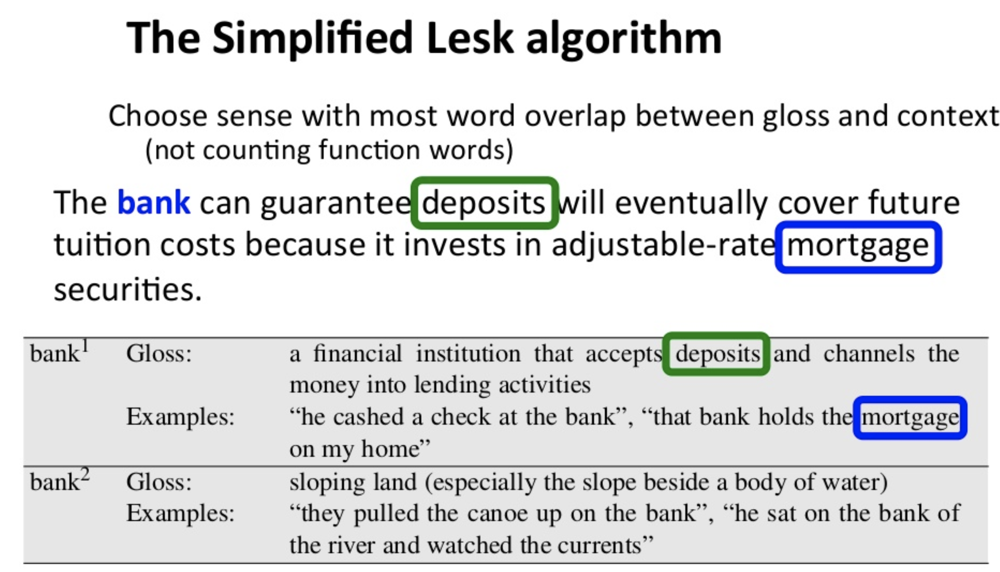

***Pro/Con***
- One model for all
- Can use similar words / synosym if example is limited
- These algorithms are overlap based, so they suffer from overlap sparsity and performance depends on dictionary definitions.


### Supervised 

***How to featurize a sample text***
- Collocational features: Position-specific information
    - *"guitar and --bass-- player stand"*
    - Feature: POS tag for targets and neighbors, and context words: $[w _{i-2}, POS _{i-2}...,w _{i+2}, POS _{i+2} ]$


- Other syntactic features of the sentence
    - Passive or not


- BoW features
    - Vocabulary list: [[fishing,	big,	sound,	player,	fly,	rod,	pound,	double,	runs,	playing,	guitar,	band]	]
    - Feature: [0,0,0,1,0,0,0,0,0,0,1,0]	
    

***Apply classfication algorithms***
- NB
- SVM


***Pro/Con***
- This type of algorithms are better than the two approaches w.r.t.implementation perspective.
- These algorithms don’t give satisfactory result for resource scarce languages. 
- Need to train it for each word

### Semi-supervised
- Bootstrapping

### Unsupervised
- Word-sense induction
- Topic modelling
- Clustering

# Machine Translation

## Problem definition
- Neural Machine Translation (NMT)
- Sequence-to-Sequence(seq2seq) architecture
- Difference from SMT (Statistical MT): calculate P(y \vert x) directly instead of using Bayes
- Advantage: Single NN, less human engineering
- Disadvantage: less interpretable, less control

## Main Components
- Encoder RNN: encode source sentence, generate hidden state
- Decoder RNN: **Language Model**, generate target sentence using outputs from encoder RNN; predict next word in *y* conditional on input *x*


<tr>
    <td>  </td>
    <td>  </td>
    </tr>

   

Bidirectional Encoder

* Allow information from future inputs
* LSTM only allows past information


​    


Google’s neural machine translation (Google-NMT) 


## Beam Search


- Greedy decoding problem
    * Instead of generating argmax each step, use beam search.
    * Keep *k* most probable translations
    * Exactly *k* nodes at each time step *t*
    * *Note*: Length bias, prefer shorter sentence because the log(P) accumulates. Can add prior for sentence length to compensate.
    

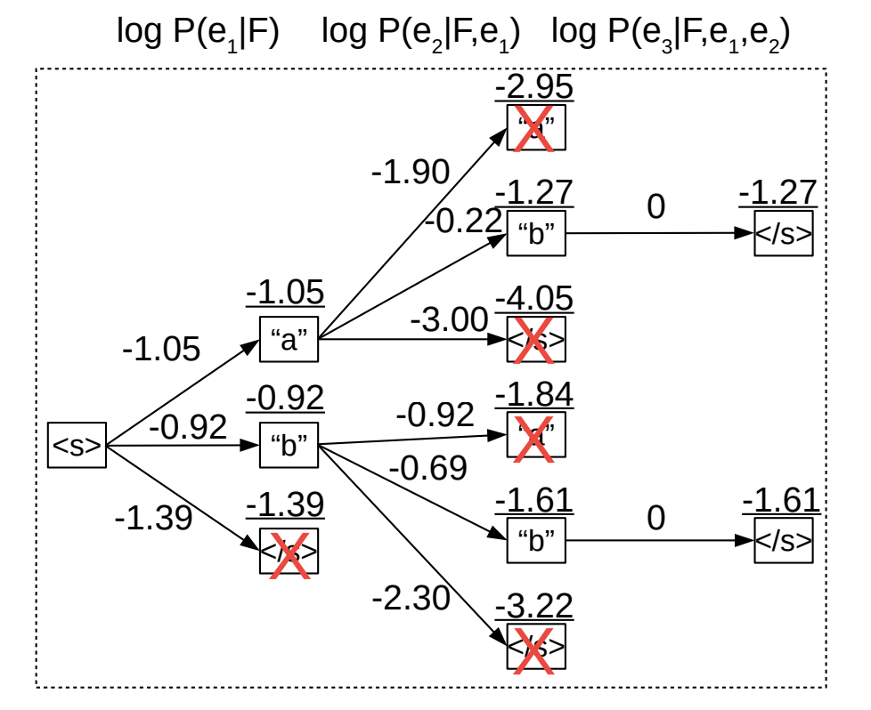
https://arxiv.org/pdf/1703.01619.pdf

## Attention model


### General Advantage

- Focus on certain parts of source (Instead of encoding whole sentence in **one single** hidden vector, here the sentence is coded as whole input **sequence**.)
- Provides shortcut / Bypass bottleneck
- Get some interpretable results and learn alignment
- "Attention is a mechanism that forces the model to learn to focus (=to attend) on specific parts of the input sequence when decoding, instead of relying only on the hidden vector of the decoder’s LSTM"


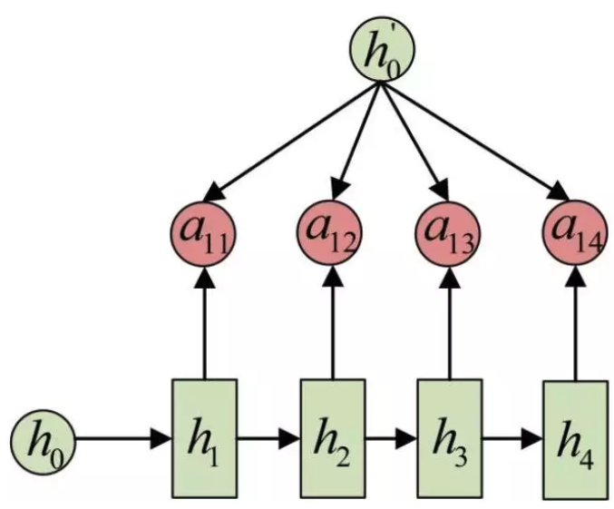

### Luong attention mechanism


1. Get ***encoder*** hidden states: $ h_1, ..h_k,..., h_N $

1. Get ***decoder*** hidden state at time *t*: $ s_t $
    - $s_t = LSTM(s _{t-1}, \hat y _{t-1})$<br/><br/>
    
1. Get attention scores by dot product: 
$ \mathbf e_t = [s^T_t h_1, ..., s^T_t h_N] $
    - Other alignment options available <br/>
     
    - Penalty available: penalize input tokens that have obtained high attention scores in past decoding steps 
    - $e'_t = e_t\ if\ t = 1\ else\ \frac{exp(e_t)}{\sum _{j=1}^{t-1}{exp(e_j)}} $ for decoder state
   
    - With FC layer: 
    
4. Take softmax of $ \mathbf e_t $ and get $ \pmb\alpha_t $ which sum up to one
    - $ \pmb\alpha_t = softmax(\mathbf e_t) $
    - Note: $\pmb\alpha_t$ can be interpreted as attention. For example, when generating word `vas`, the attention for `are` in encoder hidden states should be close to 1, others to 0<br/><br/>
    
5. Take weighted sum of hidder states $\mathbf h$ and $\pmb\alpha$, and get context vector **c**
    - $ c_t = \sum _{k=1}^{N} \alpha _{tk}h_k $<br/><br/>
    
6. Generate *Attentional Hidden Layer*
    - $ \tilde h_t = tanh(W_c[c_t;s_t])$<br/><br/>

7. Make Predicition
    - $ p = softmax(W_s \tilde h_t)$


### Bahdanau Attention Mechanism

**Main difference**

1. Get attention scores by dot product: 
    - $ \mathbf e_t = [s^T _{t-1} h_1, ..., s^T _{t-1} h_N] $<br/><br/>

1. Get decoder hidden state at time *t*: $ s_t $
    - $s_t = LSTM(s _{t-1}, \hat y _{t-1}, c_t)$<br/><br/>
    
1. Make Predicition: 
    - $ p = softmax(g(s_t))$


- Another way to illustrate:
    - Step 1:  
    - Step 2:  

**Comparison of two mechanism**


**Example of attention weights**


## Pointer Network
- RNN (LSTM): difficult to predict rare or out-of-vocabulary words
- Pointer Network: generate word from input sentence (i.e., OoV - out of Vocabulary words)


- Part I: Seq2Seq Attention Model
    - See above
    - $p _{vocabulary}(word)$
    
- Part II: Pointer Generator
    - After getting $ \pmb\alpha_t = softmax(\mathbf e_t) $
    - $p _{pointer}(word) = \sum \alpha_t$, where position t is actually word w


- Weighted sum: 
    - $g * p _{vocabulary}(word) + (1-g) * p _{pointer}(word) $
    
- Applications:
    - Summarization
    - Question-Answering

Illustrations:
1) Pointer Generator:


Illustration: 2) Combine Attention Seq2seq and Pointer

ref: https://arxiv.org/pdf/1704.04368.pdf
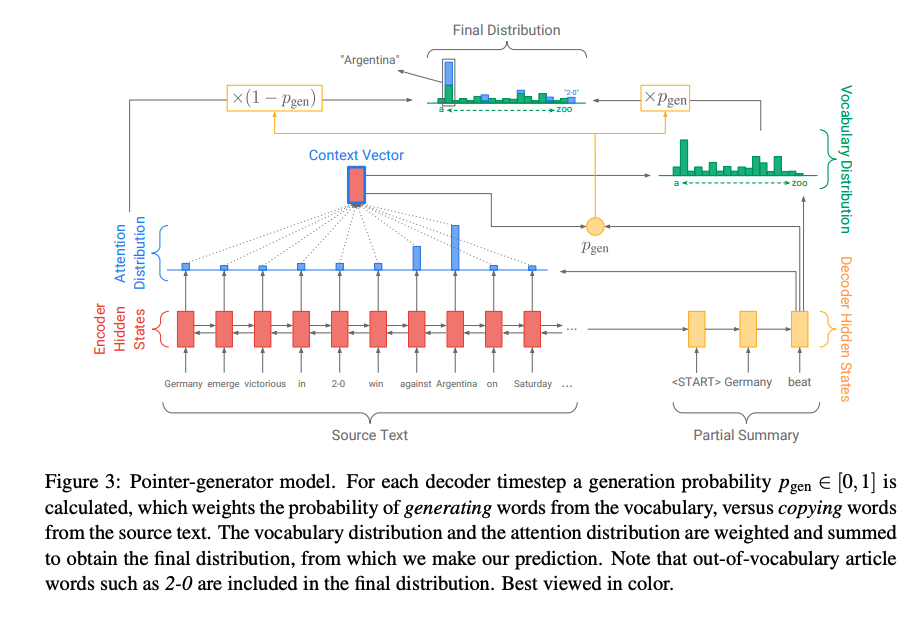

## Self/Intra/Inner Attention

- Why do we need self-attention
    - As the model processes each word (**each position** in the input sequence), self attention allows it to look at other positions in the input sequence for clues that can help lead to a better encoding for **this word**. Now it is **Bi-directional** instead of single-directional
    - 


- How to calculate?
    - By having Q / K / V matrice (to be trained)
    - 
    - ---
    - 


- How to incorporate multiple heads (i.e., multiple self attention mechanisms / representation subspaces? 
    - Motivation: having different attentions based on type of questions, like who / what / when.
    - By having multiple Q / K / V weight matrix
    - 
    - 

## Transformer Network

ref: 
- https://papers.nips.cc/paper/7181-attention-is-all-you-need.pdf
- http://jalammar.github.io/illustrated-transformer/
- https://lilianweng.github.io/lil-log/2018/06/24/attention-attention.html

- Purpose
    - ***Neural Machine Translation***, Speech Recognition, text-to-speech recognition
    - The Transformers outperforms the *Google Neural Machine Translation model* in specific tasks.
- Motivations
    - RNN: 
        - information loss along the chain (long-term dependency problem)
    - LSTM: 
        - still have information loss for long sentence, because distance between positions is *linear* (i.e., when the distance is increasing, probability of keep the context is lower) 
        - cannot be parallelized (computation is sequential)
    - RNN with Attention:
        - code sentence as sequence of hidder states instead of a single one
        - focus on difference positions at each time step
        - still cannot be parallelized
    - CNN:
        - can be parallezied (distance between input and output is on the order of $log(N)$.
        - cannot figure out the problem of dependencies
    - Transformer:
        - self-attenton layer: have dependencies (i.e., access to all positions, non-directional)
        - fc layer: have no dependencies and can be executed in parallel


- How to acccount for order of words? / Distnace between words
    - By having position encodings
    - 


- How the encoder looks like:
    - 


- How the decoder looks like:
    - 

-  Difference from encoder: 
    - In the decoder, the **"Self-Attention"** layer is only allowed to attend to earlier positions in the output sequence. This is done by masking future positions (setting them to -inf) before the softmax step in the self-attention calculation.
    - The **"Encoder-Decoder Attention** layer works just like multiheaded self-attention, except it creates its Queries matrix from the layer below it, and takes the Keys and Values matrix from the output of the encoder stack.


- How the output looks like:
    - Using typical softmax layer
    - 


# BERT

- Bidirectional Encoder Representations from Transformers
    - Goal: generate a language model (LM)
    - Motivation: transfer learning in image classification
    - Approach: only use the encoder mechanism from transformer
    - Comparison with Wordvec/Glove:
        - In wordvec, each word has single embedding (e.g., bank is a financial institute vs, bank of the river) - ***context-independent***. Also note that **word order** is ignored during training.
        - In bert: the whole ***context*** is considered to generate the vector
    - Use cases:
        - Classification
        - Question Answering
        - NER

- How the BERT model is trained?
    - Task 1: Masked LM (MLM) - Masking 15% of the word as *MASK*.
    - The goal is the predict the masked words based on unmasked words.
    - 
    
    - Task 2: Next Sentence Prediction (NSP)
    - During training, 50% of the inputs are a pair in which the second sentence is the subsequent sentence in the original document, while in the other 50% a random sentence from the corpus is chosen as the second sentence.
    - 

reference:
- http://jalammar.github.io/illustrated-bert/
- https://towardsdatascience.com/bert-explained-state-of-the-art-language-model-for-nlp-f8b21a9b6270
- https://www.kdnuggets.com/2018/12/bert-sota-nlp-model-explained.html

**Question Answwering using BERT**

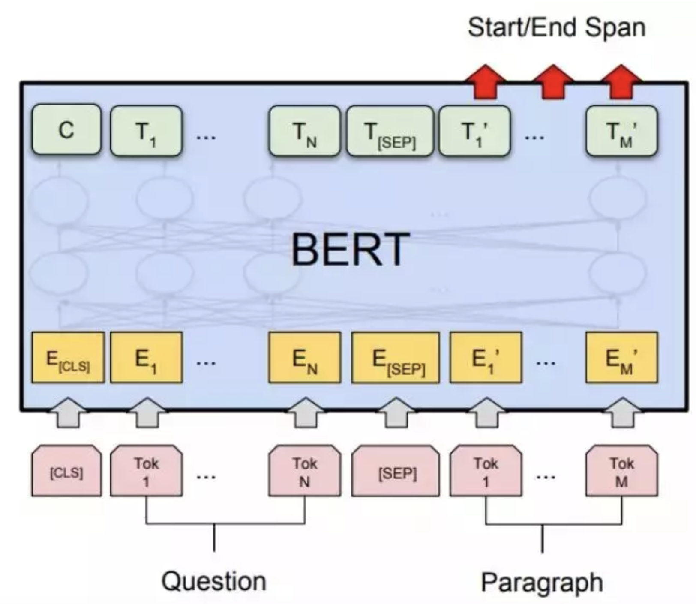

- let one dense network predict the position of answer start, and another for answer end.
- use cross entropy for loss function

# Question-Answering

## Knowledge-based Question Answering

- Extract information from structured database
- Examples
    - “When was Ada Lovelace born?” → **birth-year (Ada Lovelace, ?x)**
    - “What is the capital of England?” → **capital-city(?x, England)**

- General Approach
    - Parse question text
    - Align parsed trees to logical forms
    - 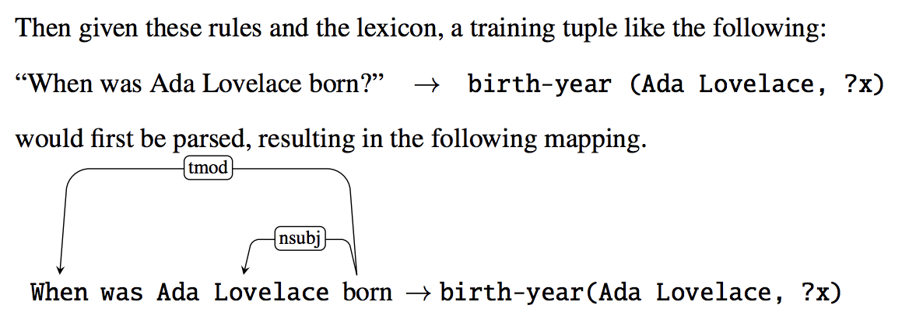
    

## Information Retrieval (IR) -based Factoid Question Answering
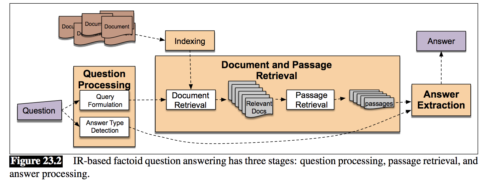

***Query Formulation***
- Input: Question Text
- Output: [***Tokens***] sent to IR system
- Example: 
    - Before: when was the laser invented
    - After: the laser was invented
- Model:
    - Human rules
    

***Question-Type Classifier***
- Input: question text
- Output: NER or predefined category
- Example:
    - who {is  \vert  was  \vert  are  \vert  were} **PERSON**
    
- Model: supervised-learning
    - Features:
        - word embeddings
        - PoS tags
        - NERs in question text
     - Often: Answer type word
         - Which **City**
         - What **Time**

***Retrieve Documents***
- Initial Ranking
    
- Based on similarity/Relevance to query
    
- Further Ranking
    - Supervised Learning
    - Features:
        - The number of named entities of the right type in the passage
        - The number of question keywords in the passage
        - The longest exact sequence of question keywords that occurs in the passage
        - The rank of the document from which the passage was extracted
        - The proximity of the keywords from the original query to each other 
        - The number of n-grams that overlap between the passage and the question
        
        

***Answer Extraction***
- Baseline: 
    - Run NER tagging, and return span that matches the question-type
    - For example:
        - “How tall is Mt. Everest?” [**DISTANCE**]
        - The official height of Mount Everest is **29029 feet**
        

- Supervised-Learning
    - Goal: to determine if a span/sentence contains answer
    - Feature-based
        - Answer type match
        - Number of matched question keywords
        
    - Deep learing
        - Example: question: *“**When** did Beyonce release Dangerously in Love?*
        - Example Answer: *Their hiatus saw the release of Beyonce’s debut album, Dangerously in Love **(2003)**, which established...*
        - 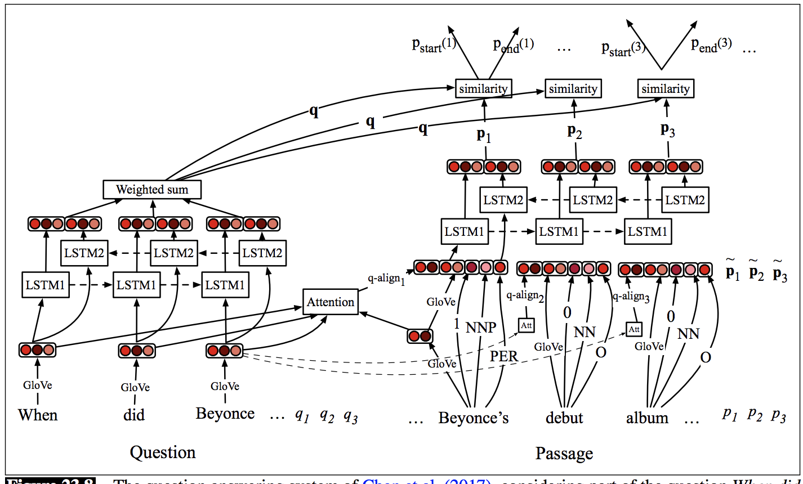

# Coreference Resolution
## Coreference and Anaphora
- Barak Obama travelled to,..., Obama
- Obama says that he ....

## Mention detection
- Pronouns (I, your, it) - Part-of-Speech (POS) tagger
- Named Entity (People name, place. tec) - NER system
- Noun phrase (The dog stuck in the hole) - constituency parser

## Coreferece model
- Mention pair
    * For each word, look at candidate antecedents, and train a **binary** classifier to predict $p(m_i,m_j)$

- Mention rank
    * Apply softmax to all candidate antecedents, and add highest scoring coreference link
    * Each mention is only linked to **one** antecedent
    
- Clustering


- Neural Coref Model
    * Input layer: word embedding and other catogorical features (e.g., distance, document characteristic)
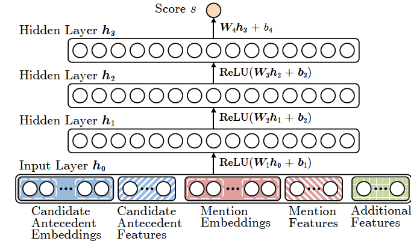


- End-to-end Model
    * No separate mention detection step
    * Apply LSTM and attention
    * Consider span of text as a candidiate mention
    * Final score: $s(i, j) = s_m(i) + s_m(j) + s_a(i, j)$, which means Is i, j mentions, and do they look coreferent.
    

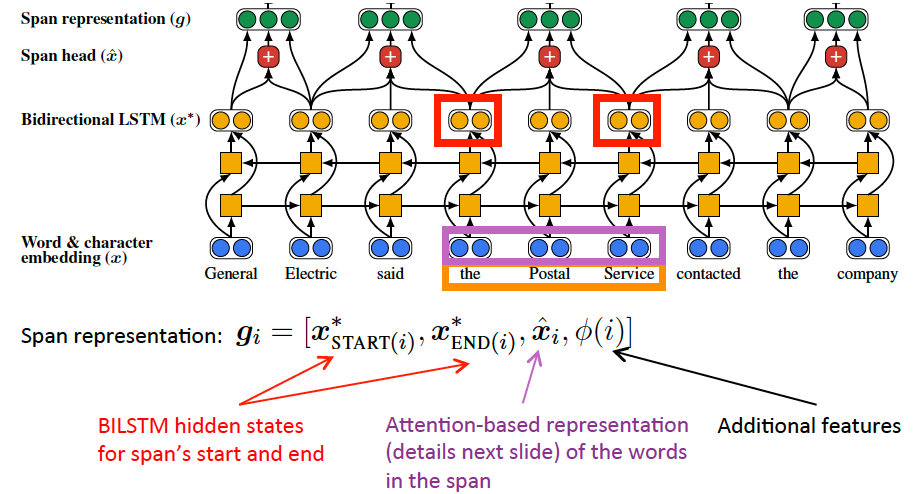

# Comparison of tools

https://www.kdnuggets.com/2018/07/comparison-top-6-python-nlp-libraries.html

