# Overview


**General Workflow**
- Generate features from user behavior (indirect) / user attributes (direct) for pairs of $(u,i)$
    - Behavior weighing (view, click, purchase)
    - Behavior time (recent or past)
    - Behavior frequency
    - Item popularity (more popular, less important)
    
- Apply algorithms (as in following sections), and get candidate list of items
    - For a give user feature vector, retrieve $(item, weight)$
    - There can be multiple tables (e,g., one table for CF, one-table for content-based) or (e.g., one table for browse, one table for click)


- Filtering based on business rules
    - For example, only recommend new products
    
- Ranking by some criterias
    - For example, variety


Input data also includes:
- User Info (sex, income)
- Item Info (BOW, TF-IDF)
- User-Item Interaction
    - active/explicit: rating
    - passive/implicit: clickstream analysis


# Memory-based CF

## Load some sample dataset


```python
%load_ext autoreload
%autoreload
import pandas as pd
import numpy as np
import scipy.sparse as sp
from scipy.sparse.linalg import svds
from scipy.spatial.distance import cosine
from scipy import sparse
from script import cf
```

**Import Example Data**

Load example data


```python
header = ['user_id', 'item_id', 'rating', 'timestamp']
df = pd.read_csv('./data/ml-100k/u.data', sep='\t', names=header)
df.head()
```

<table border="1" class="dataframe">
  <thead>
    <tr style="text-align: right;">
      <th></th>
      <th>user_id</th>
      <th>item_id</th>
      <th>rating</th>
      <th>timestamp</th>
    </tr>
  </thead>
  <tbody>
    <tr>
      <th>0</th>
      <td>196</td>
      <td>242</td>
      <td>3</td>
      <td>881250949</td>
    </tr>
    <tr>
      <th>1</th>
      <td>186</td>
      <td>302</td>
      <td>3</td>
      <td>891717742</td>
    </tr>
    <tr>
      <th>2</th>
      <td>22</td>
      <td>377</td>
      <td>1</td>
      <td>878887116</td>
    </tr>
    <tr>
      <th>3</th>
      <td>244</td>
      <td>51</td>
      <td>2</td>
      <td>880606923</td>
    </tr>
    <tr>
      <th>4</th>
      <td>166</td>
      <td>346</td>
      <td>1</td>
      <td>886397596</td>
    </tr>
  </tbody>
</table>


```python
n_users = df.user_id.unique().shape[0]
n_items = df.item_id.unique().shape[0]
print ('Number of users = ' + str(n_users) + '  \vert  Number of movies = ' + str(n_items))
```

    Number of users = 943  \vert  Number of movies = 1682


```python
df_matrix = np.zeros((n_users, n_items))
for line in df.itertuples():
    df_matrix[line[1]-1, line[2]-1] = line[3]
df_matrix.shape
```


    (943, 1682)


## Define Cosine Similarity

$Similarity = cos(\theta) = \frac{\mathbf A \cdot \mathbf B }{ \vert  \vert \mathbf A \vert  \vert    \vert  \vert \mathbf B \vert  \vert  }$


```python
user_similarity = np.zeros((n_users, n_users))
for i in range(n_users):
    u= df_matrix[i,]
    for j in range(n_users):
        v= df_matrix[j,]
        user_similarity[i,j] = np.dot(u,v) / (np.linalg.norm(u,ord=2) * np.linalg.norm(v,ord=2)) 
```


```python
from sklearn.metrics.pairwise import pairwise_distances
user_similarity = pairwise_distances(df_matrix, metric='cosine')
user_similarity.shape
```


    (943, 943)


```python
item_similarity = pairwise_distances(df_matrix.T, metric='cosine')
item_similarity.shape
```


    (1682, 1682)


## Evaluation metrics

- Rating prediction: RMSE, MAE
- Top-k rating precision: Precision, Recall, AUC
    - % of the top-k recommendations that were actually used by user
- Possible benchmark model: global top-k recommendations

## Prediction

### User-Item Filtering
- Users who are similar to you also liked ...
- Prediction for user __k__ for movie **m**:

- Prediction = User **k** bias + adjustmemnt from similar user
    - $ \hat{x} _{k,m} = \bar x_k + \frac{\Delta}{Norm}  $


- Adjustment = (similarity with another user) * (rating of another user - bias of another user)
    - $ \Delta = \sum _{k_0}UserSim(k, k_0) \cdot (x _{k_0, m} - \bar x _{k0})$

    - $ Norm = \sum _{k_0} \vert UserSim(k, k_0) \vert $


```python
%%writefile ./script/cf.py
import numpy as np

def ui_predict(ratings, similarity):
    all_user_mean = ratings.mean(axis = 1)
    ratings_diff = (ratings - all_user_mean[:, np.newaxis]) # (943, 1682)
    
    adjust = similarity.dot(ratings_diff)
    norm = np.array([np.abs(similarity).sum(axis=1)]).T

    pred = all_user_mean[:, np.newaxis] + adjust / norm
    
    return pred

```


```python
from script.cf import *
cf.ui_predict(df_matrix, user_similarity).shape
```


    (943, 1682)


### Item-Item Filtering
Users who liked this item also liked ...
- $ \hat{x} _{k,m} = \frac{\sum _{m_0}ItemSim(m, m_0)}{Norm}  \cdot x _{k, m_0}$
  

How to understand $ItemSim(m, m_0)$:
- Dot product: number of users who like both item $m$ and item $m_0$ (If input matrix is not rating)
- $ItemSim(m, m_0)$: added normalization to [0,1]

Result:
- Each item $m_0$ is contributing to rating of the target item $m$


```python
%%writefile -a ./script/cf.py

def ii_predict(ratings, similarity):
    norm = np.array([np.abs(similarity).sum(axis=1)])
    pred = ratings.dot(similarity)  / norm
    return pred
```

    Appending to ./script/cf.py


```python
cf.ii_predict(df_matrix, item_similarity).shape
```


    (943, 1682)


## Comparison between user-based and item-based
|User-based       | Item-based           |
| ------------- |:-------------:|
| more socialized      | more personalized |
| fro example: news | for example: books|
| update user-similarity matrix| update item-similarity matrix|
| number of user << number of items | number of user >> number of items|
| Not interpretable | Interpretable|
| Cold starting: No problem for new items (after 1 action) | Cold starting: no problem for new users (after one action)|

# Model-Based CF - Matrix Decomposition

## Matrix Factorization or Latent Factor Model
Singular-Value-Decomposition

- see SVD notebook for math behind SVD


- $M = U \times \Sigma \times V^T  $ Note: $\Sigma$ can be multipled to U or V
- Con: need default value for missing value in rating matrix
    - For like (0/1) or implicit feedback: 
    - 1) balanaced negative samples + postive samples
    - 2) draw negative samples from popular items 
    
- U and V are low-dimention latent vectors (Embeddings) for users and movies. 
    - How to interpret this dimensions? Genres (i.e., users' preference for Genre $k$ and a given book's weight on genre $k$)
    
- Alternative approach: $Min(L) = \sum _{i,j}{(u_i v_j - x _{ij})^2} + Regularization (u,v)$
    - Solved by SGD


​    


```python
u, s, vt = svds(df_matrix, k = 20)
s_diag_matrix = np.diag(s)
X_pred = np.dot(np.dot(u, s_diag_matrix), vt)
```


## Other methods: 
- Probabilistic factorization (PMF)
    * P = dot_product(i,j) + User_i_bias + movie_j_bias + intercept
- Non-negative factorization (NMF)

- Weighted rankings from two models
- Cascade: 1) Accurate model -> rough rank; 2) 2nd one to refine
- Treat collaborative factors as extra feature for content-based model

## Comparison with memory-based CF
- No need to store user-user ($ U \times U $) or Item-Item ($ I \times I$) similarity matrix in memory. The memory requirement is $F \times (U + I)$
- Matrix calculation on real-time is hard for large number of items, so mainly for off-line. Time complexity can be $F \times U \times I$. While memory-based method just needs a look-up table.
- Hard to interpret

# Model-Based CF - Deep Learning

- Main difference with SVD
    - Don't require orthogonal vectors as in SVD
    - Learn the embedding by itself
    - Allows non-linearity instead of just dot product
    
- Extra benefits
    - Can incoporate additional features like user profile
    

## Model Types

### Idea 1
- One-hot encoding for user i
- Hiddern layer: Embedding layer for users
    
    - Weights: latent vector for users
    
- Output layer: output ratings for each item j
    - Weights: latent vector for movies
    
    
###  Idea 2
- One-hot encoding for user i
- Hiddern layer: Embedding layer for users
    - Weights: latent vector for users
    
- One-hot encoding for item j
- Hidden layer: output ratings for each movie j
    - Weights: latent vector for movies


- More hidden layers
    - Compared with matrix factorization, more representation power


### Neural CF 


## Example of Neural CF in Keras


```python
import keras
from IPython.display import SVG
from keras import Model
from keras.optimizers import Adam
from keras.layers import Input, Embedding, Flatten, Dot, Concatenate, Dense, Dropout
from keras.utils.vis_utils import model_to_dot
```

    Using TensorFlow backend.


### Model Params


```python
n_latent_factors = 20
```

### Define Model


```python
item_input = Input(shape = [1], name = 'Item-input')
item_embedding = Embedding(n_items, n_latent_factors, name = 'Item-embedding')(item_input)
item_flat = Flatten(name = 'Item-flatten')(item_embedding)
```


```python
user_input = Input(shape = [1], name = 'User-input')
user_embedding = Embedding(n_users, n_latent_factors, name = 'User-embedding')(user_input)
user_flat = Flatten(name = 'User-flatten')(user_embedding)
```

**Option1**


```python
dotprod = Dot(axes=1, name='DotProduct')([item_flat, user_flat])
model = Model([item_input, user_input ], dotprod)
model.compile('adam', 'mean_squared_error')
```


```python
from keras.utils import plot_model
plot_model(model, to_file='../assets/figures/dl/model_ncf.png')
#SVG(model_to_dot(model,  show_shapes=True, show_layer_names=True, rankdir='HB').create(prog='dot', format='svg'))
```

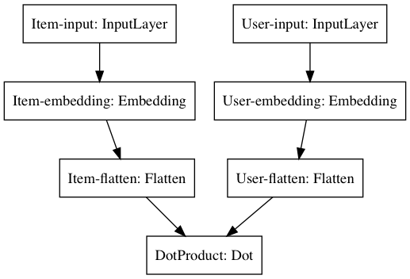

**Option2**


```python
concatenate = Concatenate(name='Concatenate')([item_flat, user_flat])
dropout = Dropout(0.2,name='Dropout')(concatenate)
dense_1 = Dense(20,activation='relu', name='FC-1')(dropout)
activation = Dense(1, activation='relu', name='Activation')(dense_1)
model = Model([item_input, user_input ], activation)
model.compile('adam', 'mean_squared_error')
```


```python
from keras.utils import plot_model
plot_model(model, to_file='../assets/figures/dl/model_ncf2.png')
#SVG(model_to_dot(model,  show_shapes=True, show_layer_names=True, rankdir='HB').create(prog='dot', format='svg'))
```

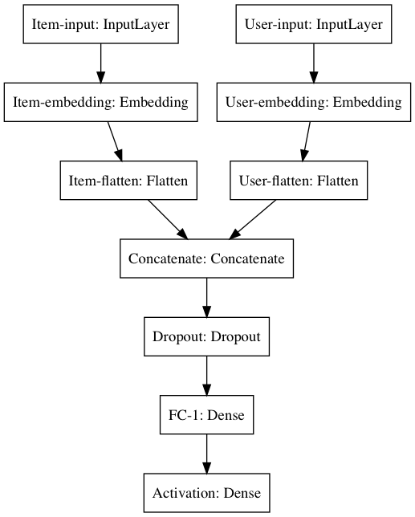


# Item Embedding / Content-basd Recommendation

- Different from item-based CF, where similarity is calculated based on user-item-interactions
- Similarity is calculated based on item attribute (for example, location, price, cuisine, etc.)
    - Output: An item space with defined distance
- One model for one user; No interaction between users


## Item2Vec
- Similar with Word2Vec, where each item is converted to a embedding vector

$$E = -\sum_i \sum_j logP(j \vert i)$$
- y=1 if item j and i appears in the same user's selection (i.e., in the same sentence)
- Difference from word2vec: no time window restriction
- Also applies negative sampling 
- Output: embedding of each item
- (-) how to address items as a network?

## Graph Embedding

### DeepWalk

- Original user behaviors  (note: three different users in this example).
- Construct item graph
- Random walk sequences (**DFS** - Deep First Search)
- Apply word2vec skipgram model
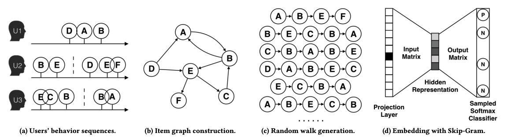

### LINE（Large-scale Information Network Embedding）

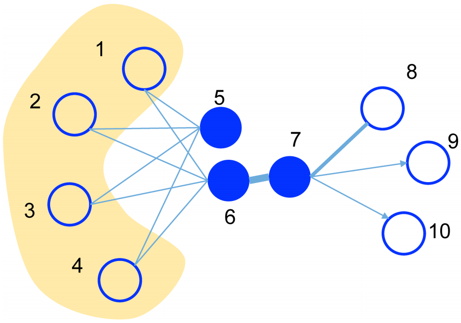

- Main Difference: Definition of higher order node similarity (e.g., node 5 and node 6)
    - 1st order: 
    $$MinO_1 = d(p_1, w_1)$$
    $$p_1(i,j)  = sigmoid(\mathbf u_i^T \cdot \mathbf u_j)$$
    
    - 2nd order: 
    $$MinO_2 = d(p_2, w_2)$$
    $$p_2(j \vert i)= softmax(\mathbf u_i^T \cdot \mathbf u'_j)$$
    
    
### node2vec

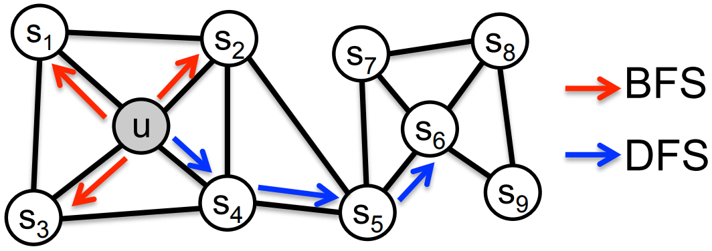

- Main Difference: Definition of node homophily (u, s1, s2, s3, s4) and structural equivalence (u, s6).

- Homophily - DFS - red arrow
- In RecoSys: same genre, attribute or purchased together.
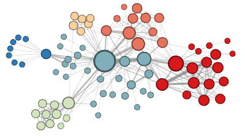

- Structural Equivalence - BFS - blue arrow
- Best / Worst item of each genre, or other structural similarity.
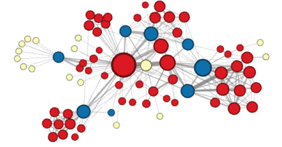

- Two parameters $p$ and $q$ jointly determines the balance between DFS and BFS

### Alibaba: Enhanced Graph Embedding with Side Information
ref: 
- https://arxiv.org/pdf/1803.02349.pdf
- https://mp.weixin.qq.com/s/LrdmMi5ulmNZZpRN3HtHMQ

- Focus: Matching phase instead of ranking phase. The main goal is the item embedding, and item similarity.


- Why not CF: CF depends on historial co-occurence of items under same user. It cannot capture higher-order
similarities in users’ behavior sequence.


- Problem with traditional graph embedding: some items with few interaction. How to do cold-starting.


- Motivation: use **side information** to enhance the embeddings (e.g., category, brand, price) with different weights


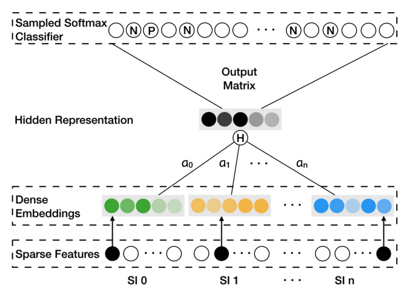

- Solve for $W$ and $\alpha$. 
    - j = 0 represents weights for item embedding
    - j > 0 represents weights for side-info embedding
$$H_v = \frac{\sum_j e^{\alpha_j} \cdot w_j}{\sum e^{\alpha}} $$

- For cold start items without any interactions
    - CF doesn't work
    - Item graph cannot be constructed
    - Represent it with **the average embeddings of its side information**, and calculate dot product with embeddings of other items.
    

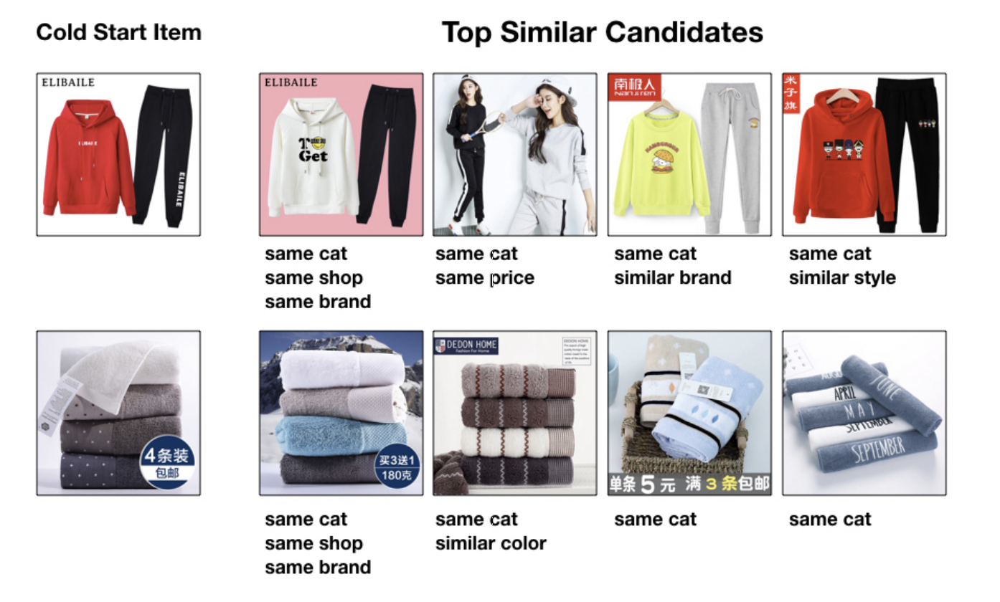

### Airbnb:
ref:
- https://mp.weixin.qq.com/s/vZN5Jr8DWsDQvOToOCxSOg
- https://dl.acm.org/doi/pdf/10.1145/3219819.3219885
- https://medium.com/airbnb-engineering/listing-embeddings-for-similar-listing-recommendations-and-real-time-personalization-in-search-601172f7603e


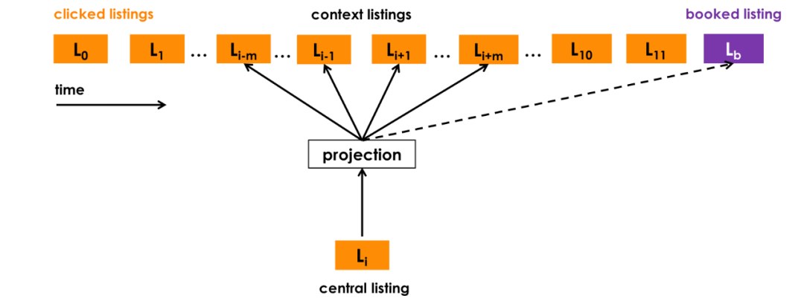

**Definition of loss function**

- The combined negative sampling loss function: 
    $$Loss = -[\sum _{(l, c) \in pos} log\ \sigma(u_c v_l^T) + \sum _{(l, c) \in neg_1} log\ \sigma(-u_c v_l^T) + log\ \sigma(u _{l_b} v_l^T) +  \sum _{(l, c) \in neg_2} log\ \sigma(-u_c v_l^T)]$$
    - $l$: center listing, $c$: context listing

- Center listing $l$: clicked listing
- $pos$: positive context listings that was clicked by *same* user before and after center listing within a **window**. Goal is to push center listing *l* closer to listings in $pos$.
- $neg_1$ comes from randomly sampled listing.
- Third component: use **booked listing** as global context even it falls out of the context windows. Goal is to ush center listing *l* closer to booked listing.
- Fourth component: $neg_2$ comes from randomly sampled listing from **the same market** as center listing.

**Application of embeddings in personalized ranking**

- Base features:
    - listing features
    - user features
    - query features
    - cross-features
    
- Define the set of listings that a user **clicked**/**skipped** (i.e., clicked a lower ranked listing) in the last 2 weeks. ($H_c$ and $H_s$).
- Define the similarity of item embedding and user embedding $$EmbClickSim(l, H_c) = cosine(v_l, \sum _{l_h \in H_c} v _{l_h})$$
- Similar for $EmbSkipSim$. Add these ***Listing Embedding Features*** to the model to improve performance.


## More generalized item vectorization

- see **Document Similarity** section is [NLP Notes](../nlp_practice/Concept%20Notes.ipynb)

# Overview of Ranking Algorithms

- Top-K ranking problem instead of rating prediction problem
- More consistent with practical user needs

## How to evaluate a ranking system

### Recall and Precision
- Given user $u$, the model generates a recommendation set $R$ and true set (where the user likes/rates) $T$
- $Recall = \frac{R \cap T}{T}$
- $Precision = \frac{R \cap T}{R}$

### AP (Average Precision)

$Average Precision = \frac{\sum _{k=1}^{N}{P(k) * rel(k)}}{K} $
- $P(k)$ is precision of first k results
- $rel(k)$ is binary value 0/1
- $K$ is total number of relevant items


### Normalized Discounted Cumulative Gain (NDCG)

- The premise of DCG is that highly relevant documents appearing lower in a search result list should be penalized as the graded relevance value is reduced logarithmically proportional to the position of the result.
- Note: rel(i) here can be any value instead of binary


https://en.wikipedia.org/wiki/Discounted_cumulative_gain

### Coverage


---


### Other metrics:
Diversity, AUC, F1, etc.


## Modelling Approach

- Pointwise
    - Given user u and item i, predict score x
    - Not necessary, since the score is not important; ranked list is important.
    - Actually solving a *regression* problem
    - The relationships between documents sometimes not considered
    - Usually: regression, classification, etc
    


    
    
- Pairwise
    - Goal is to correctly determine a>b or a<b for each document pair
    - The scale of difference is ignored


- Listwise
    - Directly optimize final performance metric
    - More complicated modelling
    

    


# CTR (Click-Through Rate) Prediction

## Problem Statement

Given (user, item, context): predict click = 0/1
- Goal: $P(Click=1 \vert User, Item, Context)$
- Difference: in recommendation system and in online ad. 
- The former mainly cares about ranking, while the latter cares about accuracy, because it contributes to revenue.

## Modelling Approach - Traditional

- Categorical features
    - Millions of dimensions after one-hot encoding


### Logistic Regression + Feature Engineering (Linear Model)
- **Advantage**: simple model, good at dealing with discrete features
- **Advantage**: linear model, can be parallelized, computational efficient
- Main **problem**: 
    - feature combination
    - high-order interaction
    - only linear relationship 
    - cannot learn unseen combinations
- For example: gender and clothes type; manual interaction is required
- Extension: MLR


### GBDT
- Advantage: good at dealing with continous features
- Capable of doing some feature combination (more than 2 orders)
- Capable of doing some feature selection
- Again, like LR, cannot be genealized well

### Degree-2 Polynomial Mappings 
- Combine features by $y(X)=w_0 + \sum _{i=1}^{N}{w _{1i}x_i} + \sum _{i=1}^{N}\sum _{j=i+1}^{N}{w _{2ij}x_ix_j} $, where N is number of features
- Sparse data (Cannot solve if there is even no $x_i = x_j = 0$ for some $i, j$)
- High dimension: $O(n^2)$
- Make trivial prediction on those unseen pairs
  

   


### Factorization Machine (FM)
- Known: for matrix $W$, and a large $K$, $W \approx \mathbf V\mathbf V^T$, i.e., $w _{ij} \approx <\mathbf v_i, \mathbf v_j>$ 
-  $y(\mathbf x)=w_0 + \sum _{i=1}^{N}{w _{1i}x_i} + \sum _{i=1}^{N}\sum _{j=i+1}^{N}{<\mathbf v_i, \mathbf v_j>x_ix_j} $
- $\mathbf v_i, \mathbf v_j - R^{N \times K}$, latent vector for feature $i$ and $j$ with embedding length $K$, and totally $N$ features
    - $\mathbf v_i = (v _{i,1}, v _{i,2},...,v _{i,f},...)$, where $i$ is index for feature, $f$ is index for feature space
    - $\frac{\partial y}{\partial v _{i,f}} = x_i \sum _{j=1}^N v _{j,f}x_j-v _{i,f}x_i^2$. 
    - Intuively, gradient direction is towards $v _{j,f}$ wherever $x_i$ and $x_j$ are both one.
- Some advantages:
    - Reasonable prediction for unseen pairs (i.e., sparse data)
    - Lower dimension compared with polynomial: $O(N \times K)$


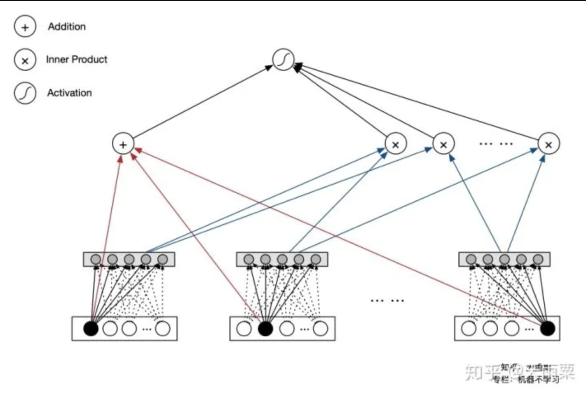   

### Field Factorization Machine (FFM)
- Split the original latent space into many “smaller” latent spaces,  and depending on the fields of features, one of them is used.
- For example: weather, location, gender; intuitively, they should have different interactions
- $y(X)=w_0 + \sum _{i=1}^{N}{w _{1i}x_i} + \sum _{i=1}^{N}\sum _{j=i+1}^{N}{<\mathbf v _{i, f_j}, \mathbf v _{j, f_i}>x_ix_j} $
 
- Higher dimension: $O(N \times K \times F)$, where $F$ is number of fields


### GBDT + LR (Mixed)
- **Motivation**: GBDT transforms features, reduced dimensions, combined attributes
- The leaves serve as new input features for LR
- Drawback:
    - Two phase modelling, i.e., LR doesn't impact GBDT
    - Tree not very good for high-dimension sparse features because trees tend to overfitting because penalty is imposed on tree nodes/depth while LR penalizes weights
    - For example, there is feature X with value 1 on 10 samples and value 0 on 9990 samples. In GBDT it is perfect node split because it takes only 1 depth and 1 split, while in LR it will be regularized for big weight.
- Alternative: 
    - Use GBDT for continous variables, get $gbdt(X _{continuous})$
    - Concatenate with $X _{discrete}$ to get final $\mathbf X$, and feed into LR.


## Modelling Approach - Deep Learning

- Main Advantage
    - High-order interaction is possible by nature by hidden layers
    - Enabled interaction of more than two (>2) features
    - Low-order is captured by shallow part
    - Can be extended into figures/texts
    
- Main characteristic
    - Shallow part of model
    - Stack part of model
        - Concentenate
        - Bi-Interaction
    - Start: Embedding layer
    - End: FC layer
    

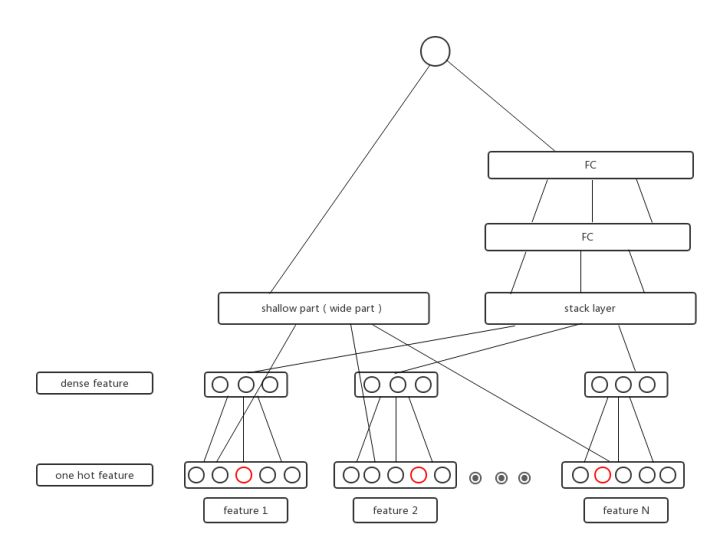

ref: https://github.com/hhlisme/Daily

### NeuralCF


In traditional CF, The **Neural CF layers** are replaced with inner product.

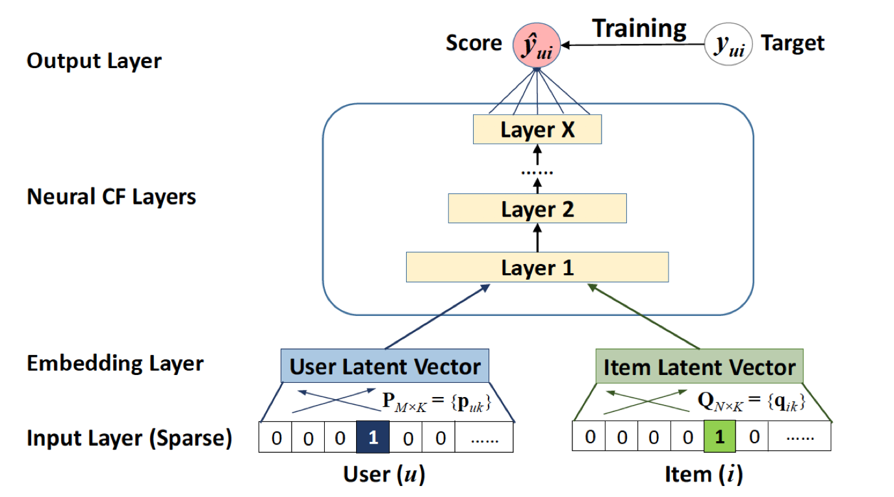

### FM as DNN

- Describe Factorization Machine (FM) as deep learning network

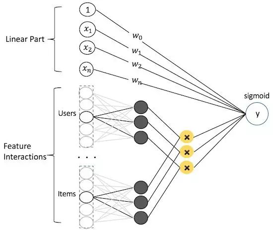

### FNN - Extension from FM
- Use embedding vector from FM as initialized input for DNN
- similar motivation with GBDT + LR
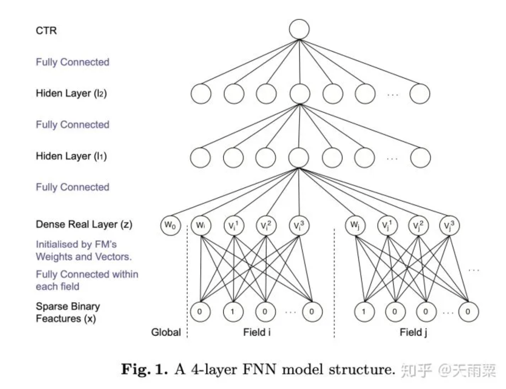

### PNN：Product-based Neural Network
- Instead of using simply concat/add in the DNN, **inner/outer product** is used for embedding vector interactions.


- Two parts inside the product layer:
    - z: original embedding vectors 
    - p: inner/outer product of embedding vectors
- Drawback: high complexity
    - note that from inner product layer to hidden layer 1 we have $(D_1  + M) \cdot N \cdot N$, where $N$ is number of features and $M$ is dimension of embedding vector, which can be simplified as $D_1 \cdot M \cdot N$
    - If outer product is used, time complexity would be $D_1 \cdot M \cdot N \cdot N \cdot M$, , which can be simplified as $D_1 \cdot M \cdot (N+M)$


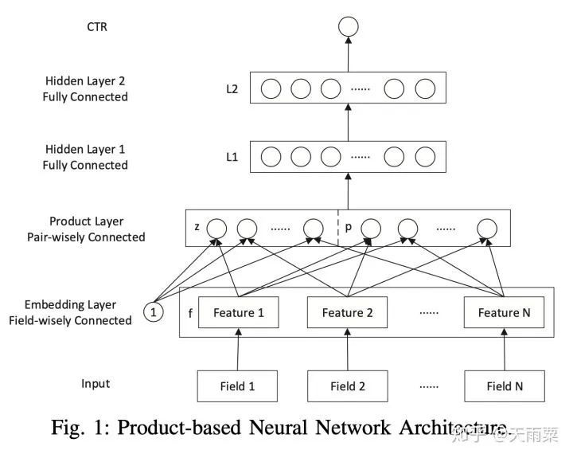

### AFM (Attentional Factorization Machines)
reference: https://arxiv.org/pdf/1708.04617.pdf
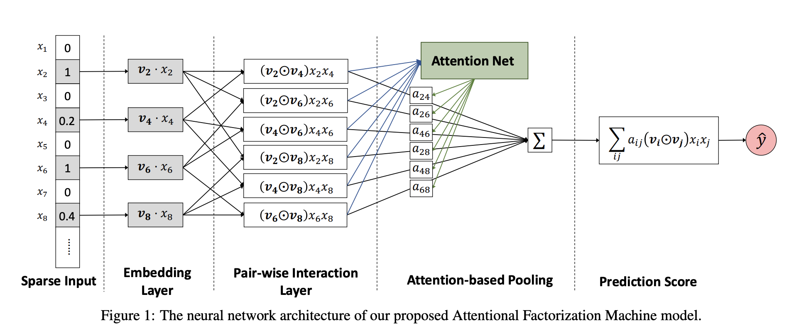 
- Motivation: similar as FFM -> Different interactions between different combinations of features
- Weights learned automatically from a DNN
- If we set **p** as 1, b as 0, and remove $\alpha$, it will downgrade to FM.
- Still, cannot learn high-order interactions.


- $$\hat{y}=w_0+\sum _{i=1}^n w_i x_i+p^T\sum _{i=1}^n \sum _{j=i+1}^n
\alpha _{ij}(v_i\odot v_j)x_ix_j$$
- $$e _{ij} = h^T ReLU(W \cdot  [v_i * v_j] x_i x_j  + b)$$
- $$\alpha _{ij} = \frac {exp(e _{ij})}{\sum _{i,j} exp(e _{ij})}$$
- parameters: p, b, W, h
- W = T(number of hidden layers) X K (number of embedding dimensions)
- h = T X 1, b = T X 1
- p = K X 1

### NFM - Neural Factorization Machines

-  Combine features by $y(X)=w_0 + \sum _{i=1}^{N}{w _{1i}x_i} + f(x)$, where N is number of features
- Define Bi-interaction layer: $f _{BI}\mathbf (V) = \sum_i \sum_j x_i v_i \odot x_j v_j$ (i.e., sum pooling with an output of $K$ dimension vector)

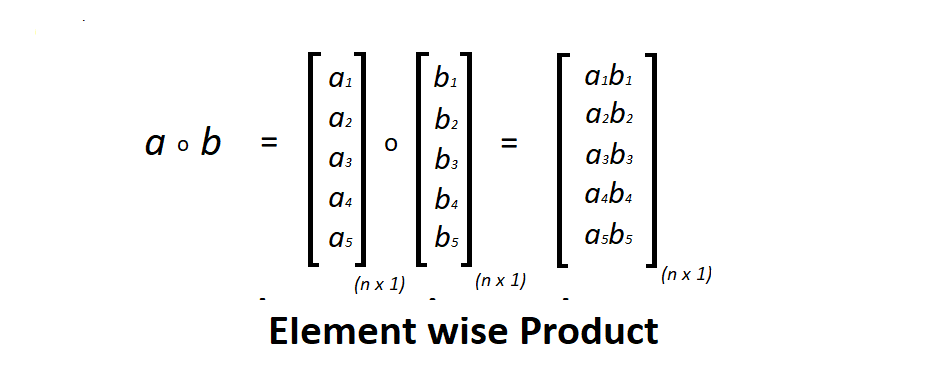


Below is the deep part of NFM (i.e, $f(x)$ term). It needs to be concatenated with 0 and 1 order terms (i.e., $wx + b)$ as the final output $\hat y$.

Difference with ***Deep FM***:

- In DeepFM: 
    - Low order interactions from FM **AND** higher order interactions from DNN
    - Concatenation increases number of parameters, while here bi-interaction reduces complexity
    
- In NFM: 
    - Low order interactions from FM **THEN** higher order interactions from DNN
    - Sum of element-wise product <span style="color:red">Loses</span> informaion, <span style="color:blue">But</span> reduced parameters

|Type|Characteristic|Example|
|:-:|:-:|:-:|
|Type1|FM and DNN are separately calculated, and then concatenated|DeepFM，DCN，Wide&Deep|
|Type2|The 1st and 2nd order calculation of FM is used as input for DNN|FNN, PNN,NFM,AFM|

---

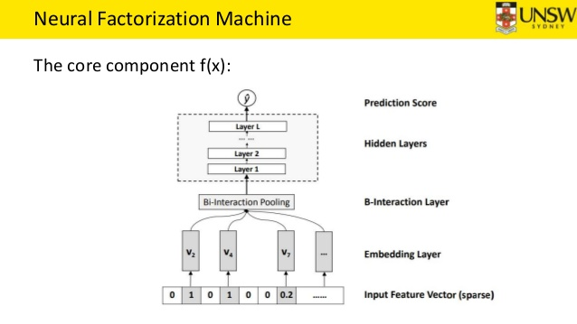


### ONN：Operation-aware Neural Network
- a combination of FFM and NN
    - have different embeddings for different feature interactions
    - have DNN to capture high-order interaction
    
- FM: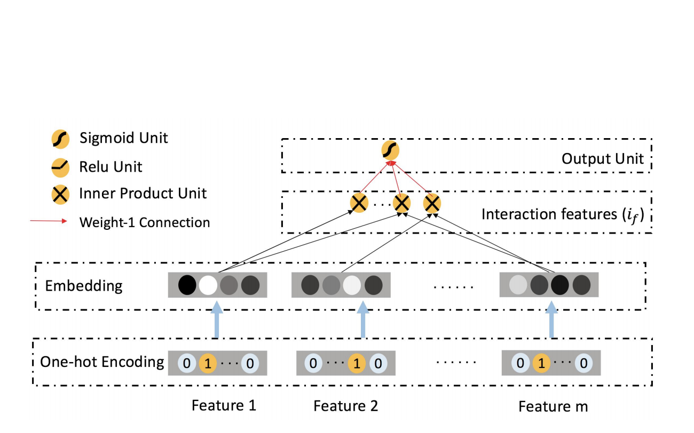

- FFM: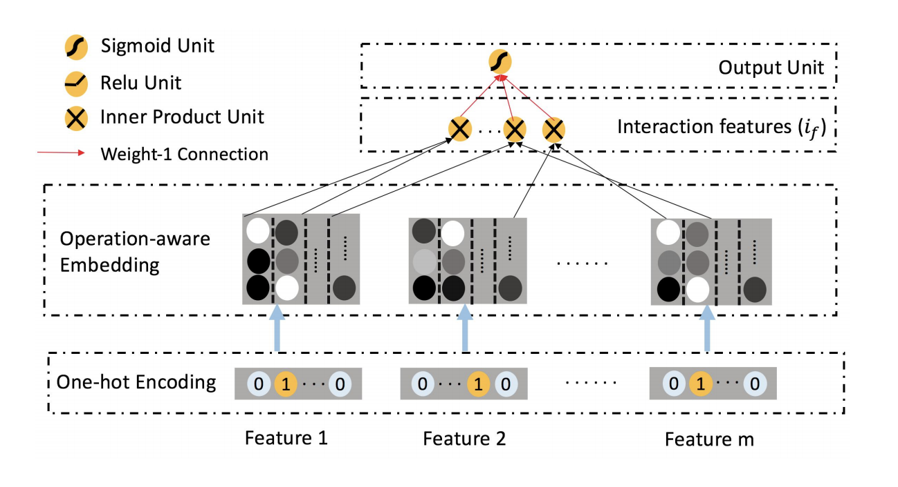

- PNN: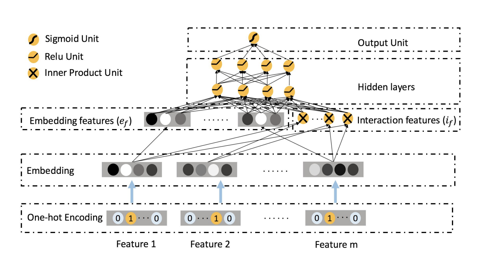

- ONN: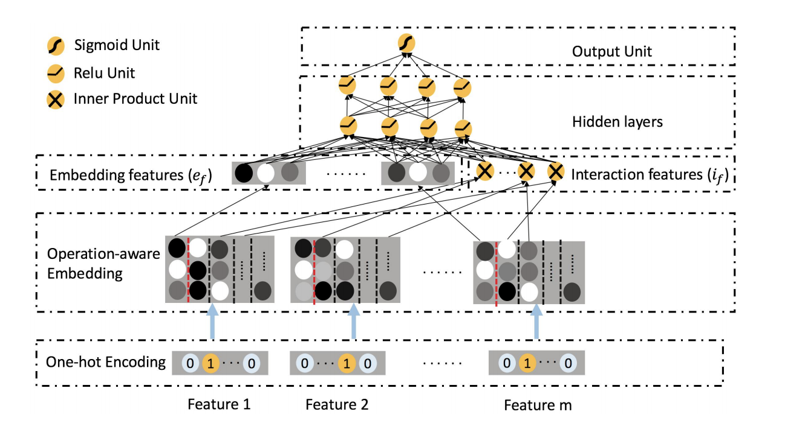

### Wide and Deep
- Memorization: learning the directly relevant frequent co-occurrence of items;
- Generalization: improving the diversity exploring new items combinations that have never or rarely occurred in the past.
- **Wide/Shallow**: LR for categorical variables --> Memorization
- **Deep/Stack**: DNN for continous/categorical variables --> Generalization

---


- An example from https://zhuanlan.zhihu.com/p/37823302

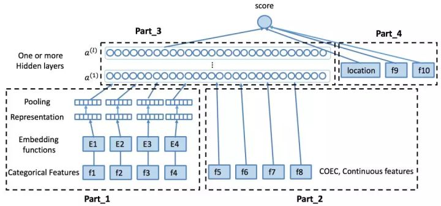

**Network structure**

Part 4: Wide Part, including position bias, some categorical features to enable memorization

Part 1: Deep Part, including categorical features
- User ID / Item ID / Area ID
- Some discretized continuous features
- Missing / Lower frequency IDs treated as separate value

Part 2: Deep Part, including continuous features
- Some statistics
- Text
- Image

Part 3: FC, Activation layer, etc.

### Deep FM
- Ref: https://www.ijcai.org/proceedings/2017/0239.pdf

- Comparison with ***Wide & Deep***:
    - FM and Deep parts shares the same inputs; In wide&deep, the two parts are independent
    - Compared with wide&deep based on manually created features, Deep FM contains the inner product of feature latent vectors (automatically)
    
- Network structure
    - Directly from very sparse layer: zero and first order terms
    - Very sparse -> Dense layer: 
        - from the neuron of $i^{th}$ feature: $\mathbf v_i$ = $[v _{i1},...,v _{i,f}]$ for $i^{th}$ feature becomes the network weights ($V_i$ in the figure below).
        - from a field of neurons: their embedding shares the same set of $f$
        - One solution for multi-value field (for example: likes both apple and banana), then take average of two densed vectors (i.e., ***Average Pooling***)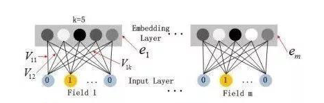
        
    - FM Layer, captures the lower (2) order combinations: Red arrow means 1 weight: $<\mathbf v_i, \mathbf v_j>x_ix_j $
    - Deep/Stack layers: captures the higher order combinations, separate from FM
    - $y _{DeepFm}=sigmoid(y _{FM}+y _{DNN})$

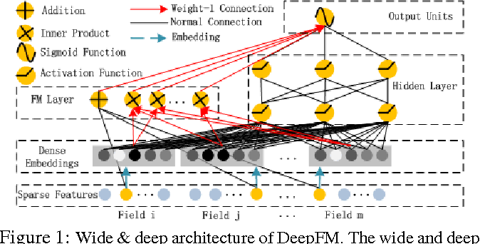


### NFFM

- ref: https://arxiv.org/pdf/1904.12579.pdf

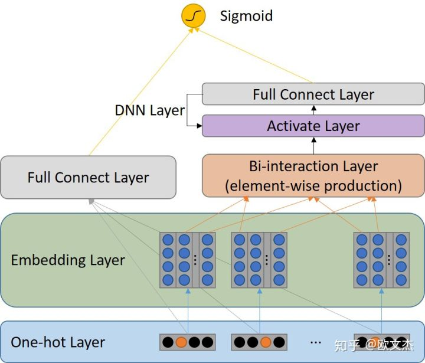

### DIN - Deep Interest Network
- Ref: https://arxiv.org/pdf/1706.06978.pdf
- Main advantage:
    - Considers **diversity** of user interest instead of embedding user history in the same way regardless of given candidate item.
    - **Local activation** helps linking only part of user's history with the candidate item (e,g., swimming cap - goggle). 
    - In other words, a weighted average pooling for user behavior history vectors.
    - <span style="color:blue">another form of **Attention** mechanism</span>

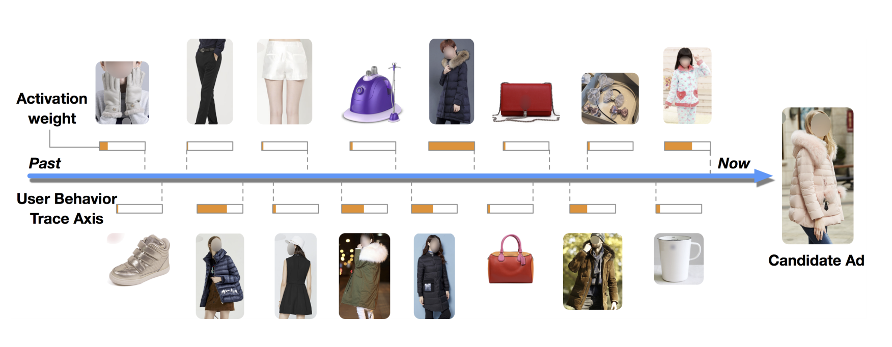   
    
- Example of feature input
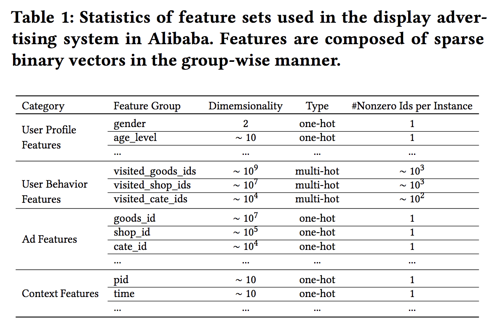
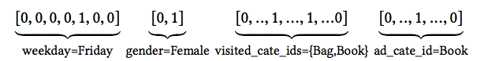

- Comparison with traditional network
    - Key formula for user embedding: 
    $$V _{user} = f(v_A, e_1, e_2, ..., e_H) = \sum _{j=1}^H g(e_j, v_A) \cdot e_j = \sum _{j=1}^H w_je_j$$ where $A$ is candidiate item id, $j$ is user's historical item id.


Note how the attention weights are calculated. A simple version would be just dot product. 

### DCN - Deep & Cross Network
- ref: https://arxiv.org/abs/1708.05123


- Compared with ***Wide & Deep / DeepFM***: 
    - The right deep part is unchanged. 
    - The left FM part is replaced with an Cross Net. 


- The motivation is similar:
    - To explicitly learn feature interactions (like FM part in DeepFM)
    - To capture feature interactions of **high orders**.
    - To apply ResNet in the interaction part so that in each step, so we can still keep original inputs.
    - Computationally more efficient than DNN: $L (number\ of\ layers)\times d(dimension\ of\ embedding)$

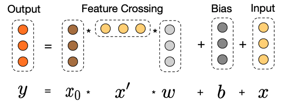

---


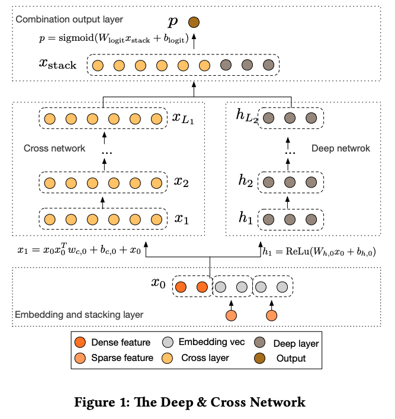

---

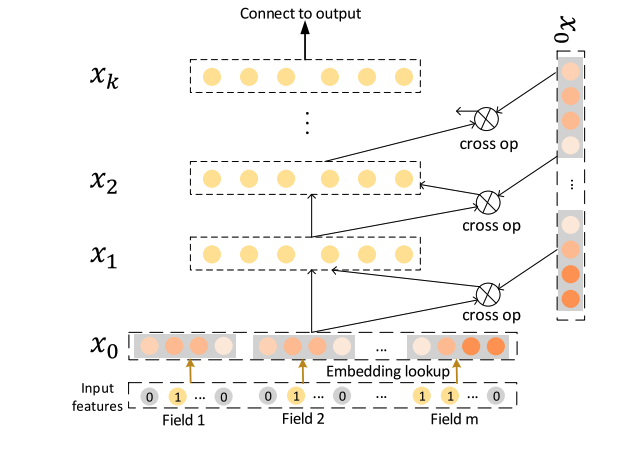

- Key: $x _{l+1} = x_0 x_l^Tw_l + b_l + x_l = f(x_l, w_l, b_l) + x_l$

- Drawbacks
    - Note that $x_L = \alpha_k x_0 = g(x_0, \mathbf w, \mathbf b) x_0$ where $\alpha_k$ is a scalar. This is one of the limitations of bitwise interaction.

### xDeepFM - eXtreme Deep Factorization Machine
- ref: https://arxiv.org/pdf/1803.05170.pdf

Comparison with Deep & Cross:
- Same: Cross feature explicitly in **high order**
- Improvement: **Vector-wise interaction**


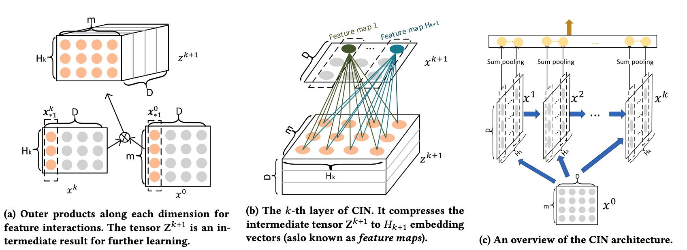


Compressed Interaction Network
- $m$: number of features
- $H_k$: number of embedding feature vectors in $k^{th}$ layer.
- $D$: embedding size


- Key Idea of Interaction:
    - p1: output from $k$ layer: $H _{k-1} \times D$.
    - p2: input: $m \times D$
    - Outer product for each $d$: $Z = H _{k-1} \times m \times  D$


- Key Idea of Compression:
    - Number of channels: $m$
    - Size of picture: $H _{k-1} \times D$
    - Filter Size: $H _{k-1} \times m \times 1$
    - Output dimension of one filter applied on $Z$: $D \times 1 $
    - Number of Filters: $H_k$
    - Output of all Filters applied on $Z$: $D \times H_k$
    - Output of Sum Pooling (keep one value for each filter): $1 \times H_k$
    - Concat the outputs of $K$ layers: length - $[H_1; H_2; ..;H_k]$
    
- Number of Parameters:
$$H _{k-1} \times m \times H_k \times K$$


- Drawbacks:
    - high time complexity
    - loss of information in sum poolings

### Model Summary
reference: https://zhuanlan.zhihu.com/p/69050253
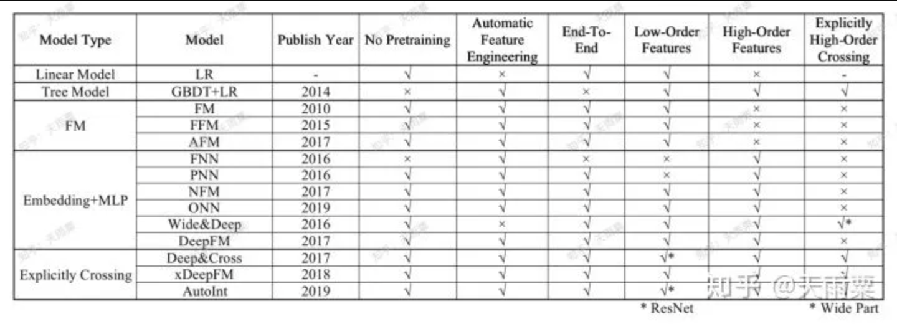
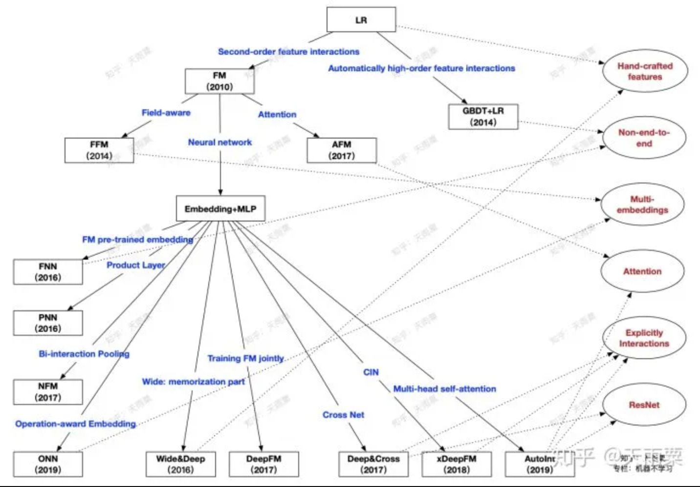
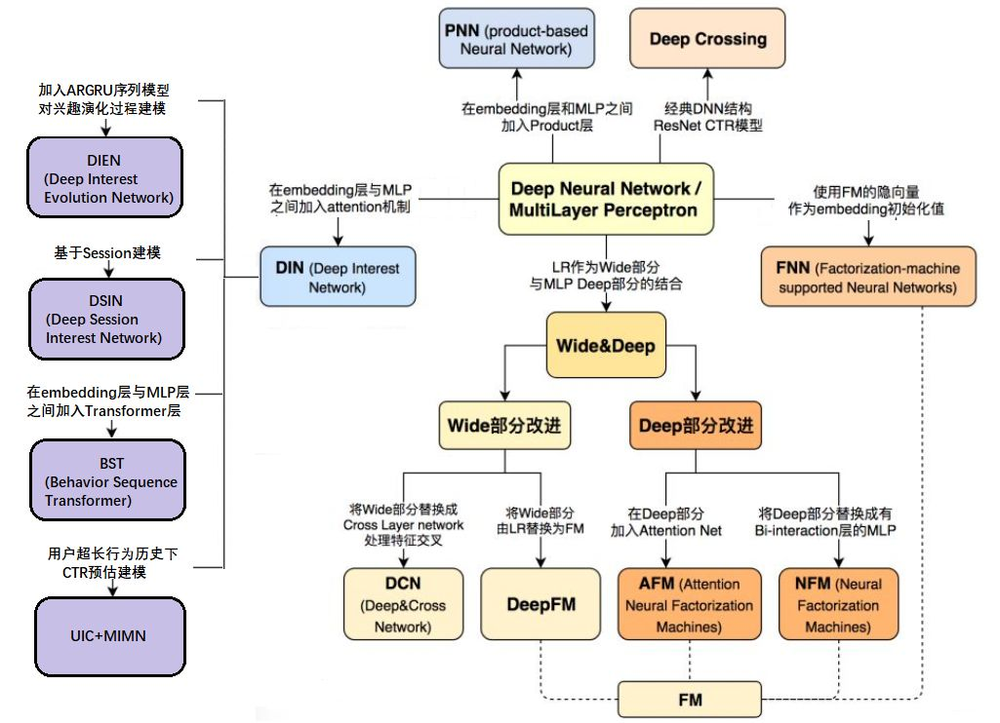
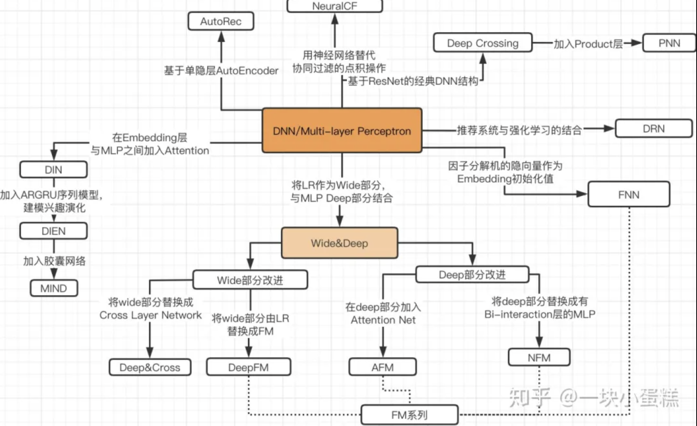

## New models from industry/papers

### ESMM - Entire Space Multitask Model
- ref: https://arxiv.org/pdf/1804.07931.pdf


- User behavior: Impression -> Click -> Buy
- CVR, CTR, CTCVR 
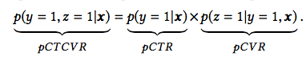
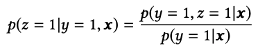
    - where $x$ is impression, $y$ is click, $z$ is conversion.


- Goal is to address  for CVR
    - **Sample selection bias**: trained on clicked data but inference made on all impressions.
    - **Data sparsity**: not so many clicks


- Network structrure: In ESMM, two auxiliary tasks of CTR and CTCVR are
introduced which
    - Help to model CVR over entire input
space
    - Provide feature representation transfer learning.
    - Embedding parameters of CTR and CVR network
are shared. 
    - CTCVR takes the product of outputs from
CTR and CVR network as the output.
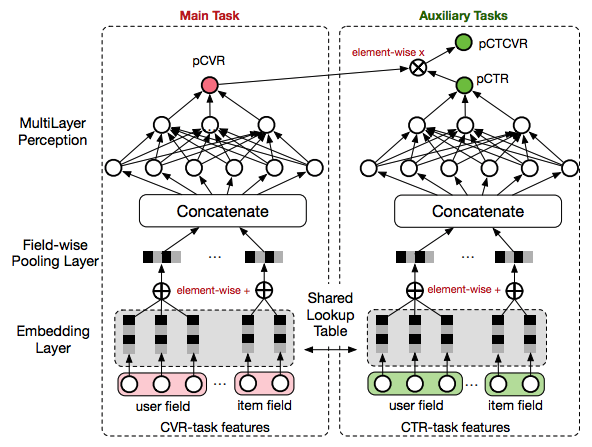


- Loss Function
    - CTR task
    $$L_1 = - y_i\ log\ P _{ctr}(x_i;\theta _{ctr}))$$
    - CTCVR task
    $$L_2 = - z_iy_i\ log\ P _{ctr}(x_i;\theta _{ctr}))\ P _{cvr}(x_i;\theta _{cvr}))$$
    - CVR task: **None**
    $$L=L_1+L_2$$

### DSTN - Deep Spatio-Temporal Neural Networks
- ref: https://arxiv.org/pdf/1906.03776.pdf

Problem Definition
- 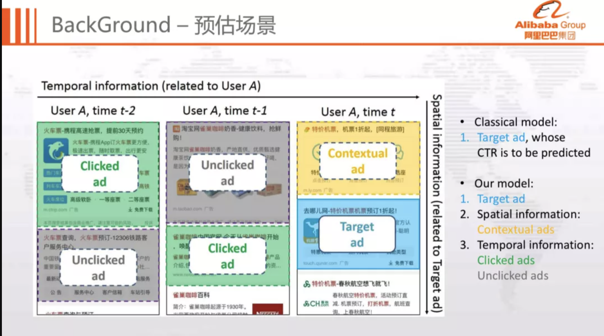

Feature Embedding
- 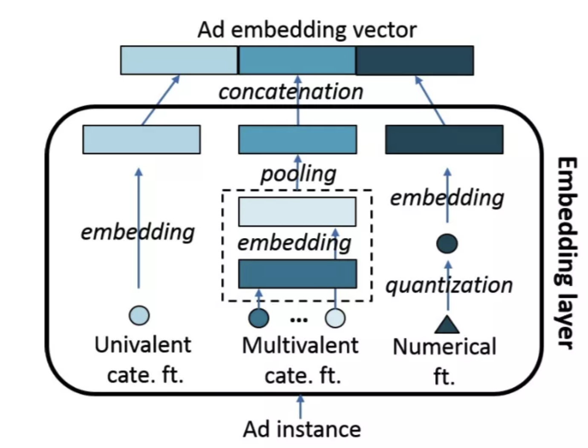
- 
- 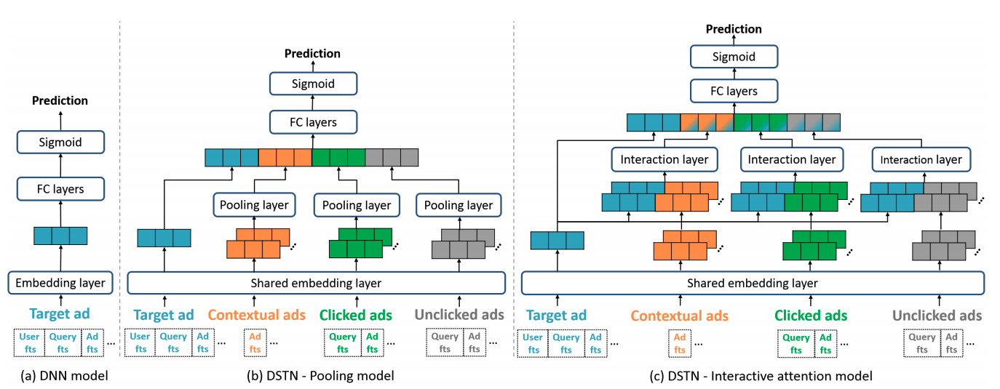

**DSTN - Pooling Model**
- (+) Pooling Layer: address the difference in number of contextual/clicked/pooling ads
- (+) Apply weights on the embedding vectors of 4 different types of ads
- (-) Loss of information in the Pooling layer
- (-) The embedding layer is shared; no interaction with target ads

**DSTN - Interaction Attention Model**
$$ \mathbf x_c = \sum _{i=1}^{n_c} \alpha _{c,i} (x_t, x _{c,i}) x _{c,i} $$
where $ \alpha _{c,i} (x_t, x _{c,i})$ is modeled through one-layer NN
$$ \alpha _{c,i} (x_t, x _{c,i}) 　＝ exp [ h^T ReLU( W[x_t;x _{c,i}] + b_1) + b_2]$$

- (+) Interaction between target and contextual
- (+) No normalization on attention scores (to avoid all useless ads but with scores summing up to 1)

**Interpretation of attention scores**
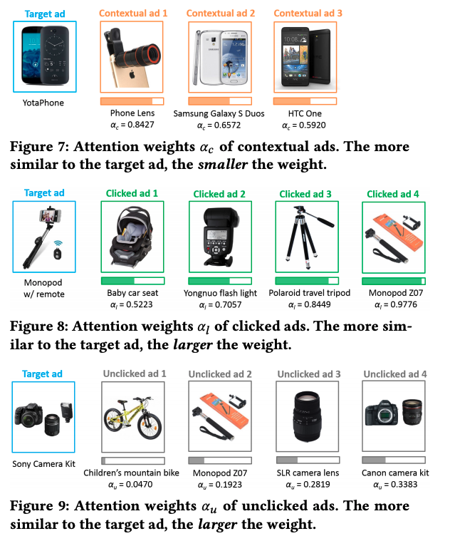

### MA-DNN - Memory Augmented Deep Neural Network
- ref: https://arxiv.org/pdf/1906.03776.pdf

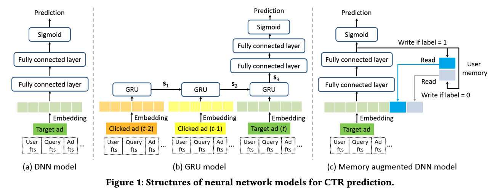

- Last layer: $$ y = sigmoid(Z_L) $$
- Motivation: 
    - $Z_L$ is the representation of target embedding.
    - Define memory vector for a given user $u$: $m _{u0}$ and $m _{u1}$. (i.e., represents the users' preference: like and dislike).

- Loss Functions:
    - $$L_1 = -\sum [ylogp + (1-y)log(1-p)]$$
    - $$L_2 = \sum [y \cdot m _{u1} + (1-y) \cdot m _{u0} - Z_L]^2$$
    - Motivation: memorize the output $Z_L$ of the last FC layer as high-level abstraction of target ad.
    - Demonstrated the merit of RNN (i.e., accounts for historical behaviors) while reduces complexity

### DIEN - Deep Interest Envole Network

### MIND

## Modelling Approach - Reinforced Learning

### DRN - Deep Reinforcement Learning
- ref: https://dl.acm.org/doi/10.1145/3178876.3185994

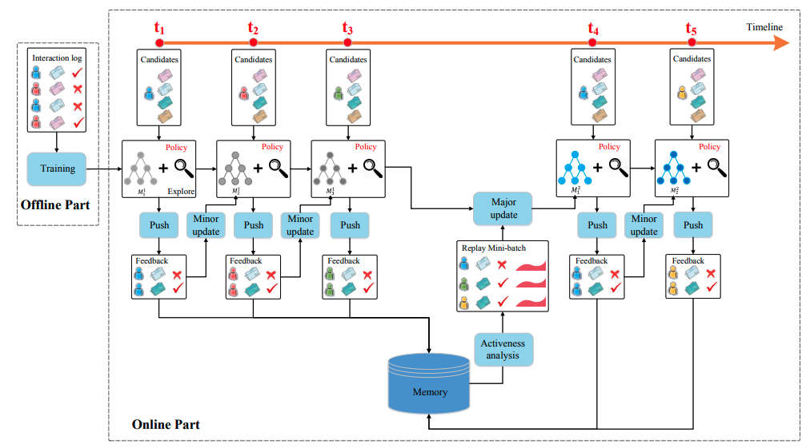

- Model:
    - DDQN - Deep Reinforcement Learning with Double Q-learning

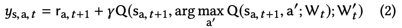

---
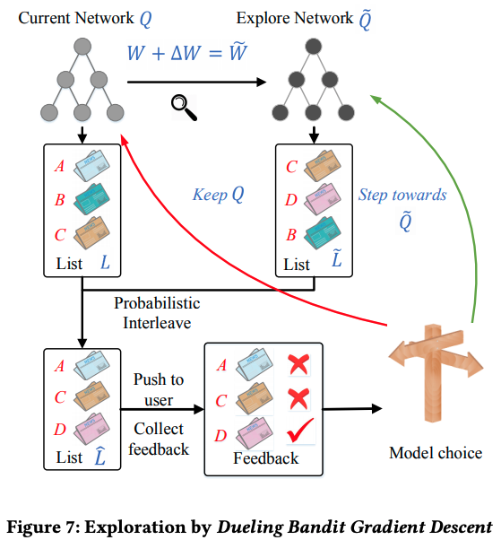

- Main advantage
    - Dynamic nature of user interest
    - Combination of short-term and long-term reward
- $\color{blue}{State}$
    - user features: statistics of news that the user clicked in the last hour/day
    - context: time of day, etc.
- $\color{red}{Action}$
    - news features: provider, topic, history clicks
    - user-news interaction: e.g., the frequency of the type of news $i$ clicked by user $u$
- Two components of rewards
    - news click (short-term)
    - user activeness (long-term)


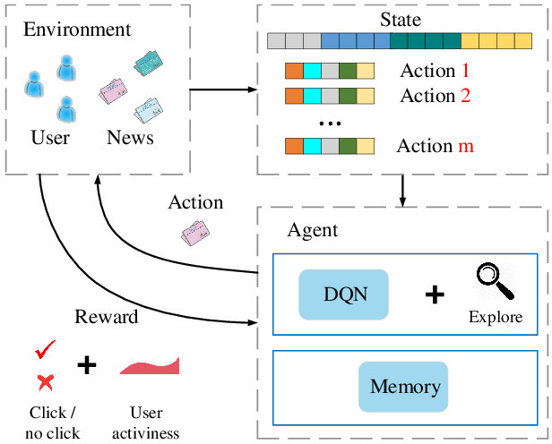

---


### *Deep Reinforcement Learning for List-wise Recommendations

- ref: https://arxiv.org/abs/1801.00209

- Network structure comparison
    - Network a) - Cannot fit high action space (e.g., recommendation system)
    - Network 
    b) - The network computes Q value for each action, separately, increasing time complexity
    - Network c) - Actor-Critic algorithm (see benefits in [Reinforcement Learning Notes](../reinforcement_learning_practice/Concept%20Notes.ipynb))
    
- Action
    - recommenda $K$ items instead of one
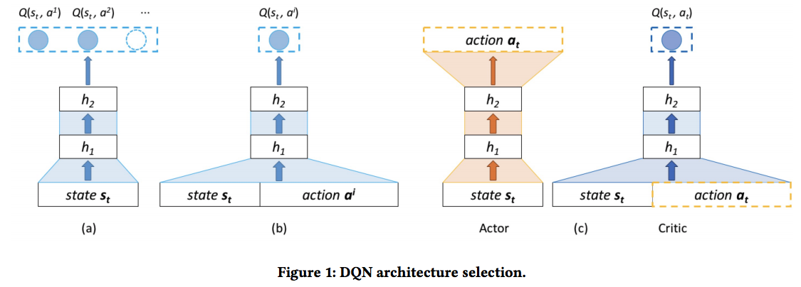  
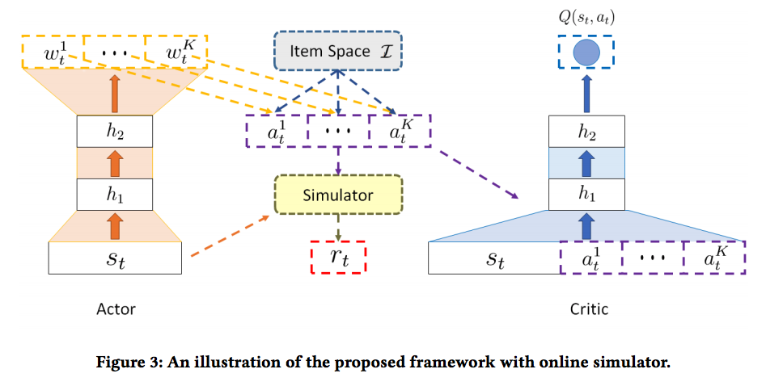 


## Some feature engineering issues


**General**
- For continuous variables
    - standardize for NN inputs
    - discretize for LR
    
    
    
- For discrete variables
    - One-got encoding
    - Text: BoW(n-gram), TF-IDF
    


**List/Type of features**
- User Characteristic
    - Demographic
    - Behavior, preference, activeness
- Business Characteristics
    - Type, city, star, etc
    - Image
- Query
    - Tokens, similarity
- Context
    - Time, distance, competition
    - Position bias

**Key feature: user behavior**
- Real time user behavior
    - Clicked Business (C_P)
    - Ordered Business (O_P)
    - Queries (Q)
    - Sortings (S)
    - Business Characteristic (C_Type, O_Type, C_Loc, O_Loc)
    
- Problem: Sparsity of C_P, O_P, Q, S
- Fix: separate model to describe **USER** based on user behavior 
    - Predict next time t user behavior based on LTSM
    - Doc2Vec to get embedding of a user based on behaviors
    - Topic modelling
    - Serve as continous feature in Part 2


**Some examples of extra features**
- Statistics for different types of behaviors, for example, conversion rate, device, etc.
    - Counting features like device ip count, device id count, hourly user count, user count
    - Bagging features
        - user \vert app id \vert bag of app id
        - user1 \vert  A  \vert A, B
        - user1 \vert  B  \vert A, B
        - user2 \vert  C  \vert C, D
        - user2  \vert D  \vert C, D
    - Click history
        - label \vert  user  \vert history
        - 0  \vert user1 \vert 
        - 1  \vert user1  \vert 0
        - 1  \vert user1  \vert 01
        - 0  \vert user1  \vert 011
- Paattern/Series of behaviors (A-B-C)


# Cold Starting

For new users:
- Provide most popular items
- Provide results based on demographic attributes (gender, age, etc)
- Ask users to provide feedback on some items before providing recommendation


For new items:
- If using user-based CF, then as long as some user finds the items from other sources, it will be spread among users
- If using item-based CF, then have to use item content to calculate item similarity, otherwise it will never be presented to users
    - Calculate item-similarity by vectorizing items
    - A strong feature would actually help content-based recommendation out-perform CF
    
- Some examples of similarity w/o user behavior history
    - keyword vector of an item title with the help of NER
    - TF-IDF of a text
    - LDA topic modelling (use topic vector to calculate similarity)
    
