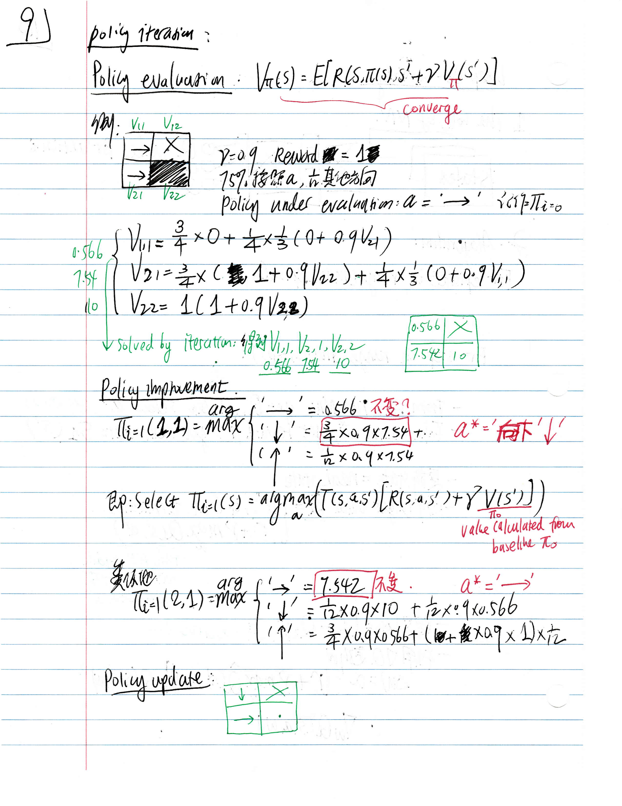
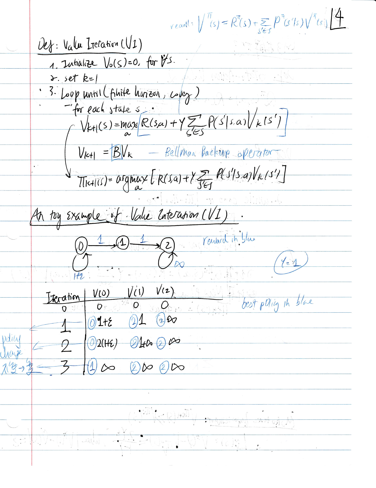
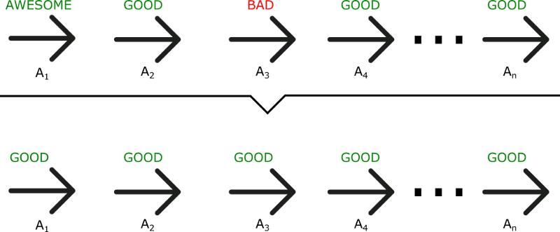
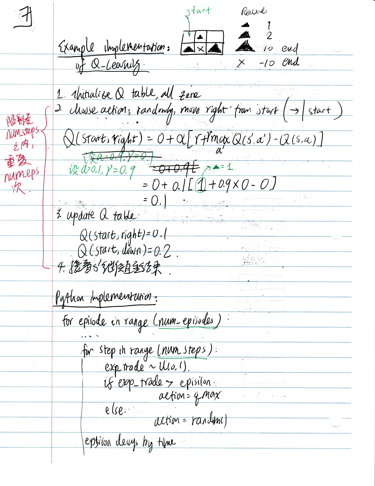
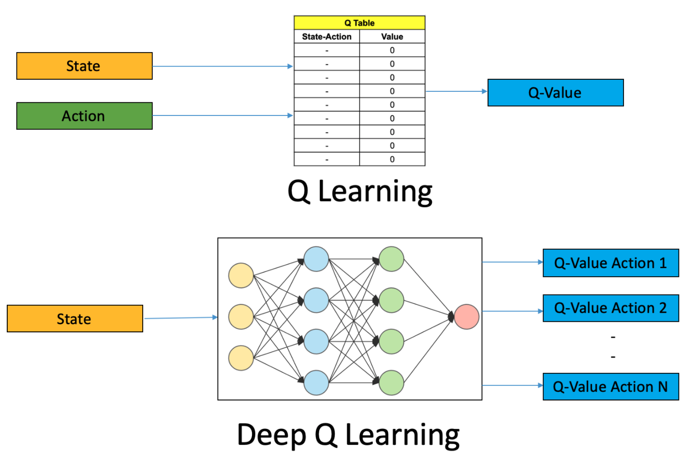
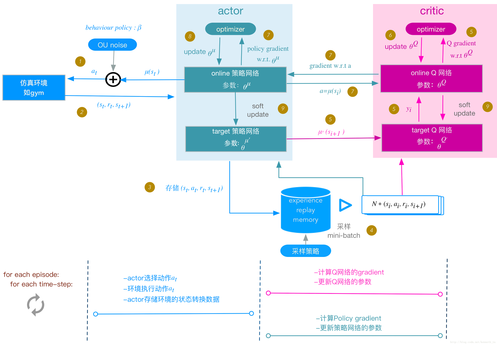
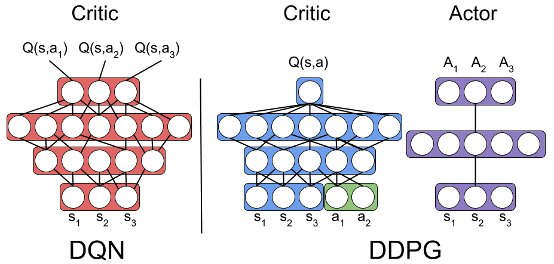
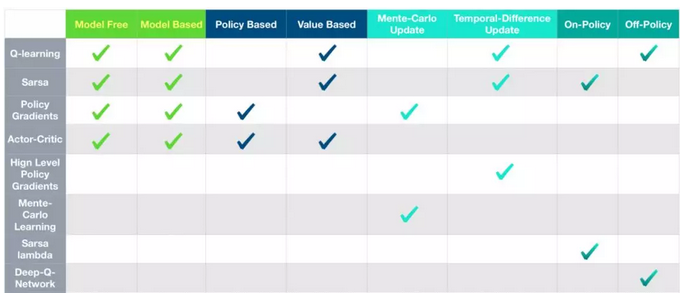
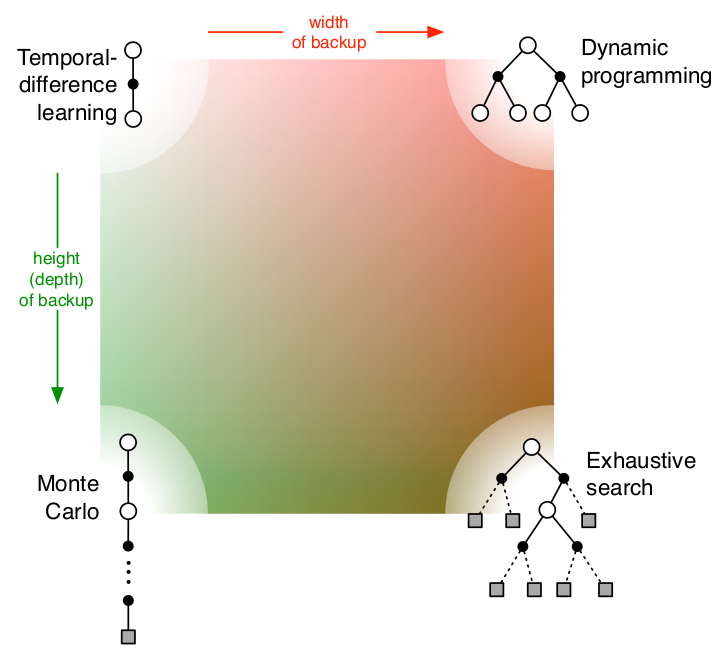

# K-Multi-Bandit and Exploration/Exploitation

For each time step $t$:
- **$\epsilon$ Greedy Algorithm**:
    - if $rand() < \epsilon$ random select $k$ from $1$ to $K$
    - if $rand() > \epsilon$, $k = \underset{a}{argmax\ }(Q(a))$
    - Usually $\epsilon = \frac{1}{\sqrt {t}}$
- Take action $k$, record reward $r$
- Update action times
$$N(k) \rightarrow N(k) + 1$$
- Update action values:
$$Q(k) \rightarrow Q(k) + \frac{1}{N(k)}[r - Q(k)]$$
- Interpretation:
$$NewEstimate \rightarrow OldEstimate + StepSize[Target - OldEstimate]$$

# Markov Process

## Markov Property of a state
- $P(S _{t+1} \vert S_t) = P(S _{t+1} \vert S_t, S _{t-1}, S _{t-2}, ...)$, i.e, given the present, future is independent of past states.

## Markov Process (MP) 
- A sequence of random states $S$ with *Markoe property*, with the defintions of:
    - $S$: a finite set of states
    - $P$: transition function - $P(S _{t+1} = s' \vert S_t=s)$

## Markov Reward Process 

**Reward Function**:

$$R(s) = R(S_t=s) = E[r _{t+1} \vert S_t=s]$$

**Return Function**: 

$$G_t =  r _{t+1} + \gamma r _{t+2} + \gamma^2 r _{t+3} + ... = \sum _{k=0}^{\infty} \gamma^k r _{t+k+1}$$

**Value Function & Bellman Expectation Equation**

- how good is it to be in a particular state
- 
$$V _{\pi}(s) = E[G_t \vert S_t=s]$$

- Two components:
    -  Immediate reward 
    -  Discounted value of the successor state 

- Interpretation:
    -  The expected reward we get upon leaving that state
    
    

$$V(s) = E[G_t \vert S_t=s] = \\ E[\color{red}{r _{t+1}} +  \color{blue}{\gamma(r _{t+2} + \gamma r _{t+3} +...)} \vert S_t=s] = \\ E[\color{red}{r _{t+1}} +  \color{blue}{\gamma G _{t+1}} \vert S_t=s] = \\ E[\color{red}{r _{t+1}} +  \color{blue}{\gamma V(S _{t+1}}) \vert S_t=s] = \\
\color{red}{R(s)} + \color{blue}{\gamma \sum _{s' \in \mathbf S}{P _{ss'}V(s')}} $$

**Analytical solution to Bellman Equation**
- Computational complexity: $O(n^3)$
$$\mathbf V = \mathbf R + \gamma \mathbf P \mathbf V$$
$$\mathbf V  = (\mathbf I - \gamma \mathbf P)^{-1} \mathbf R$$

## Markov Decision Process 

**New State Transition Probability - with action $a$**

$$P _{ss'}^a = P[S _{t+1} = s' \vert S_t = s, A_t = a]$$

**New Reward Function - with action $a$**

$$R_s^a = R(S_t=s, A_t = a) = E[r _{t+1} \vert S_t=s, A_t = a]$$

**Policy**:

$$\pi (a \vert s) = P(A_t=a \vert S_t=s)$$
- Given a fixed policy, the **MDP** becomes **MRP**.

**New State Transition Probability - with policy $\pi$**

$$P _{ss'}^\pi = \sum _{a \in A} \pi (a \vert s) P _{ss'}^a$$

**New Reward Function - with policy $\pi$**

$$R_s^\pi = \sum _{a \in A} \pi (a \vert s) R_s^a$$

**New Value Function & Bellman Expectation Equation - with policy $\pi$**

$$V _{\pi}(s) = E _{\pi}[\color{red}{r _{t+1}} +  \color{blue}{\gamma V _{\pi}(S _{t+1}}) \vert S_t=s] = $$

**New Action-Value Function - with policy $\pi$ and action $a$**:

- how good is it to be in a particular state with a particular action

$$q _{\pi}(s;a) = E _{\pi}[G_t \vert S_t=s;A_t=a]= \\
E _{\pi}[\color{red}{r _{t+1}} +  \color{blue}{\gamma q _{\pi}(S _{t+1}, A _{t+1})} \vert S_t=s, A_t = a]$$  

**The relationship between $V$ and $q$**

$$V _{\pi}(s) = \sum _{a \in A} \pi(a \vert s) q _{\pi}(s,a) --\ [1]$$

**Rewrite New Action-Value Function**

$$q _{\pi}(s, a) =
E _{\pi}[\color{red}{r _{t+1}} +  \color{blue}{\gamma q _{\pi}(S _{t+1}, A _{t+1})} \vert S_t=s, A_t = a] =\\
\color{red}{R_s^a} + \color{blue}{\gamma \sum _{s' \in \mathbf S}{P _{ss'}^a {\sum _{a' \in \mathbf A}} \pi(a' \vert s') q _{\pi}(s', a')}} \xrightarrow{\text{[1]}} \\
\color{red}{R_s^a} + \color{blue}{\gamma \sum _{s' \in \mathbf S}{P _{ss'}^aV _{\pi}(s')}} --- [3]$$ 

**Rewrite New Value Function**

$$V _{\pi}(s) = \sum _{a \in A} \pi(a \vert s)[\color{red}{R_s^a} + \color{blue}{\gamma \sum _{s' \in \mathbf S}{P _{ss'}^aV _{\pi}(s')}}] ---\ [2]$$

**Analytical solution to New Bellman Equation**

$$\mathbf V _{\pi}  = \mathbf R^{\pi} + \gamma \mathbf P^{\pi}  \mathbf V$$

$$\mathbf V _{\pi}   = (\mathbf I - \gamma \mathbf P^{\pi} )^{-1} \mathbf R^{\pi} $$

**Bellman Optimality Equation**
- Optimal Policy

$$\pi^*(s) = \underset{\pi}{argmax\ }V _{\pi}(s)$$

- Optimal Value Function

$$V^*(s) = \underset{\pi}{max\ }V _{\pi}(s)$$

- Optimal Value-Action Function

$$q^*(s,a) = \underset{\pi}{max\ }q _{\pi}(s,a)$$

**Relationship between optimal functions**

$$V^*(s) =  \underset{a}{max\ }q^*(s,a)$$

$$q^*(s,a) = \color{red}{R_s^a} + \color{blue}{\gamma \sum _{s' \in \mathbf S}{P _{ss'}^aV^{*}(s')}}$$

**Rewrite Optimal Value Function**

$$V^*(s) =  \underset{a}{max\ }[\color{red}{R_s^a} + \color{blue}{\gamma \sum _{s' \in \mathbf S}{P _{ss'}^aV^{*}(s')}}]$$

$$q^*(s,a) = \color{red}{R_s^a} + \color{blue}{\gamma \sum _{s' \in \mathbf S}{P _{ss'}^a }\underset{a'}{max\ }{q^*(s',a')}}$$

# Model-based Approach (known $P$ and $r$)

## Policy Evaluation
- Given MDP and policy $\pi$
- Using analytical solution to Bellman Equation
**Rewrite New Value Function**

$$V _{\pi}(s) = \sum _{a \in A} \pi(a \vert s)[\color{red}{R_s^a} + \color{blue}{\gamma \sum _{s' \in \mathbf S}{P _{ss'}^aV _{\pi}(s')}}] ---\ [2]$$

$$\mathbf V  = \mathbf R^{\pi} + \gamma \mathbf P^{\pi}  \mathbf V$$

- Iteration from $k$ to $k+1$:

$$\mathbf V^{k+1}  = \mathbf R^{\pi} + \gamma \mathbf P^{\pi}  \mathbf V^k$$

## Policy Iteration

- **Policy Evaluation**: Given $\pi_i$, evalute $V _{\pi_i}$ for each state $s$.

- **Policy Improvement**: for each state $s$:
    - Calculate $q(s,a)$ for each $a$

$$q _{\pi}(s, a) =
\color{red}{R_s^a} + \color{blue}{\gamma \sum _{s' \in \mathbf S}{P _{ss'}^aV _{\pi}(s')}} --- [3]$$ 
    - Get updated policy $\pi _{i+1}(s)$

$$\pi _{i+1}(s) = greedy\ (V _{\pi_i}(s)) = \underset{a}{argmax\ }\ q _{\pi_i}(s,a)$$

- **Convergence**: can be mathematically improved
- **Stop Criteria**:
    - Assume current policy $\pi_i$ is already optimal

$$q _{\pi_i}(s, \pi _{i+1}(s)) = \xrightarrow{\text{policy improvement}}\underset{a}{max\ }\ q _{\pi_i}(s,a) =\xrightarrow{\text{already optimal}} q _{\pi_i}(s,\pi_i(s))=\xrightarrow{\text{[1]}}V _{\pi_i}(s)$$

  - Then $\pi_i$ is the optimal $\pi^*$, we have:$$V _{\pi_i}(s) = \underset{a}{max\ }\ q _{\pi_i}(s,a)$$

### Example

## Value Iteration
- Directly find the optimal value function of each state instead of explicitly finding the policy

- **Value Update**: 

$$V _{i+1}(s) = \underset{a}{max\ }[{R_s^a} + {\gamma \sum _{s' \in \mathbf S}{P _{ss'}^aV _{i}(s')}}]$$

- **Stop Criteria**: Difference in $V$ value 
- **Optimal Policy**: Action with max $V$ for each state

### Example

# Model-free Approach (Unknown $P$ and $r$)

## Monte-Carlo (MC) Methods
- Update until the return is known
$$V(S_t) \leftarrow V(S_t) + \alpha [G_t - V(S_t)]$$

## Policy Gradient - Monte Carlo REINFORCE

- The parameters $\theta$ in the $NN$ determines a policy $\pi _{\theta}$
- Define trajectory $\tau$

$$\tau = (a_1, s_1, a_2, s_2, ...)$$
- Define total reward $r(\tau)$

$$r(\tau) = \sum _{t \geq 0} \gamma^t r_t$$
- The loss function for a given policy $\pi _{\theta}$ is

$$J(\theta) = E _{\tau \sim \pi _{\theta}}[r(\tau) ]$$
- A mathematical property can be proved

$$\nabla_\theta J(\theta) = E _{\tau \sim \pi _{\theta}}[\color{red}{\nabla_\theta\ log\pi _{\theta}(\tau)}\ \color{blue}{ r(\tau)}] = E _{\tau \sim \pi _{\theta}}[\color{red}{\sum _{t=1}^T \nabla_\theta\ log\pi _{\theta}(a_t \vert s_t)}\ \color{blue}{ r(\tau)}] --- [5]$$ 
- There are other revisions to replace $\color{blue}{ r(\tau)}$ with $\color{blue}{ \Phi(\tau, t)}$ to account for various problems. (e.g., standardization for all positive rewards, only calcultate the reward of $a_t$ from $t+1$, etc.). For example:

$$\color{blue}{ \Phi(\tau, t)} = \sum _{t' \geq t} \gamma^{t'-t}r _{t'}$$

- Step 1: sample $\tau = (a_1, s_1, a_2, s_2, ..., a_T, s_T)$ based on $\pi _{\theta}$, and get $r(\tau)$
- Step 2: Calculate back propagation for $\nabla_\theta J(\theta)$. For each time step $t$, it's multiclass-classification $NN$ with target value as $\color{blue}{r(\tau)}$ or $\color{blue}{ \Phi(\tau, t)}$.
- Step 3: Update weiights $w$.

**Drawbacks**
- Update after each episode instead of each time step. There may be some bad actions.
- Require large sample size.

### Example
see this [notebook](RL%20Practice.ipynb)

## Temporal-Difference (TD) Learning 

- TD methods need to wait only until the next time step.
- At time t + 1 they immediately form a target and make a useful update.

$$V(S_t) \leftarrow V(S_t) + \alpha [r _{t+1} + \gamma V(S _{t+1}) - V(S_t)] = \color{red}{(1-\alpha)V(S_t)} + \color{blue}{\alpha [r + \gamma V(S _{t+1})]}$$

## Q-Learning

- **Key idea**: the learned action-value function $Q$ directly approximates $q^*$, the optimal action-value function
- **Optimal Policy**:

$$\pi^*(s) = \underset{a}{argmax\ }Q(s,a) $$
- ref: http://www.incompleteideas.net/book/RLbook2020.pdf

- Initialize $Q$ table with $Q(s,a)$, note that $Q(terminal, \cdot)=0$
- Loop for each episode:
    - Initialize S
    - Loop for each step of episode:
        - Choose action $a$ from S using policy derived from $Q$
        - Take action $a$, observe reward $r$ and next state $s'$.
        - Update $Q$ table: 
        
        $$Q(s,a) \leftarrow Q(s,a) + \alpha [r + \gamma \underset{a'}{max\ } Q(s',a') - Q(s,a)] = \\
        \color{red}{(1-\alpha)Q(s,a)} + \color{blue}{\alpha [r + \gamma \underset{a'}{max\ } Q(s',a')]} --- [4]$$
        
        - $s \leftarrow s'$
    - until $s$ is terminal

**Drawbacks**:
- A finite set of actions. Cannot handle continuous or stochatisc action space.

### Example

## Deep Q-Learning

- The parameters $w$ in the $NN$ determines a policy $Q(s,a \vert s, w)$ for each $a$.

- For episode in range(max_episode):
    - For step in range(max_step):
        - From $s$, run $NN$, and get $\hat Q_w(s,a)$ for each action a.
        - Select and take best action $a^*$
        - Get reward $r$ and Get next state $s'$.
        - Run $NN$ again to get $Q(s',a')$ for each $a'$
        - If $s'$ is not terminal: Set **target value** $\color{blue}{Q(s,a^*) = [r + \gamma \underset{a'}{max\ } Q(s',a')]} --- [4]$
        - Set loss $L= [\hat Q_w(s,a^*) - \color{blue}{Q(s,a^*)}] ^2$
        - Update weights
        $$\nabla_w L(w) = [\hat Q_w(s,a^*) - \color{blue}{Q(s,a^*)}] \nabla_w \hat Q(s,a^*) --- [6]$$

### Example
see this [notebook](RL%20Practice.ipynb)

## Vanilla  Actor-Critic
- [reference](https://medium.freecodecamp.org/an-intro-to-advantage-actor-critic-methods-lets-play-sonic-the-hedgehog-86d6240171d)

- Instead of using $r(\tau)$ (which is the emprical, long-term reward based on T steps) and updating $\theta$ after one episode, here we use $Q(s,a)$ instead (There are also other variations). This enables updating weights every step.

    - Policy Gradient:
$$\nabla_\theta J(\theta) = \color{red}{ \nabla_\theta\ log\pi _{\theta}(a_t \vert s_t)}\ \color{blue}{ r(\tau)} ---[5]$$ 
    - Actor:
    
    $$\nabla_\theta J(\theta) = \color{red}{ \nabla_\theta\ log\pi _{\theta}(a_t \vert s_t)}\ \color{blue}{ Q(S_t,A_t)} --- [7]$$ 
    - Deep Q-Learning
    
      
   
   $$\nabla_w L(w) = [\hat Q_w(s,a^*) - \color{blue}{(r + \gamma \underset{a'}{max\ } Q(s',a'))}] \nabla_w \hat Q(s,a^*) --- [6]$$
    - Critic
       $$\nabla_w L(w) = [ \underbrace{\hat Q_w(S_t,A_t) -\color{blue}{(r + \gamma  Q(S _{t+1},A _{t+1}))}}_\color{blue}{\text{correction (TD error)}}] \nabla_w \hat Q(S_t,A_t)---[8] $$

**Algorithm**
- Intialize $s, \theta, w$, and sample $a$ from based on $\pi_\theta$.
- For $t = 1, 2, ... ,T$
    - get $s'$ and $r$
    - get $a'$ based on $\pi_\theta(a' \vert s')$
    - Update $\theta$ based on $[7]$
    - Update $w$ based on $[8]$
    - $a \leftarrow a'$, $s \leftarrow s'$.

## Deep Deterministic Policy Gradient
- Both REINFORCE and the vanilla version of actor-critic method are on-policy: training samples are collected according to the target policy — the very same policy that we try to optimize for.
- DDPG is a model-free off-policy actor-critic algorithm
- https://arxiv.org/pdf/1509.02971.pdf

---

**Comparison with Deep Q Learning**

## Comparison

ref: https://antkillerfarm.github.io/rl/2018/11/18/RL.html

- Action space
    - DQN cannot deal with infinite actions (e.g., driving)
    - Policy gradient can learn stochastic policies while DQN has deterministic policy given state.
    
- Convergence
    - Policy gradient has better convergence (policy is updated smoothly, while in DQN, slight change in Q value may completely change action/policy space, thus no convergence guarantee)
    - Policy gradient has guaranteed for local minimum at least
    - But usually policy gradient takes longer to train)

- Variance
    - Policy gradient: Higher variance and sampling inefficiency. (Think of a lot of actions taken in a epoch before updating)
    - Actor-Critic: TD update. 

- Left: model unknown
- Right: model known
- Top: update each step
- Bottom: update each episode

