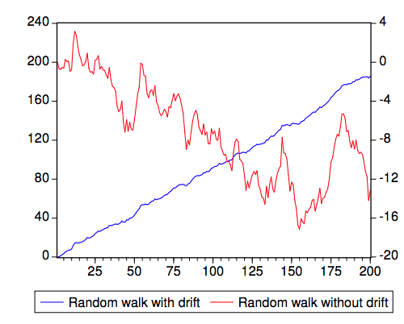
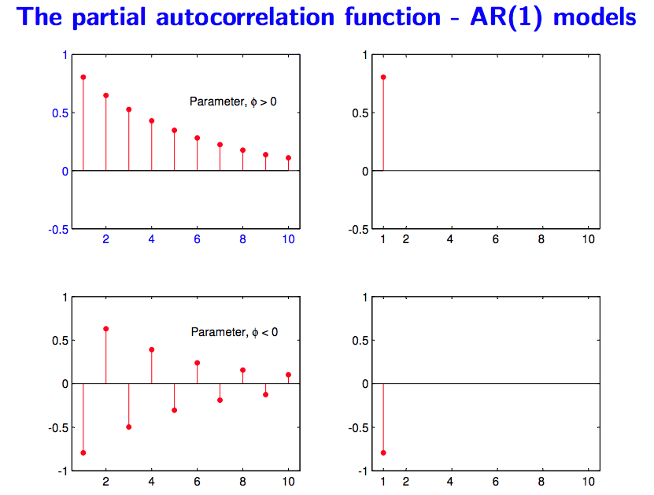
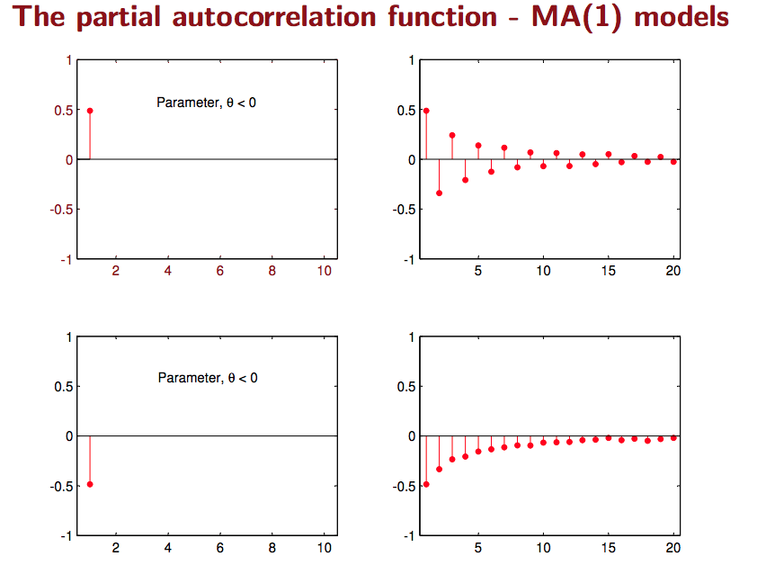
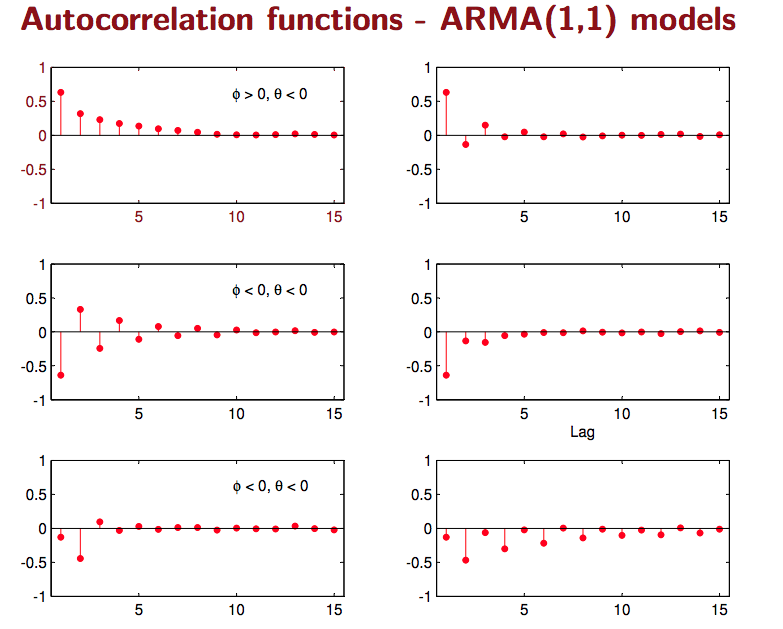
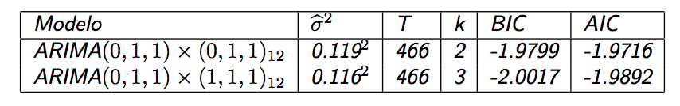

# Time Series Decomposition

## Problem Definition

Given a time series: $ y = S + T + E $

Decompose into:
- **T**: Trend/Cycle
- **S**: Seasonal
- **E**: Error (White Noise)

## Extract Trend
- Moving Average
    * For example: 7 \* MA for weekly data
    
- Moving Average of Moving Average 
    * For example: 2 \* 12 MA for monthly data, 2 * 4 MA for quarterly data
    * In R: `ma(time _series, order=12, centre = TRUE)` 2 \* 12 MA 
    
- Weighted Moving Average
    * 2 * 4 MA is a special case. i.e., W = [1/8, 1/4, 1/4, 1/4, 1/8] 

## Decomposition
Basic Approach:
1. Calculate De-trended data by using MA or 2 - m MA or m MA: **T**
1. Simple average of, for example, all January data. Adjust 12 values to sum up to zero. **S**
1. The remainder is error **E**

---

Issues: 
- No observation for beginning/ending
- Constant seasonal components over years
- Not robust to outliers

---

Other Methods:
- X-12-ARIMA Decomposition 
- STL Decomposition
    * Handle any type of seasonality
    * Change of seasonality over time
    * Users have control over smoothness
    * Robust to outliers
    
---

Forecast with decompositions:
- Naive forecast for seasonal component (assume no change, take from last year)
- For T and E
    * Random walk with drift model
    * Holt's method
    * non-seasonal ARIMA with differencing

# Time series forecasting

Ref: 
  - https://robjhyndman.com/talks/MelbourneRUG.pdf

## Simple Exponential Smoothing

- $\hat x _{t+1} = \alpha x _t + (1-\alpha) \hat x _{t\vert t-1}$
- $\hat x _{t+1} = \hat x _{t\vert t-1} + \alpha (x _t - \hat x _{t\vert t-1})$
- $F _{t+1} = F _{t} + \alpha (A _{t} - F _{t})$
- $F _{t+1} = \alpha A _t + (1 - \alpha) F _t$

## Holt-Winters Additive method
- Main idea
    * Base
    * Error
- Key:
    - Y := L + 1 * b + S
    - L := L + b
    - S := S
    - b := b
    
    - L1 = (Y - S) 
    - L2 = L + b
    
    - S1 = Y - l - b
    - S2 = S
    
    - b1: L - L
    - b2: b

- Forecast = **level** + **trend** + **seasonal component**  
$ \hat{y}  _{t+h\vert t} = l  _t + hb  _t + s  _{last} $

- Level = Seasonal Adjusted Observation + Non-seasonal Forecast for t  
$l  _t = \alpha(y  _t - s  _{t-m}) + (1 - \alpha)(l  _{t-1} + b  _{t-1})$

- Trend = Change in level + Trend from last year  
$ b _t = \beta(l _t - l _{t-1}) + (1-\beta)b _{t-1}$

- Seasonal = Current seasonal index + Seasonal index from last year  
$ s  _t = \gamma(y  _t - l _{t-1} - b _{t-1} )+ (1-\gamma)(s _{t-m}) $

- Unified error correction form: 
$ \theta := \theta + \alpha * error $ 
$ error = y _t - (l _{t-1} + b _{t-1} + s _{t-m}) $

## Other methods

1. Damped Trend Model:
    - Short-run: trended
    - Long-run: constant
    - $ \hat{y} _{t+h\vert t} = ... + (\phi + \phi + ... + \phi^h)b _t + ... $
1. Exponential Trend Model
    - $ \hat{y} _{t+h\vert t} = l _tb^h _t $
1. Holt's linear Trend model
    - No seasonal term

# AR(1) and MA(1) Model
## Defniition of stationary series
**Definition of weak stationarity**

- $ E(Y _t) = 0 $  
- $ Var(Y _t) = constant $
- $ Cov(Y _t, Y _{t-k}) = \gamma _k $
- Think of The covariance matrix

## AR(1) Model
$$ Y _t = c + \phi Y _{t-1} + \epsilon _t,\ where\ \epsilon\ - iid(0, \sigma^2) $$

- Mean: 
    - $Y _t = c \sum _{i=0}^{t-1}\phi^i + \phi^t Y _0 + \sum _{i=0}^{t-1} \phi^i a _{t-i}$
    - $E(Y _t) = c \sum _{i=0}^{t-1}\phi^i + \phi^t Y _0$

- Condition for stationary
    - When $\vert \phi\vert <1,$ $\mu = E(Y _t) = \frac{c}{1-\phi}$
    - Root of operator: $(1-\phi B) = 0, B= \frac{1}{\phi}$
    - if $ \phi = 1 $ and $ c = 0 $ : random walk
    - if $ \phi = 1 $ and $ c <> 0 $ : random walk **with drift**

- Variance
    - If c=0, $Y _t - \phi Y _{t-1} = (1-\phi B) = \epsilon _t$
    - If c=0, $\sigma^2 _Y = \phi^2 \sigma^2 _Y + \sigma^2 _{\epsilon}$, $\sigma^2 _Y = \frac{\sigma^2 _{\epsilon} }{1- \phi^2}$
    
- Autocovariance
    - If c=0, $\gamma _k = E(Y _{t-k}Y _t) = E[Y _{t-k}(\phi Y _{t-1} + \epsilon _t)] = \phi  E(Y _{t-k}Y _{t-1}) = \phi \gamma _{k-1}$
    - $\gamma _0 = E(Y _{t}Y _t) = \sigma^2 _Y$
    
- Representation by error term
    - If c=0, $Y _t = \epsilon _t + \phi \epsilon _{t-1} + \phi^2 \epsilon _{t-1} + ...$
    - $Y _t = \sum _{j=0}{}{\phi^j \epsilon _{t-j} }$, which is $MA(\infty$) with special structure for weights
    - Indication: **keep "long" memory with decreasing weights**

## MA(1) Model
$ Y _t = c + \epsilon _t - \theta\epsilon _{t-1},\ where\ \epsilon\ - iid(0, \sigma^2) $
 
- If c=0, $Y _t = (1-\theta B)\epsilon _t$
- Always stationary

- Mean
    - $E(Y _t) = \mu$
    
- Variance
    - $\sigma^2 _Y = E(Y^2 _t) = \sigma^2 _{\epsilon}(1+\theta^2)$
    
- Covariance
    - $\gamma _1 = E(Y _t Y _{t-1}) = -\theta \sigma _{\epsilon}^2$
    - $\gamma _2 = \gamma _3 = ... = 0$

Indication: **noise / shock quickly vanishes with time.**

Note: Difference between MA *model* and MA *smoothing*
- MA model: forecast stationary series
- MA *smoothing*: forecast trend

## Comparison/ Connection between AR and MA

- AR model can be represented by $MA(\infty)$ model with restrictions on the decay pattern of coefficients

- MA model has finite terms with no restrictions on coefficients

- AR model has many non-zero autocorrelation with decay pattern

- MA model has a few non-zero autocorrelation with no restriction

- It can be proved that:
    - $AR(p) + AR(0) = ARMA(p,p)$
    - $AR(p) + AR(q) = ARMA(p + q,max(p,q))$
    - $MA(p) + MA(q) = MA(max(p,q))$

# ARIMA model 

## Integrated Process / Non-stationary

- I(2) means the series need to be differenced TWICE in order to be stationary
- For example: random walk: $ Y _t = Y _{t-1} + \epsilon _t $ is $I(1)$
- For example: stationary process: $I(0)$

- Special Case : $Y _t - Y _{t-1} = c + (\epsilon _t - \theta \epsilon _{t-1})$
- $\theta=0$: random walk
- $c=0, \vert \theta\vert  <1$: simple exponential smoothing

***Random walk***

$$ Y _t = c + \phi Y _{t-1} + \epsilon _t$$

- If $\phi = 1$, $\Delta Y _t = c + \epsilon _t$
    - Or: $Y _t = ct + \epsilon _{t} + \epsilon _{t-1}+ \epsilon _{t-2} + ...$
- Unlike stationary process, constant $c$ is very important in defining non-stationary process
    - $E(Y _t) = ct $ 
    - $\sigma^2 _Y = \sigma^2 _{\epsilon}t$
    - $cov(t, t+k) = \sigma^2 _{\epsilon}t$

***Simple Exponential Smooth (SES)***

* $ y _t = Y _t - Y _{t-1} = \mu - \theta \epsilon _{t-1} + \epsilon _t$, where it is a combination of *deterministic trend* and *stochastic trend*.
* $ \mu$ is the constant term. Let $\mu=0, \vert \phi\vert<1$,
    - $E(Y _t) = \mu t$. If $\mu$ = 0, $ Y _t - Y _{t-1} =  - \theta \epsilon _{t-1} + \epsilon _t$.
    
* $ Y _t = \epsilon _t + Y _{t-1} - \theta\epsilon _{t-1} = \epsilon _t + Y _{t-1} - \theta(Y _{t-1} - Y _{t-2} + \theta\epsilon _{t-2}) + ...... $
* $ Y _t = \epsilon _t + (1-\theta) Y _{t-1}  + \theta(1-\theta)Y _{t-2} + \theta^2(1-\theta) Y _{t-3} +......$
* Equivalent: $AR(\infty)$ with infinite geometric progression

## Seasonality

- Base: $ y _t = \mu + \phi _1 y _{t-1} + ... + \phi _p y  _{t-p} + \theta _1 e _{t-1} + ... + \theta _q e _{t-q} + e _t $

- Seasonal Differencing
    - Seasonaility: $E(Y _t) = E(Y _{t-s})$ where $Y$ is de-trended. The series has a seasonal period of $s$

- Types of Seasonality
    - let $n _t$ to be stationary, then $Y _t = S _t^{(s)} + n _t$
    - Deterministic effect:  $ S _t^{(s)} = S _{t+s}^{(s)} = S _{t+2s}^{(s)} = S _{t+3s}^{(s)} = ......$
    - Stationary effect: $ S _t^{(s)} = \mu^{(s)} + v _t$, where $\mu^{(s)}$ is mean for each season, and $v _t$ is another stationary process
    - Non-stationary effect: $ S _t^{(s)} = S _{t-s}^{(s)} + v _t$
    - Note: **Seasonal MA and AR terms**

- Seasonal differencing    
    - Convert non-stationary with seasonality to stationary process
    - Example: **$ARIMA(1,1,1)(1,1,1) _4$ without constant**

## Model Identification
### Test for stationarity

**Dickey Fuller Test of Stationarity (for AR1)**

- $ Y _t = \phi Y _{t-1} + \epsilon _t$
- $Y _t - Y _{t-1} = (\rho - 1) Y _{t-1} + \epsilon _t$
- Intuition: higher value will be followed with a decrease, and lower value will be followed with an increase; 
- Random walk with $\phi$ = 1 is not stationary since the last position do not imply increase or decrease
- Test if $(\rho-1)$ is zero or not, i.e., if $\rho$ is equal to one; If zero, then non-stationary

**Augmented Dickey Fuller (ADF) Test of Stationarity (for ARMA)**

- $Y _t = \phi _1 Y _{t-1} + \phi _2 Y _{t-2} + \phi _3 Y _{t-3} +... +\epsilon _t $
- $Y _t - Y _{t-1} = \rho Y _{t-1}  - \alpha _1 (Y _{t-1} - Y _{t-2}) - \alpha _2 (Y _{t-2} - Y _{t-3}) - ... + \epsilon _t $
- Intuition: for a non-stationary series, $Y _{t-1}$ will not provide relevant information in predicting the change in $Y _t$ besides the lagged changes $\Delta$
- In other words: measure if the contribution of lagged value $Y _{t-1}$ is significant or not
- How to lag length `k`? Use AIC, BIC for model selection, or default $(T-1)^{1/3}$

**Variations**
- Other options: KPSS test, hypothesis opsite

### Transformations

- Variance stablizing
    - Log
    - Square root
    - Box-cox transformation

- Mean stablizing
    - Regular differencing
    - Seasonal difference
    
- Log: fix exponentially trending
- Detrend: Y = (mean + trend * t) + error; Model trend from here 
- Differencing: 
    * First-order differencing: $Y _t - Y _{t-1} = ARMA(p,q)$ 
    * Seasonal differencing with period m: $Y _t - Y _{t-m} = ARMA(p,q)$
    * Here the order of differencing is `I` in AR(I)MA

### Identify `p` and `q`

**Two useful graphs**
- Auto Correlation Function (ACF):
    * A lag k aurocorrelation: $Corr(Y _t, Y _{t-k})$
    * AR(1): Gradually decrease with lag k
    * MA(1): Spike at lag 1, then zero for lag k > 1
    
- Partial Correlation Function (PACF):
    * Only measure the association between $Y _t, Y _{t-k}$
    * Exclude the effect of $Y _{t-1}, ..., Y _{t-(k-1)} $
    * $Y _t = \beta _1 Y _{t-1} + \beta _2 Y _{t-2} + u _t$
    * $Y _{t-3} = \gamma _1 Y _{t-1} + \gamma _2 Y _{t-2} + v _t$
    * $PACF(t, t-3) = corr(u _t, v _t)$
    

---

---

## Model estimation and selection
- Use repeated KPSS tests to determine differenced d to achieve stationary series
- Use *Maximum Likelihood Estimation* to minimize $ e^2 _t $
- The value of `p` and `q` are selected by minimizing $AIC$ using some search strategy
    - $AIC = -2log(L) + 2K = Tln \hat\sigma^2 _{\epsilon} + 2K$
    - Error + Number of parameters
- Start from base ARIMA and add variations until no lower $AIC$ found

## Model diagnostics for residuals
- Zero mean
- Constant variance
- No autocorrelation
- Normal distribution

## Forecasting and Evaluation
- https://www.otexts.org/fpp/8/8

# Dynamic Regression: 

## ADL model (Autoregressive Distributed Lag) Model

- Formulation: $Y _t = \alpha + \delta t + \phi _1Y _{t-1} + \phi _2Y _{t-2} + ... + \phi _p Y _{t-p} + \beta _0X _t + \beta _1X _{t-1} + ... + \beta _qX _{t-q} + \epsilon _t$
- Where $\epsilon _t$ ~ $iid(0, \sigma^2)$

### If X and Y are stationary `I(0)`
- Run OLS on ADL model
- For interpretation purpose: rewrite ADL to be $\Delta Y _t = \alpha + \delta t + \phi Y _{t-1} + \gamma \Delta Y _{t-1} +\gamma _2\Delta  Y _{t-2} + ... + \gamma _p\Delta  Y _{t-p} + \theta X _t + \omega _1\Delta X _{t-1} + ... + \omega _q\Delta X _{t-q} + \epsilon _t$

- Long Term effect: $Y-Y = \phi Y + \theta X$
    * $\partial Y / \partial X = -\theta / \phi$
    * If X permanently increase by 1%, what percent with Y change
    
- Short Term effect: Not clear

### If X and Y are I(1)

In other words, X and Y has unit root I(1)

$$Y _t = \alpha + \beta X _t + e _t$$

- **Spurious Regression**: 

    - $\beta$ should be zero, but estimated $\beta$ not zero; ($e _t$ has a unit root, e _t is not stationary)
    - In other words, estimation is biased
    - Cannot use t tests because distributionb is no longer **t** or normal (error structure)
    - Possible fix: $\Delta Y _t = \Delta X _t + \Delta e _t$ as long as e is I(1), then $\Delta e _t$ is stationary. But different interpretation.
    
- **Cointegration**:
    -$e _t$ does **NOT** has a unit root --> $e _t$ is stationary, and is called **equilibrium error**
    - Premise: there exist unit root for X and Y
    - Test method (Engle-Granger Test): run unit root test (Dickey-Fuller Test) on residual $\hat Y _t - \hat\alpha - \hat\beta X _t $
    
- Under coitergration: still can run OLS with Y on X (**Cointegrating Regression**)
    - OLS: Estimate $Y _t = \alpha + \beta X _t $
    - $\beta$ is super-consistent
    - T stats not interpretable

    
    
- Under coiteration: call also run full ADL

### Error Correction Model (ECM)

- Premise: X and Y cointegrating I(1)
- Long-Run OLS: Estimate $Y _t = \alpha + \beta X _t + e _t$
- Short-Run OLS: $\Delta Y _t = \gamma \hat e _{t-1} + \omega _0 \Delta X _t + \epsilon _t$ 
- The short-run OLS above applies for **AR(1)**, can be easily proved. More lags for y and x can be added for arima models.
- Where $\hat e _t = Y _{t-1} - \hat \alpha - \hat \beta X _{t-1}$ and $\gamma <0$
- $\omega$ is the short-term effect  from $\Delta X$
- $e _{t-1}$ is error correction term, move towards equilibrium

Relationship with ADL:
- Special Case of ADL for I(1) variables

Ref: http://web.sgh.waw.pl/~atoroj/econometric _methods/lecture _6 _ecm.pdf

## A special case: AR(1) for error term
- **Example of AR(1)**: Formulation
    * $y _t = \alpha + \beta x _t + \epsilon _t,\ where\ errors\ (\epsilon _t)\ is\ autocorrelated$   
        * What happens: solution not efficient any more, and statistical tests no longer apply
    * $ Assume\ \epsilon _t = \rho \epsilon _{t-1} + \omega _t\ where\ \omega\ - iid(0, \sigma^2) $  
    * Note: More appropriate ARMA model can be available
    * Similary, it can be shown/proved that the series $ \epsilon _t $ is stationary

- Rewrite assumtpion for stationary error
    * $ E(\epsilon ) = 0 $  
    * $ E(\epsilon^2 \vert X ) = \rho(\frac{\sigma^2}{1-\rho^2}) $ Homescedasticity  
    * $ E(\epsilon _i \epsilon _j) = \rho _{\vert i-j\vert } * \sigma^2 $ What matters is proximity $k = \vert i-j\vert $
        * $ Corr(\epsilon _t, \epsilon _{t-1}) = \rho $
    
- Model assumptions
    * Stationarity for Y and X
    * Differencing may be needed
    
- How to solve for $\beta$?
    * One way: **Cochrane-Orcutt Method (Yule-Walker Method)**
    * OLS: $\hat{\epsilon _t} = y _t - \hat{\alpha} - \hat{\beta} * x _t$
    * OLS: $\hat{\epsilon _t} = \rho \hat{\epsilon _{t-1} } + \omega _t,\ solve\ for\ \hat{\rho}$
    * Re-formulate: $y _t^* = t _t - \rho y _{t-1} = \alpha(1-\hat{\rho}) + \beta* x _t^* + \omega _t,\ solve\ for\ \hat{\alpha}, \hat{\beta} $
    * Where $ y _t^* = t _t - \hat\rho y _{t-1}$
    * Re-iterate until convergence
    
    
    
- How to predict?
    * $F _{t+1} = \hat{y} _{t+1} + re _t$, combining regression part and ARMA part
    * how about X? model separately, given, or assume future values

## Test for auto-correlation of residuals
**Durbin-Watson test**
- $\epsilon _t = \rho \epsilon _{t-1} + \omega _t\ $
- Hypothesis
    * $H _0: \rho = 0$ 
    * $H _1: \rho <> 0$

- Test statistics

**Ljung-Box Q Test**
- Hypothesis
    * $H _0$: the autocorrelations up to lag k are all zero
    * $H _1$: At least one is not zero

- Test statistics

